# WGS Extract Manual

Alpha v4 Edition \
15 July 2022 release \
Combined Reference and User Manual

*[Installation and Starting](#heading=h.2jp1un3npqh4)** section at the end.* \


**WGS Extract** is a desktop tool to aid with extracting data from and analyzing your 30x Whole Genome Sequence (WGS) test result. The tool is geared toward the [Genetic Genealogist](https://h600.org/wiki/Genetic+Genealogy) and [Deep Ancestry](https://h600.org/wiki/Deep+Ancestry) researcher to feed autosomal segment match, ad-mixture (ethnicity) and [phylogenetic tree of haplogroup](https://h600.org/wiki/Phylogenetic+Tree) analysis tools. As well as websites that support the upload and analysis of other lab test results. Benefits can be had by those manipulating 30x WGS files for health and [ancient DNA](https://en.wikipedia.org/wiki/Ancient_DNA) analysis; but that is not a promoted focus. Most [Next Generation Sequencing](https://h600.org/wiki/Sequencing) (NGS) results can be used with this tool.

**WGS Extract** provides a more gentle, push-button introduction to 30x WGS processing.  It is a small subset of the capability in a Galaxy server (such as [usegalaxy.org](https://usefalaxy.org/) and [usegalaxy.eu](https://usegalaxy.eu/)). But far easier to use. Its goal is to take complex research tools out of the university lab and put them into the hands of personal test takers. Thus enabling the processing of 30x WGS test results for individual needs.  We use the tool acronym of **WGSE**, which we pronounce as “wig-see”.

**WGS Extract** utilizes the BAM file as the primary input. A goal of the tool is to let you quickly ascertain its content. Then manipulate the file to generate commonly needed files and reports. CRAM files (a more compressed SAM file format than BAM) are also available as a primary input. BAM and CRAM files can be used interchangeably. When the manual mentions BAM, it usually means BAM or CRAM. Reading in of FASTQ and VCF files are now supported as well.


**Note**: *Still waiting for your 30x WGS test results?  See the **[International Genome Sample Resource](https://www.internationalgenome.org/data)** (1K Genome archive) for downloadable BAM / CRAM files. Get started today!*


**WGS Extract**s’ most unique contribution is the [chip microarray](https://h600.org/wiki/Microarray+Testing) test file generator.  Over a dozen different microarray test results can be output. Microarray files generated from 30x WGS test results are more complete than from the microarray tests themselves. This feature provides the main bridge from 30x WGS test results to most [genetic genealogy](https://h600.org/wiki/Genetic+Genealogy) tools. Many [health sites](https://bit.ly/DNA_Test_Interpretation) utilize these files as well due to the prevalence of these tests with consumers. And hence generating microarray test files from 30 WGS results is a primary use of this tool. Much detail is lost going this route if your site will accept the whole BAM or gVCF.

**WGS Extract** installs no-cost, personal-use, [licensed tools](#heading=h.70bo6e93ks77) to do the major work. Of particular note are [HTSlib](https://www.htslib.org/). [Samtools](https://www.htslib.org/), [BCFTools](https://www.htslib.org/), [BWA](https://github.com/lh3/bwa) and [Minimap2](https://github.com/lh3/minimap2) from the [1K Genome Project](https://www.internationalgenome.org/) at the [Sanger Institute](https://www.sanger.ac.uk/tool/samtools-bcftools-htslib/) (Cambridge). Other tools used are [y-Leaf](https://github.com/genid/Yleaf) and [Haplogrep](https://haplogrep.i-med.ac.at/). Future releases may include [GATK 3 / 4](https://gatk.broadinstitute.org/), [Picard](https://gatk.broadinstitute.org/), and [IGV](http://software.broadinstitute.org/software/igv/) from the [Broad Institute](https://www.broadinstitute.org/) (Harvard/MIT). We are indebted to these and other research institutes for developing these tools that are made available under GPL and MIT licensing terms. The Microarray generator is built by the team here and was initially inspired by Thomas Krahn of YSEQ’s [Extract23](https://github.com/tkrahn/extract23) 23andMe v3 file generator.

30x WGS test results are delivered in FASTQ, BAM and VCF file formats. See the document **[Bioinformatics for Newbies](http://bit.ly/38jnxnK)** for information about the file types and the tool flow used to process them.  **WGS Extract** will create the FASTQ and/or VCF files from the BAM as needed. Sometimes a BAM file may only contain a subset of the 30x WGS test result. Or maybe it is not sorted and indexed as needed by the tools. The tool helps you quickly ascertain the content of any BAM file. The tool adapts to the content available to keep this complexity hidden.

30x WGS test results contain a near complete image of your DNA.  Much more detail than typically found in a microarray test as delivered by 23andMe and Ancestry, for example. The microarray RAW data files have only a small fraction (less than 0.01%) of your DNA data. Whereas 30x WGS results have 99.7+% -- often nearer 100% -- of the known human genome reference model.  Your microarray result file has only about 10% of entries that are variant from the reference model. And so only about 1% of the variants typically found by a 30x WGS test. \
 \
Although WGS testing has lower error rates than microarray testing, there can still be some errors; especially if using improperly handled samples, low-quality unfiltered sequencing or bad post-processing. Occasionally, microarray probes can better read complex areas that short-read sequencing cannot reconstruct properly. You are cautioned to check your results.

**WGS Extract** is available on the **Linux**, **MacOS** and **Windows **OSs**.**  It is mainly written in Python with the installers in BASH Shell script.  The bioinformatic programs it relies on are mainly written in C or C++ and compiled for efficiency. Some are in Java.

The Bioinformatic tools require a 64 bit OS due to processing 50 to 300 gigabyte (GB) BAM files.  The more resources available the better. Recommended minimum amounts of memory (12 GB), free file space (500 GB), and CPU cores (4) exist. As well as the need for fast disk access (NVMe SSD or SATA3 best). The most complex task can take a few hours on the highest end system or 7 days on a low end one. Intel, AMD and Apple silicon ARM processors are supported. Some laptops have these higher end resources; most home desktops do not.

The **WGS Extract** release on **Windows** is available using either a locally developed **[CygWin64](https://cygwin.org/)** or **[MSYS2](https://www.msys2.org/)** Windows port of the bioinformatic tools.  This includes a customized BWA MEM (aligner) that behaves nearer that found on Linux and MacOS -- in a parallelizing fashion. This is the only source of recent-version, Windows-native, bioinformatic tool releases that we are aware of.  The Linux and MacOS **WGS Extract **installers grab the bioinformatic tools from established package vendors on those platforms (Micromamba or MacPorts; respectively).

**WGS Extract** is a quick and easy install of many bioinformatic tools usable in a command shell environment. Including ones usable in a Windows cmd.exe or Powershell directly. As a result, **WGS Extract** is sometimes installed just to get these tools.

Some Windows users utilize WSL2 to get a native Ubuntu SERVER Linux VM and use bioinformatic command line tools that way. **WGS Extract**s’ Ubuntu port needs the DESKTOP GUI (Window) interface though. Currently, this is only provided by [WSLG](https://devblogs.microsoft.com/commandline/the-initial-preview-of-gui-app-support-is-now-available-for-the-windows-subsystem-for-linux-2/) in Windows 11. So under Win11, you can install **WGS Extract**s' Ubuntu DESKTOP version in WSL2. Virtual Machines (e.g. Ubuntu Desktop on Windows) can run the tools but the emulated disk I/O interface limits the performance of WSL based tools.

**WGS Extract** is composed mainly of Python program scripts that run the bioinformatic tools behind the scenes.  In fact, if you are trying to learn more about the bioinformatic tools, simply look at the Python scripts or follow the log window to see what tool invocations are made. We try to capture the major commands in the **[Appendix: Under the Hood](#heading=h.eiv7zewtkcid)**. There is a lot of additional processing work in the Python code to give the simple interface and provide unique statistics and checks. Over 7,500 lines of code and growing.

This **WGSE **v4 major release contains many underlying improvements.  See the [release notes](#heading=h.kon8uyri8bnh) for more detail. The biggest new benefits are support for the new T2T reference model library, FASTQ file support, and VCF file generation. Other underlying improvements are made as well.

The historical tool (v1 and v2) is originally from Marko Farmer (2019-2020) and uses similar concepts found in Felix Immanuel’s **[BAM Analysis Kit](https://fiidau.github.io/BAM-Analysis-Kit.html)** ([orig](https://web.archive.org/web/20200201193614/http://www.y-str.org/2014/04/bam-analysis-kit.html)) (2012, Win10 only) and his early-on **[Y-STR kit](https://github.com/fiidau/Y-STR_Kit)** ([orig](https://web.archive.org/web/20200201193655/http://www.y-str.org/2015/07/y-str-kit.html)). v1 was first released on 15 May 2019 and v2 last released on 18 Feb 2020. The new v3 was first publicly released on 15 June 2021. v4 is now available a year later.

**Warning about BAM File Content**

All BAM files are not the same.  4x or even 0.4x WGS BAM files or any WES BAM file will not have sufficient data to generate correct microarray files. Only 20x <span style="text - decoration: underline;">mapped</span> or larger WGS BAM files are sufficient to generate an accurate microarray file or haplogroup call for 99.9% of the values. We currently generate a user warning when processing a 10x or smaller average read depth BAM file for this reason.

BAM and VCF files are just container formats like the MPEG standard.  What is in each file can vary dramatically. In fact, `BCFtools` has a command to convert any microarray TSV (RAW) file into a legal VCF. But such a VCF would have much less information than even a VCF from a 0.4x WGS test. Some BAMs that are made from badly degraded, ancient remains are just that – low content BAMs (with respect to the whole genome).

See the [Installing and Starting Section](#heading=h.mam87xr16xrb) moved to the end of the document if you have not yet installed the **WGSE** tool. We now delve directly into how to use the tool once you click the script to start it.

# 1 Running the WGS Extract Tool

There are actually four main tools delivered: the WGSExtract program itself, the (Reference Genome) Library tool, the installer, and the uninstaller. The focus here is on the main WGS Extract tool.  For more information on the [Reference Library subsystem and its tool](#heading=h.uftldulsu3gr), see the later chapter covering it more. And  the [Installing and Starting Section](#heading=h.mam87xr16xrb) for more on the installer and uninstaller.

Once you have started the WGSExtract tool in your environment (by just clicking on the **WGSExtract** command script file name), you will see a series of windows come and go. We highlight key ones here and introduce the tools main screens and functionality in more of a reference manual style. But first, let's cover a quick "How-to for Genetic Genealogists" to help you understand what you eventually may want to do. Even for those processing for health reasons, the genetic genealogy features are interesting to learn.

## 1.1 Quick How-to for Genetic Genealogists

Many are using this tool, as mentioned at the start, as a bridge from WGS tests to Genetic Genealogy tools.  Here is a quick how-to for just that. It minimizes the use of the tool to just that necessary to get into the genetic genealogy tools.  We focus it around these common WGS result sets:

- Dante Labs WGS/WGZ done on an Illumina NovaSeq 6000 sequencer and delivered mapped to the <span style="text - decoration: underline;">hs37d5 reference model</span>, 

- Nebula Genomics WGS done in the BGI Labs on a MGI DNB sequencer and delivered mapped to the <span style="text - decoration: underline;">hs38xx reference model</span>, and 

- ySeqs WGS400 done on a MGI DNB sequencer and mapped to the <span style="text - decoration: underline;">hg38 reference model</span> (with 15x or greater read depth)

- Sequencing.com WGS done in the BGI Labs (Nebula) and delivered mapped to a custom <span style="text - decoration: underline;">hs38s reference model</span>

We assume you have installed the **WGS Extract** tool.  Download the BAM or CRAM file from your vendor. Load it into **WGS Extract** after setting your **Output Directory.**  Hit the **Index** button if it is not yet done.  Click the **Stats** button just to make sure you have properly loaded a good file and are ready to go. The Stats may take 30 minutes to finish the first time if you loaded a CRAM file or did not index your BAM. Any later invocation of Stats on a CRAM is immediate.

### 1.1.1 Segment Match / Comparison Sites

On the second tab (**Extract Data**), in the **Microarray Test** frame, hit the **Microarray Raw** button.  In the pop-up dialog window, leave the default recommended values and hit the **Generate** button.  After an hour, you will find four files in your **Output Directory**: a <span style="text - decoration: underline;">CombinedKit</span>, a <span style="text - decoration: underline;">23andMe_v3</span>, a <span style="text - decoration: underline;">23andMe_v5</span>, and a <span style="text - decoration: underline;">23andMe v3/v5 combo</span> file.  The <span style="text - decoration: underline;">CombinedKit</span> can be uploaded to GEDMatch and Geneanet.  Try the <span style="text - decoration: underline;">23andMe v3/v5 combo</span> for other sites.  But if not accepted, then the <span style="text - decoration: underline;">23andMe_v3</span> or <span style="text - decoration: underline;">23andMe_v5</span> can be uploaded to sites like MyHeritage, LivingDNA, and FamilyTreeDNA.  

Do not worry if you use a non-optimal hs38 reference model BAM to start.  For these sites, it does not really make a difference. Once the generated microarray raw file is loaded into these sites, you can do segment matching with other testers, see your ethnicity makeup and find something about your deep ancestry. All as if you tested there directly. But this generated file will have fewer no-calls then the actual test.

### 1.1.2 Haplogroup / Phylogenetic Tree Sites

On the second tab (**Extract Data**), under the **Y Chromosome** frame, hit the **Y and MT BAM** button to generate a subset BAM. You will now find a file similarly named to your original BAM in the **Output Directory**; with a **_chrYM** added to the name. Upload this **_chrYM** BAM to yFull. \
 \
Only if starting with a Dante Labs BAM based on the hs37d5 (Build 37) model, you will want to realign the file to Build 38. If you have the time, realigning the original full BAM will yield the best result. But this can take 1 to 7 days to complete. 

A quick work-around to get a Build 38 Y and MT model is as follows. Load your just created **_chrYM** subset Dante BAM into **WGS Extract**. Hit the **Index** button and then the **Realign** button.  After about 10 minutes, it will have created a **_chrYM_hs38** BAM file and have reloaded and indexed it for you automatically. You can ignore the low coverage warning (see the Stats to understand why it comes up). **Important**: You must now subset this new BAM (again) by clicking on the **Y and MT BAM **button (again). So now your **Output Directory** will have a BAM file, named like your original BAM, but with **_chrYM_hs38_chrYM** appended to the name.  You will now use this Build 38 BAM file to upload to yFull.

While waiting for yFull to process your BAM file, hit the **Y-Only VCF** button on the second tab (**Extract Data**).  Upload that generated VCF file in your **Output Directory** to the site [Cladefinder.yseq.net](https://cladefinder.yseq.net/).  It should give you the haplogroup that yFull will eventually determine from your uploaded BAM. You can also use the third tab (**Analyze**) **Haplogroups** buttons to see the yleaf / Haplogrep Phylotree placement of your Y and Mito haplogroups; respectively.

That is it for the quick genetic genealogy how-to. Keep it in mind and return here once you feel comfortable navigating the program after you have skimmed the rest of this manual. Now back to the details on running the program overall.

## 1.2 Initial Screens and Startup

We will now cover some of the initial screens and startup procedure for **WGS Extract**. And then delve into the various options in detail.

### 1.2.1 Language Selection pop-up

The first time you ever run **WGS Extract you will get** a radio-button pop-up window to select which language you wish to use.  Supported now are English, French (Français), Portuguese (Brazilian) and Finnish (Suomi). There is no default language. A language must be selected to proceed.  The tool is developed with the English language setting. German was in v2 but not updated and in later versions at this time. v4 language updates are lagging.

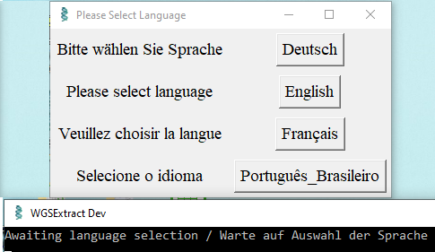
**Figure 1.1: Language Selection Pop-up and main Command Script area**

If you never see the above dialog, the tool will never properly start. Change the OS window focus to find this dialog pop-up as it may get hidden.


**Note**: *Starting in BetaV3, the language selection will be remembered and you will not be asked for it again.  Remove the file *`~/.wgseextract`* in your home directory to clear this and other saved settings; like your last used BAM file. Or adjust values in the program before exiting to change any stored values.*


Your available languages may vary depending on the source of your language file. Interface languages are easy to add.  See the [appendix on adding languages](#heading=h.2f2t7m4v739o) at the end of this document.

Shown just below the language selection pop-up in **figure 1.1** is the first line of the command script log window where you can follow actions of the program. This should always be available and provide a log of activity. If your OS installation did not support this window being created, you can force it by starting a Terminal / Shell and launching the **WGS Extract **program from there. On MacOS using Stage Manager, the Terminal window will be a separate item.


**Note**: *Starting in v4, you can run multiple copies of ****WGS Extract**** on the same machine.  The UI of each copy is still “blocking”. Meaning, you have to wait for a button click operation to finish before you can click again and get a response. So start another instance of ****WGS Extract**** to start another button operation.  Some buttons take time but consume few resources (CPU cores, memory or disk bandwidth).  Starting the 2nd instance will read in the current (stored) settings like the current BAM file.*


### 1.2.2 Main Window with Tabs

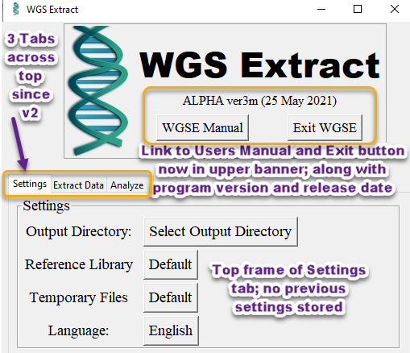
**Figure 1.2: Main Window banner and tabs**

After selecting the language, the main window should now appear. This window is shown anytime the program is running. The English version of this and all other windows is used in this manual. The window is active and accepting mouse clicks if no other pop-up dialog is shown.

The first thing to note about this main window is that there are Tabs across the top and just below the banner. The three tabs for the overlapping panes are named “Settings”, “Extract Data” and “Analyze”. The top half of the "Settings" tab is shown in **Figure ****1.2** above and is the default view when you start. Click on any tab to switch the main window view for that tab. A fourth tab labeled “DEBUG” may appear if you turn Debug Mode on.

The banner across the top is always visible in the main window.  Included there is a link to this manual.  As well as an indication of the program version you are running. The **Exit** button is there for convenience.  When a BAM / CRAM file is selected, the file name will appear in the banner so you are always reminded of what you selected when in the other tabs.

<div align="center">
   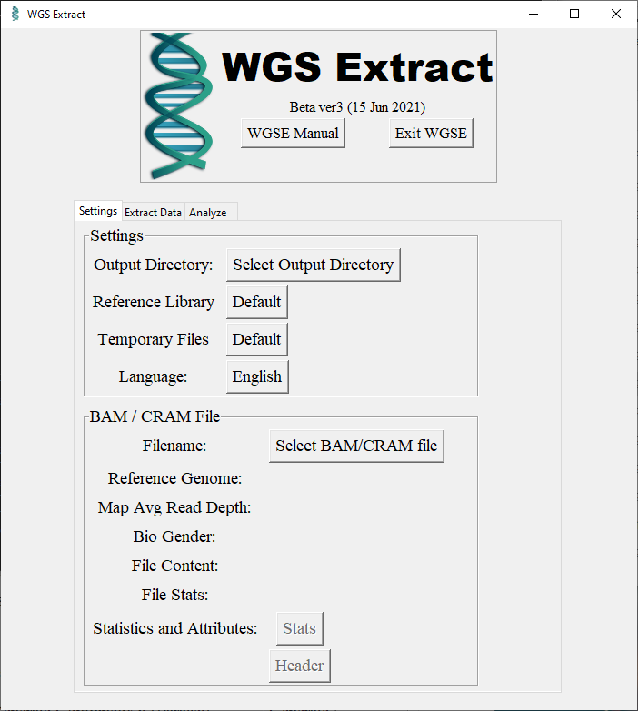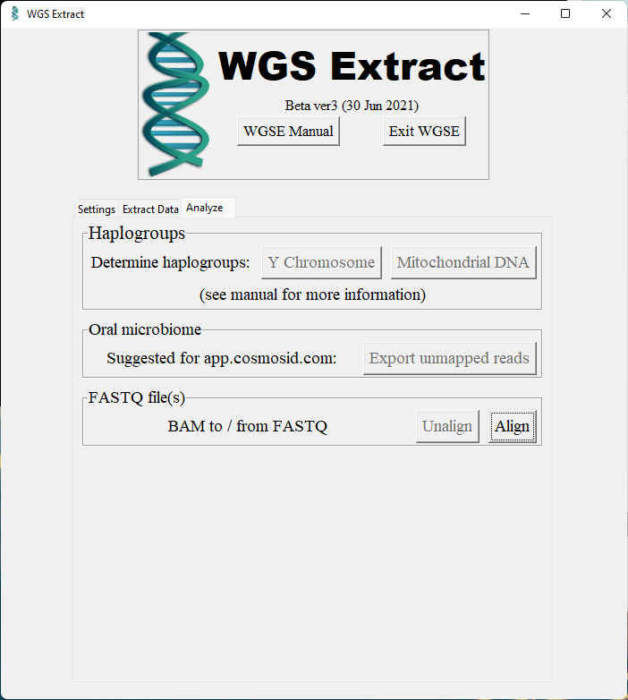
</div>
**Figure 1.3: Main Window with each of the three tabs shown**

Above in **figure 1.3** is a capture of each tab in the main window before having entered any other settings. Most buttons are grayed out until key button selections are made. Within each Tab are named Frames. Each Frame has one or more buttons and possibly some informative fields.


**Note**:* **if using the Chrome browser, an extension named **[Docs Image Zoomer](https://chrome.google.com/webstore/detail/docs-image-zoomer/cflcffjlkchkdaljonjmfljdfilfnhkm?hl=en)** allows you to click on an image in this manual and view it full screen. Otherwise, click, copy and paste -- or save the image -- to view the image larger with an external program. Each image above is repeated in a larger format in the individual sections on each tab below.*


### 1.2.3 Required Initial Order of Button Clicks

Specifying the **Output Directory** in the **Settings** frame of the Settings tab is required before anything else.  This is because even selecting a **BAM file** will create some output files from the initial analysis done while loading. Once the **Output Directory** is selected, the **BAM / CRAM file** selection and the FASTQ frame of the “Analysis” tab buttons will become available. Other settings can be set now or later, as desired. The **Output Directory** setting is saved between runs for convenience. 

A BAM or CRAM file must be selected after the **Output Directory** to enable most of the program features. Instead of specifying a **BAM file** directly, you can run an “**Align**”ment on a **FASTQ file** (available on the “Analysis” tab).** **The resultant new **BAM file **will then be automatically selected once created. This allows one to start with a **FASTQ file** if a **BAM file** is not available. Otherwise, the next step is always to specify a **BAM file**. There are some VCF file processing buttons available as stand-alone on the “Analysis” tab.

The **Stats** button function for Sorted and Indexed **BAM file**s is automatically run when a **BAM file** is selected; thus alleviating the need to click this third button. You will know when **Stats** has been run as some stats in the **BAM / CRAM File** frame are filled in.  But in other cases, you will have to run the **Stats** as a third button to enable the rest of the program buttons.


**Note**: *You **<span style="text - decoration: underline;">must*</span>* select the (1) ****Output Directory,**** (2) a ****BAM File ****<span style="text - decoration: underline;">AND*</span>* (3) click the ****Stats**** button **BEFORE most other buttons become available**. Hence why you see the grayed out buttons in the tabs of ****figure 1.3**** above.*


Once all three buttons are clicked (or automatically run), the other buttons in the program become available; as applicable. The **Stats** must be run as only then is basic analysis of the **BAM file** content done to understand what other buttons should be enabled. Clicking **Index **may enable an automatic run of the **Stats**. A **BAM file** should be sorted and indexed for all other operations.  So you may need to do that first; if not already done. A **CRAM file**, if specified and even if indexed, must have the **Stats** clicked directly. This is because it takes 30 minutes to run the **Stats** on a **CRAM file**; where it is instantaneous for an indexed **BAM file**.

Settings in the **Settings** Frame are saved as you exit the program.  The selected **Output Directory** and other **Settings** Frame values as well as the selected **BAM / CRAM File** are saved.  Next time you start the program, they will be automatically restored.  If **Stats** were run and the results are still in the **Output Directory**, the **Stats** button click will have been effectively saved and restored as well.  If a saved setting is no longer available when restarting, the setting is not restored. Most buttons store their results in the **Output Directory** and are much quicker to re-run if those result files are left there for the program to find. For example, the **Stats **button results are saved in the **Output Directory** and available immediately if that BAM or CRAM is loaded again. A CombinedKit file saved after running the microarray generator lets additional files be generated in a minute or less.

### 1.2.4 Operating Mode

The program is only ever in one of two modes.  Waiting for a button in a window to be clicked.  Or busy doing the action from a button click. If a button is visible but not clickable (the OS may report it is busy), then a button action must be in progress. Note that some buttons that are not applicable may be grayed out and are not available until a BAM allowing that function is loaded. For example, a BAM of a biological female will never have the yDNA processing buttons active.

When busy with the action of a button, a **Please Wait** pop-up will be somewhere on your desktop and give useful information about the command, the time it started, and how long it might take.  The variation in time to complete can be large due to the wide extremes of platforms the tool can run on. So if it is much longer than say 3x the stated time, likely something has gone wrong.  If you try clicking on the program window and it does not respond, likely there is a **Please Wai**t pop-up hiding somewhere.


**Figure 1.4: Example Please Wait pop-up**

#### 1.2.4.1 Main Windows

Beside the command script log window (mentioned earlier) and the Please Wait pop-up,  there are other windows that may appear. The main window already mentioned is the key one.  But there are other minor ones that, if there, supersede the main window for accepting button clicks. For completeness, here is a listing of all the windows that may be waiting for input at some point during program operation:

- Main window (as described above; with three tabs and an Exit button)

- Stats result window (with buttons to calculate more stats; as well as a Save and Close)

- Microarray RAW file generator select and initiate window

- Results windows (Y haplogroup, Mitochondrial haplogroup, Unmapped BAM creation, Header) which have Save and Close buttons

- OS File / Directory selection dialog for specifying a BAM / CRAM file, selecting VCFs and FASTQs and other special times

- Reference Genome selector (from in Settings Frame, BAM / CRAM File Frame, and the Align, Unalign, Realign button functions)

- General message dialogs (with OK or Close buttons)

- A missing reference genome request that allows you to answer YES, NO or CANCEL as to whether you want the program to load the missing reference genome, let you do it yourself while the program waits, or simply cancel the command.

Remember that the **Please Wait** pop-up is not a modal window and does not accept any button clicks.  But if visible, it may prevent you from clicking a button in the main window.

### 1.2.5 The Rest of this Chapter and the Manual

So we are done with the overview and introduction.  We will now cover each button in each Frame of each main window Tab in the rest of this chapter; starting with a top-level description for each Frame and Tab. Any general message dialogs not yet covered are at the end of this first chapter. More detail on complex functions follow in subsequent chapters. We end with the Installation chapter and then a final chapter on any known limitations, licenses, and suggestions for improvement.  A number of appendices follow these main chapters.

Let's look at each Frame within each Tab now.

## 1.3 Settings Tab

The main window Settings Tab actually consists of two distinct Frames.  The general program settings in the upper frame. And a BAM / CRAM file selector and its processing buttons in the lower frame. We showed just the top frame in Figure 1.2 above. Figure 1.5 below is the full Settings tab frame as if no run of the program has ever been performed (after a language has been selected). Let's look at each Frame separately.

### 1.3.1 Settings Frame

There are a number of settings you can specify here.  Some of which can be left alone if you do not modify the installation.  There are two settings in this frame that <span style="text - decoration: underline;">must always be set</span> before proceeding further.  The **Language **(which must be set before the main Window can even be shown) and the **Output Directory**.


**Figure 1.5: Settings tab  \
**(nothing selected nor any settings restored other than the language)

#### 1.3.1.1 Specifying the Output Directory

You can specify a location for generated output files via the **Output Directory** button.  It is mainly used to put ALL generated output and occasionally to read it back in.  It need not be your fastest storage area but should likely have upto 100 gigabytes of free space available.

Often you may want to choose a folder associated with your **BAM file**.  Maybe a folder below where the **BAM file** is stored. All files generated will be labeled by the **BAM file** base name. Thus you can use the same **Output Directory** for multiple, differently-named **BAM file**s.

Generally, you do NOT want to specify the **Output Directory** as the same folder where your **BAM file** is located. The **BAM file** folder should be treated like a read-only area to avoid accidentally deleting your source data. For example, if you load a BAM, change it to a CRAM that is put in the **Output Directory**, and then change the CRAM back to a BAM  -- you may end up overwriting your original **BAM file**.  So good practice is to keep your source files from the test company in a “read-only” area and all processed output files in a separate **Output Directory**. If the **BAM file** is a copy of the original, then having it in the **Output Directory** is likely OK.


**Note**: *There is one exception where a file is written to the original BAM / CRAM folder location.  A missing BAM / CRAM index file is created in the same folder as the BAM / CRAM file. Index files must always be in the same folder as the file they index. \
*

When you create a new **BAM file** from an old one (BAM to CRAM conversion, sorting a BAM file, etc.) then the new **BAM file** is placed in the **Output Directory** and the program switches to the newly created file for you.  This to help you verify it was created correctly. In this instance, the location of the selected **BAM file** now coincides with the **Output Directory**.  But as this is a derived file, this is not deemed an issue.  It is the source files from the WGS test company we are working to preserve and not delete.

You must set the **Output Directory** first.  That way, when you go to select your **BAM file**, the **Output Directory** is ready to immediately accept files. You must set the **Output Directory** before trying to **Align** a **FASTQ file** to create a **BAM File**. Or analyze a VCF file.

Make sure to keep the files in the **Output Directory** as it can save you time in the future.  For example, the `.csv` files from the more detailed stats runs can take an hour each to create. But the commands take less than a second if these files are still available. Similar for the CombinedKit from the Microarray file generator or FASTQ files created from unaligning.

#### 1.3.1.2 Overriding the Default Reference Library and Temporary File Location

There are two other directory location buttons in this Settings frame: the **Reference Library** and the **Temporary File** directories. Generally, you do not want to change the location of these directories.  They are located, by default, in the **WGS Extract** installation directory. 

If you decide to move them, this setting can be used to change where the program can find them. If you move them, the program cannot start without knowing where they are. *So start the ****WGS Extract**** program, move the directories in the OS, then update the setting in the program.* When you exit the program, the new location will be stored and used each time you restart the **WGS Extract** program.

The **Reference Library** area is shared with other users and programs. It occasionally must be written to (for example, to create the indices needed for the alignment program.)  The directory you specify as the new **Reference Library** must have the files moved there before selecting it with this setting. The **Reference Library** contains microarray target templates, liftover files, BED files, annotation files, reference genomes and other commonly needed reference files.

The **Reference Library** is needed for the bulk storage of <span style="text - decoration: underline;">human reference genome</span> assembly models and their related files.  20 - 30 GB is usually sufficient and it can be more read-only in nature;  like the original **BAM file** folder(s).  The genomes and associated files are in the genome sub-folder of the reference library

The WGS Extract Installer runs the Library command as the last step during a new installation. This **Library **command, which can be run directly by the user, is used to load **human reference genomes** into the **Reference Library** genomes sub-folder. The library command can download upwards of 20 GB from NIH and EBI websites and then runs a special processing script to properly format, index and collect the needed stats about each genome. Once setup, the directory is more static. (Except the alignment program will create an additional 5 GB of index files per reference model on demand.)

The **Temporary File** directory often needs 100 to 200 gigabytes of free space. It should be your fastest accessible disk. An SSD is often best.  You generally do not want to use a USB-attached or network disk for this directory.  This directory, along with the computer's memory, is used for temporary storage of large, uncompressed data files.  The program cleans out the **Temporary File** directory after every button execution completes unless an internal DEBUG_MODE is activated. The **Temporary File** directory should be empty to start. Note that each program invocation will create its own numeric sub-folder in the **Temporary File** directory. This allows multiple copies of the program to run simultaneously.

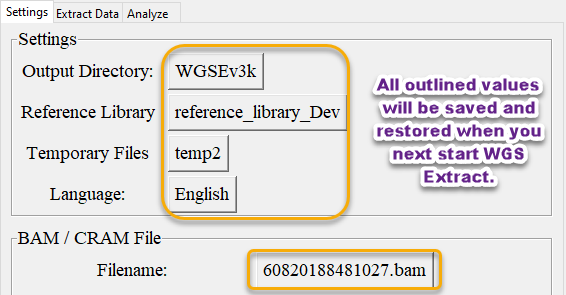
** \
Figure 1.5: Settings Tab, Settings Frame; \
**indicating current settings that will be restored on the next run


**Note**: *During heavy computations that do large amounts of file I/O, we have found that the Virus software kicks in to analyze the 100’s of gigabytes of data being generated in the file system.  This can slow the process down by 10-20%.  If you can, set the Virus detection to ignore the ****Temporary Files****, ****Reference Library**** and ****Output Directory****.*


#### 1.3.1.3 Multiple instances of WGS Extract Running

There are a number of operations that will not tax your desktop.  For example, most of the more detailed **Stats** commands can use only a single processor.  So you may want to run multiple instances of **WGS Extract** in parallel.  This release supports multiple copies of the **WGS Extract** program running in parallel and sharing the same **Temporary File** directory.

#### 1.3.1.4 Language Setting

We introduced the language setting dialog earlier.  There is an indicator of the current language setting in this settings frame that also serves as a language change button.  Clicking that indicator button will bring the language selection dialog back up. Once you change the language, the program window will update to reflect the new language.

Note that the language selection is for the User Interface only.  Not any of the command logs or file content themselves (except, obviously, for saved screenshots of output like BAM statistics or haplogroup analysis).

We are finished with the Settings Frame.  Note that all these settings will be saved on program exit and restored the next time you start.  Thus making it easier to get back where you were and restore the location of any moved installation folders. If you ever need to clear the settings, simply delete the file **.wgsextract** in your desktop account home directory. \
 \
Next on this main window Settings Tab is the BAM / CRAM File frame.  We will now cover that.

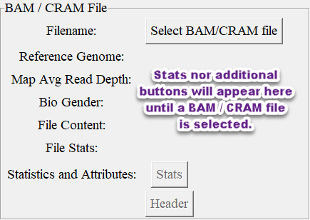
 \
**Figure 1.6: Clean start of BAM / CRAM File frame on Settings Tab**

### 1.3.2 BAM / CRAM File Frame

The next major Frame on this Settings tab is related to selecting a **BAM / CRAM file**, followed by some information about the loaded file, and then rows of buttons to operate on the chosen file. Buttons here are related to the **BAM file **itself and not the analysis or extraction of content from it for other purposes.  For example, statistical analysis to help verify the BAM is one of the buttons included here.  Buttons here are all related to characteristics of the BAM / CRAM file itself.

You **select a BAM** (or CRAM) **file** to be the source of most processing by other buttons.  We use BAM and CRAM interchangeably.  Either can be specified and used anywhere.  They are simply different compression formats of Sequence Alignment Maps (SAM) files and contain the same information. SAM files are created by aligning the FASTQs to a reference genome model.  FASTQs contain the DNA segments output by the sequencer.

The **BAM File** button is not available until the **Output Directory** is set. Figure 1.6 above shows the Frame before a **BAM File** has been specified but after the **Output Directory** is set.  Thus the **BAM File** selection button is available. Other buttons will appear and stop being grayed out (unavailable) once a **BAM file** is selected.

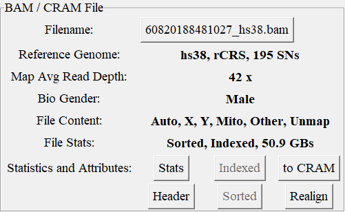
** \
Figure 1.7: BAM File frame in Settings Tab  \
**(after selecting a BAM file and the Stats are run)

After selecting a BAM file, the tool will immediately perform “quick” prep-work. For example, if the BAM index file already exists, the detailed stats will be gathered as if the **Stats** button was clicked.  Some of the stats will then be shown in this frame. Otherwise, without a BAM Index file or if you specify a CRAM file, then you will have to click the **Stats** button to run <span style="text - decoration: underline;">samtools idxstats</span>. The detailed stats are needed before we can enable other buttons here and in other tabs. An example of the frame after selecting an indexed BAM is shown in Figure 1.7 above.


**Note**: *You must select an ****Output Directory****,** a ****BAM file**** and run the ****Stats**** before other Tabs and their processing buttons become available. And even then, only applicable buttons will be made available. The ****Stats**** button is run automatically without displaying the results when selecting an indexed ****BAM file**** or any**** ****file** that had the ****Stats**** results already run and saved in the ****Output Directory****. If you ****Index**** a ****BAM file**** missing its Index, the ****Stats**** will be run automatically (when a BAM and not if a CRAM).*


More buttons in this **BAM File** Settings Frame become visible once a **BAM file** is selected. 

The selected **BAM file** name replaces the initial “Select” button.  Clicking on the selected **BAM file** name then allows you to select a different BAM (or CRAM) file to load.  Thus you can quickly switch between BAM files to compare and recall what each may contain. Stats runs are saved and results immediately loaded when available (or if an indexed BAM).

Another way to specify a **BAM file** is to select the **FASTQ Align** button (currently on the **Analysis** Tab described later).  This will create a **BAM file** that will be selected once created. Like the **BAM file** selector button, this **FASTQ Align** button is available as soon as you specify an **Output Directory**. They are the only two buttons enabled outside the Settings Frame after the **Output Directory** is specified. Only Settings Frame and Banner buttons are always available; even before the **Output Directory** is specified.

If there are any limitations detected when the **BAM file** is selected, a pop-up warning message will be presented that requires you to click an OK button to continue.  A common example may be if the BAM Index file could not be found.

Nothing can be done until a **BAM file** is (coordinate) sorted; most **BAM Files** are by default.  If that is your pop-up warning, you should **Sort** the **BAM File** using the button here.  Note that sorting the **BAM file** creates a new source **BAM file** which is then automatically selected.  You must remember to use this new **BAM File** put in your **Output Directory** going forward. As this is a derived file, it is placed and used from the **Output Directory** where other files reside.

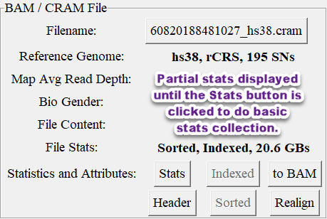
 \
**Figure 1.8: BAM / CRAM file frame in Settings Tab; CRAM file selected**

If you specify a CRAM file or the BAM Index file is not found, the summary stats will be mostly blank (as depicted in figure 1.8 above).  This is because it takes 30 minutes to gather the stats (with the IDXStats command) in these cases. Instead of immediately tying up your machine; the program delays this calculation until you request it by hitting the **Stats** button directly. 

Hitting the **Stats** button will run the 30 minute stats gathering, if not yet run. Otherwise, the idxstats previously generated and saved in the **Output Directory** is used to bypass the long run. Clicking the **Stats** button will always force the stats to be found or generated and then display the **Stats** results window. This is the only way to get the Stats result window.

The buttons here may cause a new BAM / CRAM to be created. If so, the newly created BAM / CRAM file is immediately loaded and replaces the originally selected file.  For example, if your **BAM file** was not sorted, after clicking the **Sort** button and waiting some time, your originally selected **BAM file **will be replaced with the newly created Sorted BAM. This automatic replacement does not occur with BAM files created from buttons in the **Extraction** Tab. Only by buttons here.

The **Indexed** and **Sorted** buttons serve as indicators of the state as well as buttons.  Meaning, if the BAM / CRAM is already indexed and / or sorted, the button will become inactive and greyed out.  The button text changes from the action (Index, Sort) to the state (Indexed, Sorted) as well.

The buttons enabled in other Tabs are dependent on the content of the **BAM / CRAM file**. For example, if you load a Y-only BAM (say the FamilyTreeDNA BigY-700 test result), then the Microarray file generation and mitochondrial extraction and haplogroup buttons will not be available. Only when the **Stats** are run and the File Content label shows what is in the file will appropriate buttons be enabled here and in other Tabs.

You do not have to supply a full 30x WGS **BAM File** to **WGS Extract**.  Maybe you specify a Y-only or a Y and MT BAM created from an earlier Extract Tab run. Or maybe you extracted an unmapped-reads **BAM File**. Loading a **BAM file** and seeing its stats can help remind you of its content. Other inputs can be the **BAM file**s supplied by FamilyTreeDNA from their BigY test. Whole Exome Sequencing (**WES)** test BAMs and similar. If FTDNA BigY, make sure to first “unzip” the file they supply. The BAM and it’s index (`.bai`) are grouped together inside a zip file when delivered.

Now let's further introduce each button in the **BAM / CRAM File** Frame.

#### 1.3.2.1 BAM Stats button

Version 3 has an expansion of data extracted from the BAM / CRAM file.  Additionally, no “long” runtime stats gathering is initiated without an explicit user button click.  Version 2 ran the idxstats command whether the BAM was indexed or not.  Now, this is delayed if the BAM is not indexed or a CRAM file is specified.  The idxstats command takes 30 minutes in those situations; not seconds.

For more detail on the stats shown in this BAM / CRAM File frame and the Stats pop-up window detail, please see the [next chapter on BAM / CRAM file stats](#heading=h.fpa690dqny1l). The stats are mainly to help you verify what is contained in the BAM, understand the likely quality of the BAM content, and related information.

#### 1.3.2.2 BAM Header

Just a quick, simple results screen to show you the content of the BAM (or CRAM) file header.  From that, you can likely see various commands used to create the BAM file.  As well as the required section of Sequence Names (SN’s) from the reference model that were used to align the read segments.  From the summary stats on the Settings Tab or the general stats results pop-up, you can see how many SN entries are shown in this header.  A Save (as a jpeg image) and Close button exist like other Results pages. The header is also saved as a text file in the **Output Directory**; whether you save the image of the window or not.


**Note**: The initial release may not have scroll bars created for the image of the header.  There is likely more content than can be displayed in the window. We are working to correct this universally across all platforms so you can always see the whole header.  You can always run the quick command yourself:  `samtools view -H your.bam > header.txt` . Or view the saved header.txt file in the **Output Directory**.


#### 1.3.2.3 Sort and Index buttons (or Sorted and Indexed if greyed out)

Most of the time, your BAM or CRAM will have its index file with it. And be coordinate sorted.  But sometimes you get a BAM file where the index is missing or the BAM is in the wrong sort order.  Each button is greyed out if the **BAM file** is already coordinate sorted and / or indexed; respectively.  The button is available to perform the function if not yet done.  You generally will never have to worry about this feature.  But if you lose the companion index file, you can recreate it here. The index file is only a few megabytes in size and placed with the original **BAM file**.

For almost all processing, the BAM / CRAM file needs to be coordinate sorted.  In fact, it has to be sorted to be indexed.  Coordinate sort means the segments are sorted by base-pair coordinates, forward-strand order.  Starting with position 1 in chromosome 1.  A very few cases require name sorting (each read segment has a unique name).  When name sorting is needed, this is done behind the scenes (and takes nearly an hour to complete). Creating a sorted BAM from an unsorted one creates a new BAM file name and index.  It is appropriately named with “`_sorted`” added to the original BAM file name and before the suffix. The Sorted BAM is automatically switched to within the tool for use in further processing.

The BGZF compression format was invented for coordinated sorted BAM files. It provides the sequence name (e.g. chromosome) and coordinate start - end position (range) of segments within each compression block. This allows the tool to quickly determine what is in each compressed block. Thus avoiding uncompressing the whole file to get a subset of information. BGZF is a Block-oriented GZ stream compression format.  It takes about 100K bytes of data at a time (block size), compresses it down to 64K bytes or smaller, and stores it in a standard block size for easy indexing and retrieval. Think of a long freight train.  Each box car has compressed data.  The manifest (index) tells you what is in each box car.

#### 1.3.2.4 BAM to CRAM, CRAM to BAM

Many people are fond of the CRAM format.  Mostly because it takes half the disk space of a BAM and yet holds the identical information.  So we make it convenient in the tool to use either one at all times.  And to convert from one to the other and back as desired.  Some tools cannot take in the CRAM format.  But we hide this complexity and accomplish what you ask anyway.

BAM and CRAM are just different compression methods of a SAM format file.  They hold the same information. So why use one or the other? \
 \
CRAM is ½ the size of a BAM and 1/10 the size of the original SAM file.  It achieves this extra level of compression through recognizing that each base-pair in a BAM file is the reference genome value 99+% of the time.  So it slices the SAM file vertically by base-pair and only stores the “different” values.  BAM is simply running standard compression on the horizontal, row order, line of each read segment in the SAM text file format.

The data is needed in row order (by segment) to process. So, in almost every case, to use a CRAM, a CRAM is internally converted back to a BAM/SAM and then processed.  So most commands take 30 minutes longer as they need to complete this conversion.  It is also critical that the exact same reference model be available to process a CRAM as was used to create the original BAM. Otherwise, the incorrect reference values for the alignment are used.

So use the CRAM file for longer term storage.  And BAM for current processing of multiple commands. Possibly, you can get rid of your FASTQ and VCF files as they can be created from the CRAM / BAM file.  At minimum, put them in a backing store with limited access. For any organization storing lots of 30x WGS results, they only store the CRAM file for each sequencing run.  You can only recreate the files if you have knowledge of the original pipeline used to create them.

If you load a BAM, the “To CRAM” button is enabled.  If you load a CRAM, the “To BAM” button is in its place.  When you convert from one to the other, the tool automatically loads the new file so you can check its stats and verify it is the same and was successful.

Any result window has the full file name, including its extension, to remind you which file was used.  As does the banner across the top. Only the file size and the time to utilize are generally affected by a CRAM versus BAM file selection.  As both files use the same base-name, and their content is the same, saved Stats files are utilized for both when either the BAM or CRAM is loaded. There is a lossy CRAM format but that is not employed here.

#### 1.3.2.5 To WES / Poz

A Whole Exome Sequence (WES) result is only 1-2% of the genome but is usually generated with a 120x average read depth for that area.  Dante Lab’s WGZ is a 30x WGS mixed with a 130x WES result.  This button will isolate that WES result.  A WES BAM is only a few gigabytes in size and thus much quicker and easier to handle.  The Exome has most of the known active genes and thus important tracked variants for health analysis.

Note that this extracted exome is only the primary sequences (chromosomes, mitochondria). And not any of the mapped alternative contiguous regions.  Often, 0.5 to 1.0 % of the SNPs are captured in the alternate contiguous sequences of a 1K Genome reference model.  So you may not get as many variants from the extracted WES file as you would from the original BAM file; even if a WES test result..  Nonetheless, a WES file can be useful to some.  A WES region only BAM  file has no use in genetic genealogy. A microarray file should not be created from it. This button will likely rarely be used.


**Figure 1.9 Understanding the chrY Exome (dark blue) and Haplogroup (green) regions**

When a Y (or Y and MT)  only BAM is loaded, all references to WES in the buttons, labels and reports are instead identified as “Poz” to clearly delineate what BED file is being used.  The Coverage WES button is also modified in this way.

Poz labeled buttons use a special defined BED region on the Y. This region is larger than the exome region and defines where significant SNPs for age analysis in haplogroups are drawn from, This special Y BED is created from merging the CombBED, McDonald and Poznik regions. These special regions in the Y are not the only place to find stable SNPs. It only represents around 12 million of the 23 million base pairs in the Build 38 model, for instance. For more information on each region, see [CombBED](https://www.researchgate.net/publication/273773255_Defining_a_New_Rate_Constant_for_Y-Chromosome_SNPs_based_on_Full_Sequencing_Data), McDonald (1, [2](https://pubmed.ncbi.nlm.nih.gov/34200049/)) and [Poznik](https://www.biorxiv.org/content/10.1101/088716v1) and figure 1.9.

#### 1.3.2.6 BAM Realign

This button will take your current BAM and realign it to the companion "build" reference genome model of the same class.  So Build 37 to Build 38.  Or Build 38 to Build 37.  If you recall, microarray files and most health sites are best generated from a Build 37 BAM file.  Y haplogroup and advanced medical analysis is best from Build 38. So this lets you generate the other BAM file based on the model you do not have.

| &nbsp;&nbsp;&nbsp;&nbsp;&nbsp;&nbsp;&nbsp;Build <br> Class&nbsp;&nbsp;&nbsp;&nbsp;&nbsp;&nbsp;&nbsp;  | Build 37 | Build 38 |
| :--- | --- | --- |
| UCSC / HG | hg19 * / hg37 | hg38 |
| 1K Genome | hs37d5<br>human_g1k_v37 | hs38<br>(aka GCA_*GRCh38_no_*set)<br>hs38DH *<br>(aka GRCh38_full_analysis_set_...) |
| EBI / GRCh | Homo_sapiens.GRCh37 | Homo_sapiens.GRCh38 |

**Figure 1.10: Companion Reference Models**

* hg19 with a Yoruba model will always be taken to the hg38 rCRS model.  hg38 will always be taken to what we label here as hg37 with the rCRS mitochondrial model.  hs38DH will always be taken to hs37d5. And hs37d5 to hs38. All T2T variants will be taken to the T2T v2.0 final.  The T2T final will be taken to Build 38 hs38. There is no way to get to a T2T model with Realign.

At the current time, you do not have a choice of which reference model to realign too. The tool will automatically choose the “companion” reference model as shown in figure 1.10. If you need to realign to a different reference model than the companion shown, then use the **Align** button in the **FASTQ frame** of the Analysis Tab. If you do not have the **FASTQ file**(s) to start with, first use the **Unalign** button to create the FASTQ file(s) from the BAM file loaded.

There are no options for this button.  Once clicked, the program immediately starts the long process of realignment.  Often ½ a day to 6 or more days.  More details are given in the [special chapter on Unalign, Align and Realign a BAM](#heading=h.cvx45pf9ifec).

## 1.4 Extract Data Tab

The various extraction programs are all grouped together in an “Extract data'' tab.  Each is described further below.

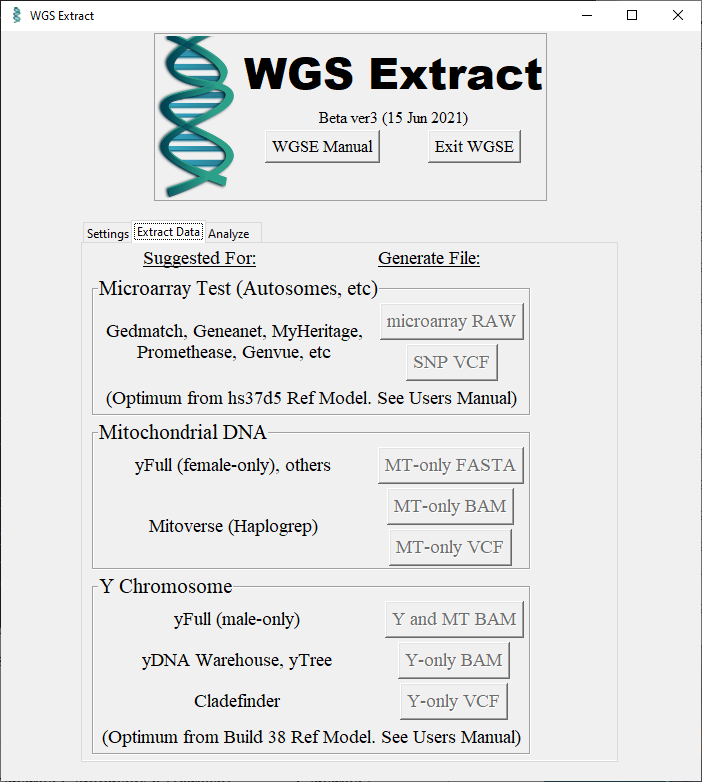

**Figure 1.11: Extract Data Tab from Main WIndow**

If no buttons are clickable (greyed out as shown), you need to go back to the “Settings'' and specify an **Output Directory. **Then in the** BAM / CRAM File **frame, you need to select a file and possibly clock the **Stats** button. Once done, only buttons for content available in the BAM will be enabled. If the “Y-only BAM'' button is not clickable (greyed out), then likely the program has determined this is a gender Female sample file and has no Y chromosome values to generate. If a Y-only, mtDNA-only or unmapped-only BAM, then the “Microarray RAW” button will be greyed out.

Let us cover each Frame of buttons next. Starting with the top Frame on Microarray Test (Autosomes) generation.

### 1.4.1 Microarray Test File Generation (Autosomes, etc)

When you click on the “**Generate files in several autosomal formats**” button in this tab, you get the following new dialog box shown below. 

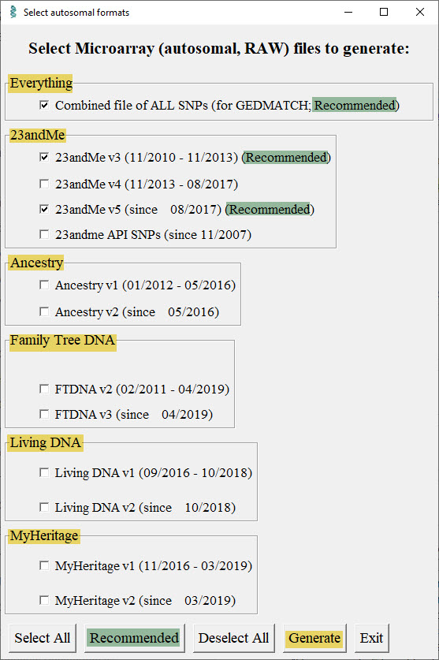

**Figure 1.12: Microarray File Generator pop-up window**

Select which options you want to generate.  The default when you open is the 3 recommended formats shown in green: Combined File, 23andMe v3, and 23andMe v5. A separate RAW data file will be generated for each box selected. Once you select at least one option, the “Generate” button will become active to allow you to initiate the file generation.  Click “Select All” to select everything. “Deselect All” to clear everything selected.  And click “Recommended” to get back to the initial three formats that were checked at the start.

Otherwise, if not wanting to generate anything, simply close the window (hit the ‘x’ in the upper right or the Close button) to return to the main program screen.

This option generates the microarray RAW data files (pseudo, simple VCF or TSV) as provided by the major [genetic genealogy](https://h600.org/wiki/Genetic+Genealogy) test vendors ([23andMe](https://23andme.com/), [Ancestry](https://ancestry.com/), [FamilyTreeDNA](https://familytreedna.com/), [LivingDNA](https://livingdna.com/), and [MyHeritage](https://MyHeritage.com/)). The output files are read in by many of the above companies as well as 3rd Party sites such as [GEDMatch](https://gedmatch.com/) and [Geneanet](https://en.geneanet.org/); or tools such as [DNA Kit Studio](https://dnagenics.com/dna-kit-studio/). Additionally, many health analysis sites also take in microarray RAW data files ([promethease.com](https://promethease.com/), [nebula.org](https://nebula.org/), [mthfr-genetics.co.uk](https://mthfr-genetics.co.uk/), [genvue](https://genvue.geneticgenie.org/), [selfdecode](https://selfdecode.com/), [genetic lifehacks]( https://www.geneticlifehacks.com/) and so on).


As to which option(s) you select, well, that is a longer discussion and [given in more detail in a later chapter](#heading=h.3gz6h240qhpl) so as not to clutter up the introductory tutorial here.  In quick summary, “CombinedKit” can only be used at [GEDMatch](https://gedmatch.com/) and [Geneanet](https://geneanet.org/).  Whereas 23andMe v3 and v5 are the best, most accepted files with all the other sites that allow import. Merging your v3 and v5 files via [DNA Kit Studio](https://dnagenics.com/dna-kit-studio/) can be helpful with some of those sites.

Not all vendors can read all the file formats from all the companies.  You have to experiment to see what works.  We have a table below to show you what works and how well.

<table>
  <thead>
    <tr>
      <th> Test File to Create → </th>
      <th> Combined </th>
      <th colspan="4"> 23andMe </th>
      <th colspan="2"> Ancestry </th>
      <th colspan="2"> Family TreeDNA </th>
      <th colspan="2"> Living DNA </th>
      <th colspan="2"> My Heritage </th>
      <th> Nat Geo Geno (TBD) </th>
    </tr>
    <tr>
      <td>Import Site↓ </td><td> vE </td><td> v3 </td><td> v4 </td><td> v5 </td><td> vE </td><td> v1 </td><td> v2 </td><td> v2 </td><td> v3 </td><td> v1 </td><td> v2 </td><td> v1 </td><td> v2 </td><td> 2+ </td>
    </tr>
  </thead>
  <tbody>
   <tr><td> FTDNA </td><td> 🆇 </td><td> ✅ </td><td> ☑ </td><td> ✅ </td><td>  </td><td> ☑ </td><td> ☑ </td><td> 🆇 </td><td> 🆇 </td><td> 🆇 </td><td> 🆇 </td><td> ☑1 </td><td> ☑1 </td><td> 🆇:2 </td></tr>
   <tr><td> LivingD </td><td> 🆇 </td><td> ✅ </td><td>  </td><td> ✅ </td><td>  </td><td>  </td><td>  </td><td>  </td><td>  </td><td> 🆇 </td><td> 🆇 </td><td>  </td><td>  </td><td> 🆇:2 </td></tr>
   <tr><td> MyHerit </td><td> 🆇 </td><td> ✅ </td><td>  </td><td> ✅ </td><td>  </td><td>  </td><td>  </td><td>  </td><td>  </td><td>  </td><td>  </td><td> 🆇 </td><td> 🆇 </td><td> 🆇:2 </td></tr>
   <tr><td> GEDMat </td><td> ✅ </td><td> ✅ </td><td>  </td><td> ✅ </td><td>  </td><td>  </td><td>  </td><td>  </td><td>  </td><td>  </td><td>  </td><td>  </td><td>  </td><td> 🆇:2 </td></tr>
   <tr><td> Genea </td><td>  </td><td>  </td><td>  </td><td>  </td><td>  </td><td>  </td><td>  </td><td>  </td><td>  </td><td>  </td><td>  </td><td>  </td><td>  </td><td> 🆇:2 </td></tr>
  </tbody>
</table>
✅: Recommended, Supported, ☑ Supported, 🆇:Claimed no support,  🆇: NOT Supported^ ^

**Figure 1.13: Microarray File Compatibility for Different Import Sites**

^1^ According to [FTDNA Documentation](https://learn.familytreedna.com/imports/autosomal-transfer/family-tree-dna-family-finder-transfer-program/), they only accept MyHeritage files within 6 months of the test result creation. We suspect this is because FTDNA is the laboratory of MyHeritage and they are not accepting file imports from MyHeritage unless they find it on their internal server.

^2^ FTDNA historically only imported NatGeo Geno yDNA results, because FTDNA was the lab performing the test. FTDNA nor others have ever accepted the Autosomal results from Geno+ (aka Geno NextGen) tests directly.  But it can be imported if you very slightly edit to the Ancestry microarray file format. See the [additional information available](https://h600.org/wiki/Microarray+File+Formats).

Generally, 23andMe v3 and v5 RAW data files can be read by all other sites that accept result files. 23andMe v3 is 50% larger and covers over 900,000 SNPs compared to most of the other formats and files.  There is [additional information available on these various formats](https://h600.org/wiki/Microarray+File+Formats).

Oddly, sites will <span style="text - decoration: underline;">NOT</span> accept their own format (which would be optimal to match against people who natively tested at that site). Ancestry and 23andMe do not allow import of any external test result files and are the largest test databases; and hence generally accepted by everyone who accepts imports. You will have to test with them directly to get into their match databases.


**WARNING****:** ***WGS Extract**** **maps SNP variants** but **<span style="text - decoration: underline;">NOT InDel*</span>*’s (Insertions / Deletions) as extracted from the BAM into a microarray file.  A few to seven thousand InDels exist in each microarray file (less than 0.5%)  InDels are not used by the Genetic Genealogy companies but are used in medical diagnosis. A future release should properly call and include InDel’s. In v2, all supplied positions were treated as SNPs and ATCG values emitted for them; not I or D. There are over 22,000 InDels in the CombinedKit file which has over 2 million SNPs.*


We have found that starting with a hs37d5 (Build37) reference genome based BAM yields the greatest accuracy to generating the microarray format files. The tool will use whatever BAM and reference model it is provided and do the best it can with it. A pop-up warning is presented if starting with anything other than an hs37d5 mapped BAM file.

If supplying a Build38 reference model mapped BAM, the tool uses **(Py)Liftover** to convert the coordinates of called SNP variant values to Build37. Build37 is what the microarray test file formats are defined in.  This liftover operation only takes a few minutes and causes the loss of 500 or so values (out of 600,000 or more) due to unmappable regions between Build models.

The tool takes about an hour to generate an initial CombinedKit file from the BAM -- it performs a pileup, then variant calling followed by an extraction. The tool then takes about 2 minutes for each file format selected beyond the CombinedKit. The CombinedKit file is then destroyed if you did not select that as one of the delivery formats.

If the tool finds a CombinedKit file in the **Output Directory** (that is newer than your BAM), it will start with that and generate any selected file in minutes.  So we suggest you always generate a CombinedKit file initially and leave it in your **Output Directory**.


**Note:** *All sites accept the X chromosome information as part of the “Autosomal” import, segment creation and matching.  No genealogy site processes the Y nor Mitochondrial info in the file format. There are sites to analyze the Y and mitochondrial info in a microarray format file though.  So we make sure to include it as if you tested with that vendor. **[Cladefinder.yseq.net](https://cladefinder.yseq.net/)** is one such site that will read your Y SNP values and report on the deepest haplogroup found using the current yFull tree.*


~~To further improve performance, the tool will attempt to run jobs in parallel on your platform when doing the pileup and variant calling; and then merge the results.  This will max out your available resources.  Parallelizing has caused the runtime to drop from an hour to 5 minutes for 16 core desktops.~~*It was determined, with further testing, that upwards of 20,000 values were called incorrectly with the parallelization.  Showing that the alt-aware hs37d5 model is useful in the bcftools variant caller.*

The next Frame is covering Mitochondrial DNA.

### 1.4.2 Mitochondrial DNA Processing

The main function here is to create a mitochondrial FASTA file from the aligned BAM content. This file is simply a single segment of the whole 16K+ base-pairs found in the mtDNA. The FASTA file can be imported to many other mtDNA sites and is the more universal, complete way to specify the mitochondrial sequencing results; although still dependent on an underlying genome reference model.  FASTA-style formats are common for Final Assembly genome reference models.

Sites that accept the mitochondrial FASTA file are:

- James Lick’s [mtDNA Haplogroup Analysis](https://dna.jameslick.com/mthap/) \
(looking for no mismatches, most matches, and least extras)

- Dr. Ian Logan’s [mtDNA resource](http://www.ianlogan.co.uk/mtdna.htm) and [GenBank assistance](http://www.ianlogan.co.uk/checker/genbank.htm)

- Haplogrep v2 online at [https://haplogrep.i-med.ac.at/app/index.html](https://haplogrep.i-med.ac.at/app/index.html)  \
(use open in upper left)

yFull also accepts mtDNA data for processing and placing in their mtDNA phylogenetic tree. But they prefer a BAM file input.  Currently there is no button to generate an mtDNA BAM although it is being generated in the tool as a temporary file (see Other / Haplogroups / Mitochondrial). We hope to add the BAM button option here in the near future. And learn to recognize if it exists and simply use it in other places where needed. Once mtDNA BAM files can be saved, it can be used as a quick source to generate a FASTA. A combined mtDNA and Y BAM can be created below.


**Note:*** Previous versions could only process the mitochondrial DNA of the BAM that was in the specific rCRS format (typical of Build 38 and 37 BAMs). Originally, Dante Labs used a bioinformatics pipeline that puts out the mtDNA alignment using the Yoruba model  As of the Beta v2 release though, the tool can adapt appropriately to handle either reference model. It generates the FASTA in whatever format has been supplied in the BAM. So a Yoruba source model yields a Yoruba FASTA.*


The last Frame is on Y DNA processing.

### 1.4.3 Y-DNA Processing

The main function here is simply to create a subset of your BAM that contains only the specified DNA reads.  This is to dramatically reduce the size of the BAM to make it easier to upload to the other site(s).  Otherwise, you often have to put your 40+ GB full BAM on some 3rd party file site that allows a URL to be generated and given to the upload site. The full BAM often exceeds the size provided with free online storage services (for example,Google Drive gives 15 GB free with any gmail account). An extracted Y and MT BAM is less than 1 GB.

There are 3 different buttons available:

1. Generate a Y and Mitochondrial only BAM (for use at yFull)

2. Generate a Y only BAM (for use at yDNA-Warehouse or other sites that only need a Y BAM)

3. Generate an annotated Y VCF file for use at yFull in lieu of a BAM, with Cladefinder.yseq.net (see haplogroup section later here) or similar.

[yFull](https://yfull.com/) has both a Y and MItochondrial phylogenetic tree of haplogroups. [FamilyTreeDNA](https://familytreedna.com/) had traditionally been the site for both Phylogenetic trees as they offered the most extensive tests available before WGS became practical. But you now have the option of this at yFull as well. Hence the extraction of both into the same BAM; even though under this Y DNA section.

The [yFull.com](https://yfull.com/) site is quickly becoming the premier site for Y haplogroups and phylogenetic tree development.  yFull not only accepts any WGS and BigY BAM file results, but has incorporated many results from researchers testing ancient DNA samples.  This has led to the discovery of a large number of new SNPs over the last few years from the combining of more WGS BAMs than from any particular test lab.  While [FTDNA](https://familytreedna.com/) is still the largest Y phylogenetic tree and deepest branching in many areas (due to the largest test base), yFull has many unique branches due to this import-from-anywhere capability.

[yFull](https://yfull.com/) and [Dante](https://dantelabs.com/) announced an arrangement where [yFull](https://yfull.com/) can go grab your BAM file directly from Dante. But nothing has ever appeared to implement this.  Hence, the need for this tool.

[ySeq.net](https://yseq.net/) and [yFull](https://yfull.com/) have a working arrangement.  So any BAM processing (or WGS test result) done at yseq can be directly uploaded to [yFull](https://yfull.com/).  But using the **WGS Extract **tool to create a subset file here makes it easy to upload your needed data to [yFull](https://yfull.com/) using any free online cloud storage service. So you can either use ySeq’s service or simply roll your own here.

[Nebula Genomics](https://nebula.org/) and [FamilyTreeDNA](https://familytreedna.com/) have announced an arrangement where [Nebula Genomics](https://nebula.org/) WGS 30x results (only) can be grabbed directly and imported into [FTDNA](https://familytreedna.com/) accounts.  This is expected to include SNPs extracted from the BAM for Autosomal (FamilyFinder), mitochondrial, and Y.  The import of Y is expected to behave like the National Geographic Genographic import of 13,000+ Y SNPs before or possibly a native BigY test.  So SNPs will be available to project managers and give you a deep haplogroup there. Access to the BigY tree and tools may be added for a separate fee. This has yet to become a reality as well.


**Note:** *[Dante Labs](https://dantelabs.com/)** delivers a Build37 model BAM.  But **[yFull](https://yfull.com/)** works much better with a Build38 model BAM for Y. It is best to convert your BAM to Build38 before doing the Y extraction supported here. That is, supply a Build38 BAM to this tool instead of the **[Dante Labs](https://dantelabs.com/)** delivered Build37 one.*

*[Nebula Genomics](https://nebula.org/)** delivers BAMs in a Build38 model format already.  We utilize the “liftover” function to Build37 to make the Microarray extract tools work on them directly. But in a similar fashion, creating a Build37 model BAM for microarray generation is the most desirable method to use.*


The [y-DNA Warehouse](https://ydna-warehouse.org/) site is the gateway not only to [James Kane’s Haplogroup-R](https://haplogroup-r.org/) where it spun out of but also to [Alex Williamson’s Big Tree at yTree.net](https://ytree.net/) of R1b-P312 and below.  (note: *Alex has announced a possible scaling back of his Big Tree effort as he has not been able to keep up with the explosion of SNPs discovered with BigY-500, BigY-700 and WGS test results.*) The [y-DNA Warehouse](https://ydna-warehouse.org/) is working on their own full phylogenetic Y tree now as well. A Y BAM extracted from here can be uploaded directly there.

A Y DNA VCF could also be generated (actually, more easily) by a simple subsetting of the existing VCF.  But at the current time, WGS Extract does not know how to request and store a VCF file internally; only SAM / BAM / CRAMs.

## 1.5 Analysis Tab

Currently there are two categories of commands on the Analyze tab of the main program window.  Each is described separately below.

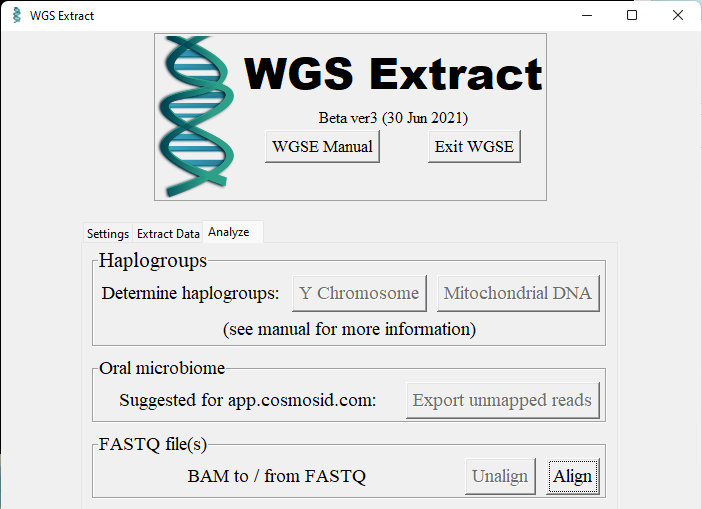

**Figure 1.14: Analyze Tab from Main WIndow**

Part of the v2a minor update saw major changes in the Analysis (then called Other) tab functionality.  The “Check BAM file” was expanded to include the RAW total gigabases number. That which is used to check if Dante Labs met their stated deliverable for 30x WGS tests.  The Y-DNA Haplogroup tab now works on Win10 systems.  And has been enhanced on all systems to go deeper in the ISOGG tree.  Often to the leaf nodes.  Finally, a new “Oral Microbiome” option is added to simply create a BAM file of all the unmapped (to the human genome reference model) portions of the FASTQ/BAM file read segments.  Suitable for submission to sites like cosmosid.com and mg-rast.org.

### 1.5.1 Haplogroups

Often you will submit your Y and mtDNA BAM to [yFull.com](https://yfull.com/) or similar to have your Haplogroup determined and your placement made in their Phylogenetic Tree of Haplogroups.  We have incorporated some haplogroup calling software in **WGS Extract** to enable a quicker, more streamlined call.  The two tools are:

1. [Haplogrep](https://haplogrep.i-med.ac.at/) v2.4.0 from the Medical University of Innsbruck, Austria; and

2. [yLeaf](https://cluster15.erasmusmc.nl/fmb/Yleaf_v2/index.html?lang=en)  v2.2 from the Erasmus Medical center Department Genetic Identification, Netherlands

for the mitochondrial and Y DNA Haplogroup determination; respectively.

Note that the software and its database used here may not be as up-to-date as the dedicated services mentioned earlier in the **Extract Data** section. Haplogroups and the trees can be changing hourly every day.  So use this result as a quick and dirty approach to see the result and verify your BAM file is correct.  But a haplogroup should be confirmed with more in-depth, recent tree tools like [yFull.com](https://yfull.com./) or mitomap using the **Extract Data** section output.

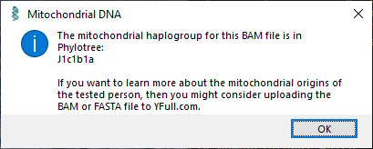
 \
**Figure 1/15:** **Example output from the Mitochondrial DNA Haplogroup Caller**


**WARNING**: *The “mitochondrial DNA” Haplogroup tool is based on **[Haplogrep](https://haplogrep.i-med.ac.at/)** and requires a Java 8 release to be installed. The installer works to assure it is available.  But the system may simply error (in the command script menu) and seem to hang (with the Waiting pop-up never going away) if an older, incompatible release of Java is installed on your system. A fix we hope to get in the next update to check that a compatible release is installed before attempting to execute the command.*


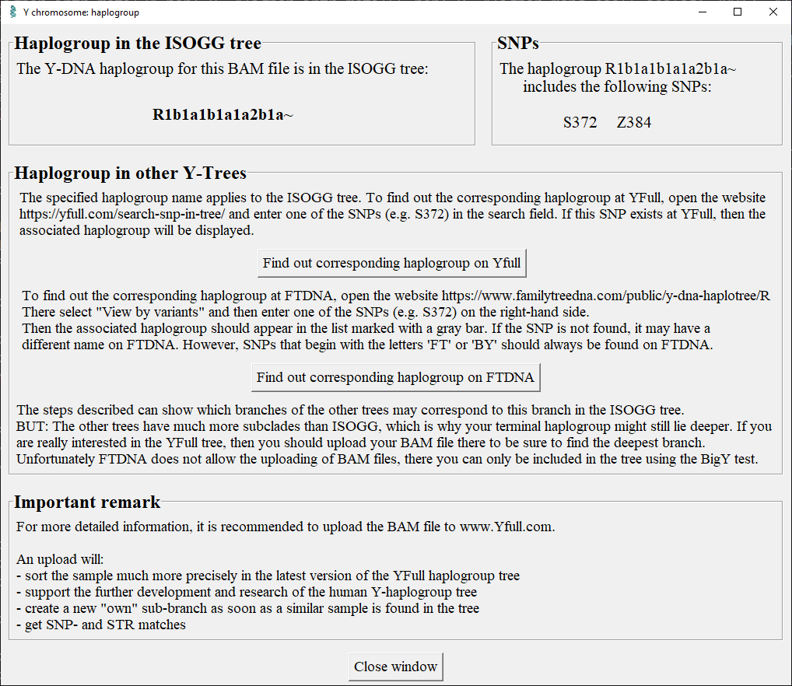

**Figure 1.16**: **Example output from the Y Haplogroup caller.**


**Note**: *none of the text giving the Haplogroup, SNPs or URLs is written in a form that is selectable to copy and paste as text (in fact, no window in this program).  You have to retype any text in other tools or pages.  This will hopefully be fixed in a future release. For now, here are those URL’s from the above window (obtained by clicking on the buttons also):*

- *https://yfull.com/search-snp-in-tree/*

- *[https://familytreedna.com/public/y-dna-haplotree/](https://familytreedna.com/public/y-dna-haplotree/)** followed by the letter of your main branch*


So the first thing to notice in the Y Haplogroup results is that the ISOGG Y Tree is still using the YCC Long Hand haplogroup format names.  Whereas most other sites (FamilyTreeDNA, yFull, etc) are using the YCC Short Hand names based on an SNP in the haplogroup.  Next, the list of SNPs in the haplogroup is not complete.  Some haplogroups have tens to a hundred or more SNPs.  So not all the SNPs are displayed.

We go into much more detail about these result windows in a [dedicated chapter on Haplogroups](#heading=h.zevgdxxblkw5) later in the document.

### 1.5.2 Oral microbiome

Basically, this command will extract the unmapped reads from your BAM file.  Those marked as “asterisk” for the chromosome (or model designated area).  It is a simple Samtools command to do this: “samtools view  <your BAM>.bam -b -O ….  But this program takes it a step further and converts the BAM back into the paired-end FASTQ files of these unaligned / unmapped read segments. These files are suitable for upload to sites like [CosmosID.com](https://app.cosmosid.com/) (paid service but free trial) and [mg-rast.org](https://mg-rast.org/). This is new to version 2.

The command takes a few minutes to an hour to run; depending on how much of your original BAM is mapped to the Human Genome.  Once done, a pop-up similar to the below appears. The URL given in this pop-up is embedded as a link [here](https://app.cosmosid.com/).

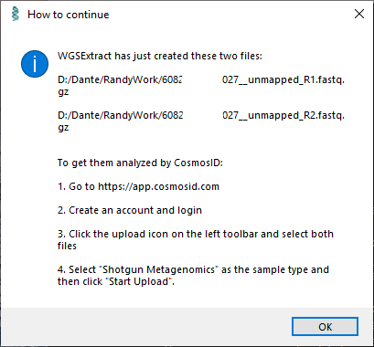

**Figure 1.17: Example Pop-up from the Unmapped Reads BAM button**

WGS result files generally will have 90 or more percent of the sequenced DNA mapped to the Human Genome Reference Model.  Sometimes as high as 98%.  That remaining unmapped DNA is often attributed to bacteria. Likely in your mouth when your spit sample was taken. Not any gut bacteria or similar within the bloodstream. Hence the title “oral microbiome”.

The goal here is to extract a BAM of just these unmapped reads, which is often significantly smaller, to then pass to other tools to align and map to other DNA reference models. The size of the resulting files depends on the mapping percentage of your original BAM file. The higher your sample mapped to the human genome, the lower the amount of unmapped read segments contained in this file.

If you have a low mapping rate; especially one at 60% or lower, then the resultant FASTQ files may still be very large.  Take this into account when manipulating and submitting the result to another site. (If you have a low mapping rate, the output of many functions of this tool are in question. You should seek to be re-sampled and re-sequenced.)

Note that the FASTQ file is unmapped and no longer dependent on a reference model. But, as these are the unmapped segments in the BAM, there really is no difference. So a simpler and much quicker option is to generate an unmapped-only BAM; cosmosID accepts it just as easily and it is the same size as the FASTQ files: This will be added as a preferred option in a later release.

When the author first learned of these tools he had a good laugh. His focus is on genetic genealogy which commonly promotes the ad-mixture (ethnicity) aspect of DNA testing.  The tools targeted to use these unmapped BAM files are basically providing the ad-mixture (ethnicity) for your symbiotic bacteria in your mouth.  Joking aside, the need for this analysis is a serious search for a possible source of illness with some taking a WGS test.

### 1.5.3 FASTQ File Operations

This is currently a catch all for FASTQ file processing until we get a more general Kit Library function that remembers Kits of related FASTQ, BAM and VCF files.  The Frame now has four buttons: **Align**, **Unalign**, **Fastp** and **FastQC**.  The first two buttons existed internally to implement the **Realign** button in the BAM file section.  By bringing them out here, we allow the user to specify the parameters for **Align** independent of the simple **Realign** with no parameters. The **Unalign** and **Align** buttons are described in more detail in the special [chapter on Unalign, Align and Realign](#heading=h.cvx45pf9ifec). \
 \
**Fastp** and **FastQC** are FASTQ file analysis programs. In general, you will not need to run them as most modern WGS sequencing pipelines assure good quality sequencing results.  We provide them as a further aid for quality checks, just in case.  Each tool creates an HTML file as the primary output which is then displayed once created.  If previously created HTML files, the button simply opens the displayed file for you in your browser.  See the documentation on the Fastp and Fastqc tools for more information on their output.


**Note**: The FastQC tool actually does separate runs on paired-end FASTQ files.  We use the MultiQC tool to merge the two FastQC result files into one report (results graphed on top of each other).  The [Fastp](https://github.com/OpenGene/fastp), [FastQC](https://www.bioinformatics.babraham.ac.uk/projects/fastqc/) and [MultiQC](https://multiqc.info/) tools are powerful with many options.  See the user documentation linked in the above for more information.  [Fastp](https://github.com/OpenGene/fastp) is a compiled binary available in the command line from the path variable. [FastQC](https://www.bioinformatics.babraham.ac.uk/projects/fastqc/) a java program available via a perl start script. And [MultiQC](https://multiqc.info/) a python library available in the python/Scripts directory for direct execution..


The **Unalign** button requires a BAM file be previously selected before it is available.  The other buttons are available once an **Output Directory** is specified. And will request the name of a FASTQ File(s); if not automatically determined from a selected BAM file.


**Note**: use the new **Unselect** button in the BAM File frame to remove a selected BAM file and any associated FASTQ files.  This will then allow these buttons to request specific FASTQ file(s) from the user.


### 1.5.4 VCF File Operations

With this v4 release, we introduce the VCF file generation and manipulation buttons in their own frame.  Initially, just an SNP VCF generator along with an Annotate VCF button.  The SNP VCF file will be generated with annotation.  The Annotate VCF button will query the name of a VCF file to add annotation too. Most WGS tool providers give you unannotated VCF files. Eventually, an InDel VCF button should also become available. See the [Annotating VCF Files](https://bit.ly/346Z84M) doc for more information on benefits of annotating VCF files. \
 \
The Y DNA section has a button for VCF generation that includes annotation.  That button useless the yBrowse database to annotate.  Whereas here, the focus is more on gene, dbSNP rsID, and gene effect annotations.  The microarray generator also is doing a VCF generation behind the scenes. But that targeted, limited VCF is only retained in the form of a CombinedKit TSV file.

## 1.6 DEBUG mode Tab

WIth version 4, we have moved a normally hidden DEBUG mode frame from the Analysis tab to its own, separate DEBUG tab.  This tab will only be visible when DEBUG_Mode is turned on.  All further description of DEBUG_mode and the content of this Tab is in the [appendix on the DEBUG_Mode](#heading=h.xecb9pylfnas).  Only turn this mode on if requested by a developer or you have a special interest in one of its offered buttons. We only mention it here for completeness.

## 1.7 General pop-up’s

Some additional basic pop-ups that will occur during processing are mentioned here. We already introduced you to the language selection pop-up.  Lets cover a few more including the underlying, always there, command line window.

The pop-ups, in general, will deactivate the main dialog window while open. (As do various result windows that may come but are explained under each command.)  Some await a response to continue.  The Please Wait will disappear once the action is completed.

### 1.7.1 Please Wait

There are many commands. Some may take a few seconds, others a few minutes, some an hour or even a day or more. When such a command is started, the main program window is deactivated and a pop-up Please Wait similar to shown here appears:

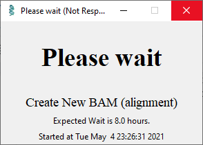

**Figure 1.18: Please Wait processing mode pop-up**

The pop-up will disappear and the main program window will be active once the command is finished.  You are executing bioinformatic tools on 50 GB files so expect a wait for some operations. Consult the oft-hidden command script window for an idea of what may be running in the background.

The execution times are general guides.  Your actual time heavily depends on your computer's hardware (mainly, the number of CPU cores and size of their caches, the memory size and speed, and the disk access speed). The actual number for users can vary greatly. We try to get numbers from average desktops to report by.  A gaming computer will be quicker.  An old desktop or laptop with only a single core and little memory much slower.  Shown always is the command being executed and the time it was started.

### 1.7.2 Command Script Window

It is easy to lose the “focus” of the program. The persistent, initial command script window can get buried behind other windows.  Which means any subsequent dialog windows may be hidden as well.  So learn how to find the original command script window and bring it to the forefront and thus bring any other **WGSExtract** pop-up dialogs to the front also.  The below is an example of the persistent, initial command script on a Windows10 machine:

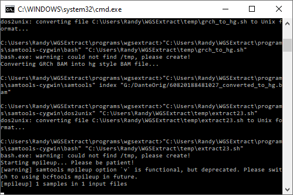

**Figure 1.19: Command Script Log Window**

This window is also useful to get the detailed status of what is currently executing. It will contain a log of the command actions over time and as they happen. Think of it as a current status and dialog history.

Occasionally the script running in the background will cause an uncaught error.  That should be displayed in this command script window, if so. In which case you may need to kill this window (hit the ‘X’ or close) to bring the program to a close and restart.  Try to copy and save any error reports in the command script window and email them to the developer: Often, uncaught errors are indicated by the word “Traceback”. Here is an example of one:

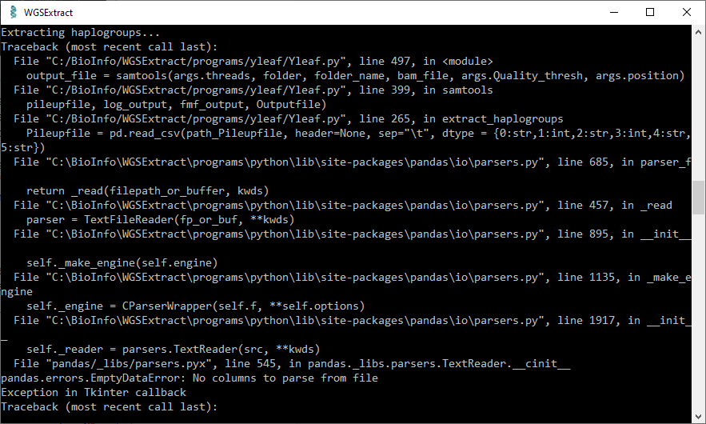

**Figure 1.20: Command Script Log Window showing program crash**

### 1.7.3 Missing Reference Genome File

Starting with version 4, release 40, the program now does more than simply give you an error pop-up about a missing reference genome file before it cancels the current command. Now you are more explicitly presented with three options as shown here:

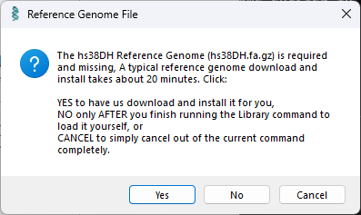

If you answer YES, the program will run the Library command to try and load the missing reference genome for you. Otherwise, as before, you can leave the dialog open and run the Library command yourself to install the missing file.  Once done, come back to the dialog and in this case hit NO. In the case of YES or NO, it will check once more for the reference genome.  If now found, it continues on as before.  If not found, then a final error pops up and it is as if you hit the CANCEL button to exit out of the current command.  This pop-up only occurs when the reference genome is required to complete the command.

Note that this pop-up could come when you start the program and before any other window appears.  This happens if you have settings saved from a previous run. But now when it tries to load a CRAM file, it cannot find the required reference genome to decode the CRAM. All CRAM files require their corresponding reference genome in order to decompress it.

In the settings window is a small button; by default set to NIH but could be showing EBI.  This is the default, preferred

### 1.7.4 Error and Warning Dialogs

Occasionally, an error or warning must be issued. Often via a pop-up dialog box. For example, if you have a directory path or filename that includes special characters or spaces, you may see the following error pop-up:

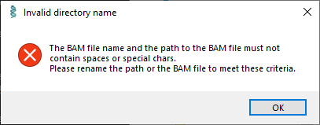

**Figure 1.21: Error pop-up on Win10 systems**

Or, for a warning, a pop-up dialog may appear like the below:

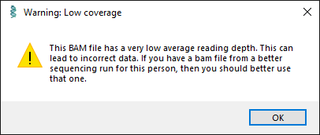

**Figure 1.22: Warning pop-up on Win10 systems**

# 

# 2 BAM / CRAM file statistics

We cover the various statistics in a little more depth here to explain what is being presented. Providing you a deeper understanding of how to interpret the content of your file.  It is helpful to have the basic understanding of what the sequencer is putting out.  In our case, we are mostly concerned with high-throughput, massively parallel, short-read sequencers (also known as “shotgun sequencing”).  But the tool covers long read sequence files like from Nanopore as well. More detail is covered in the introductory document [Bioinformatics for Newbies](http://bit.ly/38jnxnK). 

Because the stats button is so quick for an index BAM file, it is the best and quickest method to verify the efficacy of your loaded file.  If you just created a subset BAM, and then look at its stats, you can quickly verify the file was created properly.

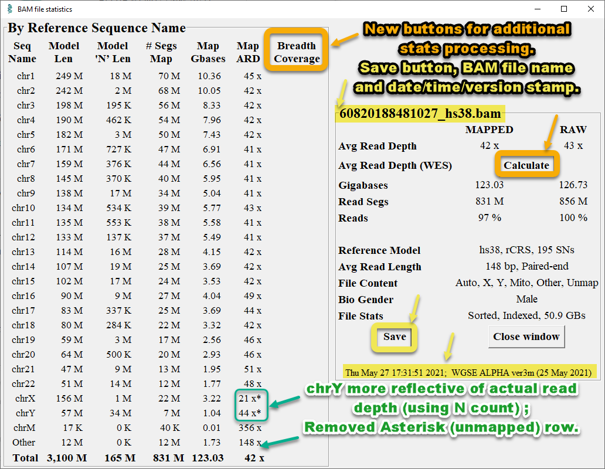

**Figure 2.1: Sample Statistics Window; no additional button clicks**


**Note:** Most of the stats are derived from sampling a subset of the file and have generally been shown to be within 1% of the actual, measurable value. The sampling allows for a quick determination and result.  Longer executions, such as the breadth of coverage, are actually reading the whole BAM file. Some of the techniques are unique to this tool.


## 2.1 Stats Page Broken down

The Stats page has two distinct areas.  A per-sequence (e.g. chromosome) stats table on the left. And a summary stats table covering the whole file on the right. The by-chromosome (reference sequence name) summary table in the Stats Window is loosely based on the [IDXSTATS v2 spreadsheet](http://bit.ly/2R3R4dn) and **[Average Read Depth](http://bit.ly/304ciw0)**[ documents](http://bit.ly/304ciw0) and comes from the samtools idxstats run.  Other summary stats in the box to the right are determined by the tool using various means.  Often by scanning the header and sampling the body content of the BAM.

If the BAM is indexed, the idxstats can be calculated in one second.  If not indexed or is a CRAM file, the idxstats command will take approximately 30 minutes as the whole file must be scanned.  As it takes 30 minutes to index a BAM file, and this extra time is required for most operations, it is often best to index the BAM or convert the CRAM to a BAM and then get the stats automatically and quickly that way.

Let's look at each major area in detail now.

## 2.2 By-Chromosome Detailed Table

The **By Reference Sequence Name** table on the left of the Stats page takes a majority of the **Stats **window.  Each chromosome has a name. Autosomes are numbered 1 to 22 and sometimes appear as chr1 instead of just the numeral 1.  Next is the length (in base pairs) of that chromosome in the reference model. The reference model size is unique to a Build (38, 37). Following that in column 4 are the number of sequencer read segments that were aligned or mapped to that chromosome.  This includes both localized and unlocalized.   \
 \
As summarized earlier, it is column 4, times the read length, and divided by the Model Length (column 2) less the Model ‘N’ length (column 3) that gives you the MAPPED average read depth (column 6). The 4th column “mapped read segments” times the read length gives the Mapped Gigabases (5th column).

Not depicted (anymore) in the table directly are the read segments marked with an asterisk (*). These are segments that did not map to anywhere on the human reference genome model.  This could be due to any number of reasons.  A segment with enough corruption during the read does not allow its location to be identified. Or maybe Non-human DNA such as bacteria in your mouth when you sampled (see the oral microbiome section).  Or worse, contamination during transport or in the lab itself. And so on. The larger the number unmapped (‘*’) then the larger the percentage of the result that is unmapped.  Normally, your mapped percentage should be above 90%. The unmapped value is implied in the summary table to the right. It is the difference in the RAW versus MAPPED “Gigabases” , “Read Segs” and “Reads” columns.

The “Other” row is simply everything else found in the reference model.  If you see in the summary section, there is a count of sequence names in the BAM / reference model  (e.g. 195 SNs in this example).  Subtract the primary 25 sequences already shown and the Other row is the summation of results for all the rest of those sequence names.  Sometimes alternate contiguous regions for a specific chromosome and position. Or decoys of commonly found bacteria. Or maybe alternates to the primary sequence that draws down the total of what you think should be a mapped segment to a chromosome.

Alternate regions can be explained as follows. Sometimes there is a large but consistent variation between people in a specific area of a chromosome. But the reference model only allows for one primary chromosome sequence. This is often too much variation for the aligner to map short segments too and so the variation is caught by one of these special sequences.  Including these alternate assembly scaffolds allows a person's DNA to be mapped to a specific chromosome and location that might not be otherwise captured by the reference model. When doing variant calling later, these contigs can be used as alternate references to base the variation analysis on. Very few tools use these analysis sections of the model. But some do.  Some of the Build 38 models have a few hundred variations of the HLA region in Chromosome 6.  Which special tools can analyze to truly understand your true genome.  Capturing these regions in alternate contigs keeps them from being marked as unmapped and not part of the human genome.  It can reduce the stats in the primary chromosomes by a bit. Less frequently, these “Other” sequences may be decoys such as the EBV virus common in blood-based samples of DNA.  The decoys tend to capture these contaminants. This may increase your apparent “mapped” stats but usually have a minimal effect.

Technically, this “Other” row should not be included in many of the summary statistics.  As it represents variation from the existing model.  But they are small enough areas that simply including them is easier to get a better overall picture. The number and naming of these alternate contigs vary so greatly between different models that we do not attempt to account for them otherwise here. They perform a vital function for informed variant calling later and making a more inclusive reference model in the next release. The primary reference model and the one used for alignment can thus be different to make it easier for the tools to process the data.

Note that females will often show some Y chromosome mapped segments.  This is because the tips of the Y chromosome are the same as areas in the X and in fact recombine with the X.  These are termed Pseudo-Autosomal Regions (PAR for short). Some models may mask these out of the Y. Some leave it in the Y but mask it out of the X. Some leave it in both and let the aligner map them to both locations.  When the average read depth on the Y exceeds 4 or 5, then you know the sample was from a biological male with a Y chromosome. Otherwise, a biological female with some Y values is simply an artifact.

Similarly, a female sample will show the same strength (average read depth, total segments read) for X as for other similarly sized chromosomes; like chromosome 7 or 8).  A male will show half the reads and read depth for the X and often lower than the overall average for the Y. This is because there is only one copy of each to sequence. As opposed to two copies of each  autosome. So statistically, less is sampled.


**Note**: *By natural artifact of the sequencing process, X and Y chromosomes in males will tend to have around ½ the ****average read depth**** compared to the other chromosomes.  This is because there is only one of each where there are two of each autosome.  It is typical for the ****average read depth**** on the Mitochondria to be in the hundreds if not thousands.  Again, partly due to numbers as there are many copies of the mitochondria in the body of each cell for every one nucleus with the chromosomes.*

**Note**:* We have “ignored” the EBV / NC_00705 alternate contiguous sequence in the “Others” section of the stats. Oral samples do not have this contamination and thus have very low mapping (like for Y in a biological female) and thus it throws off the stats.*

This table and some of the summary values to the right are described in more detail in a companion doc on [Average Read Depth](http://bit.ly/304ciw0).

## 2.3 v3/4 Key New Features

Added with v3 are modified calculations that account for the **contiguous ‘N’ blocks** in the reference model primary sequences, a **Breadth of Coverage** column (filled in after clicking the **Coverage** button as it is a 45 minute data gather; at best) and a **WES Average Read Depth** and **Coverage** calculation (again, a separate button and additional 60 minute gather). v4 introduces the change over of **Coverage** to be based on a **Bin Coverage** and generating a new additional stats screen with per sequence bins provided.

The **‘N’ block** consideration, not available anywhere else that we have found, helps “normalize” the actual Y and Autosome values to what would be expected.  As well as more accurately report other summary values.  5 to 7% of the Build 37 and Build 38 reference genome are filled with N’s instead of the expected bases ACGT.  In fact, over 50% of the Y chromosome itself has ‘N’s.  So incorporating this information into the calculations can have a marked effect.  Your read segments from the sequencer cannot be mapped to regions of N’s.  The mapped **Average Read Depth** and **Breadth of Coverage** incorporates the **‘N’ block**s by reducing the model size accordingly.  Thus, values calculated are more accurate when incorporating the **‘N’ block**s.

The **mapped gigabases** are estimated by taking the number of mapped segments multiplied by the average length of the read segments. The **mapped Average Read Depth** (ARD) is also estimated by taking the number of **mapped gigabases** and dividing by the number of gigabases in the reference model (now less the number of **‘N’ block** bases).

The v3 **Breadth of Coverage** was based on the `samtools coverage` command and used the default, non-zero mode.  That is what is still reported in the by-sequence summary section. It determines what percentage of the reference model has at least one read. It also <span style="text - decoration: underline;">calculates</span> the actual mean of the read depth.  That latter value is not displayed but available in the saved `.csv` file generated when the button is clicked. The v4 **Breadth of Coverage** (for WGS and WES) is based on the `samtools depth` command (as was the v3 WES coverage calculation).  But now calculating more bin buckets instead of simple zero and non-zero buckets.

The **WES Average Read Depth** and **Breadth of Coverage** will only report very differently from the WGS value shown IF the BAM is WES-only or contains a special, higher read depth WES-region run.  From Dante, this is their WGZ product that is a 30x WGS and 130x WES; merged. The **WES Average Read Depth** is the average read depth over only the Exome regions; the Exome regions represent less than 2% of the whole genome. A WES-only BAM will show a more normal full coverage using the WES calculation but a very small WGS coverage otherwise.

v4 saw the introduction of the Read Insert Size calculation. And a standard deviation for this value and the average read depth.  Look for more on the Insert Size in the [later special section](#heading=h.uhxj4mq7iuum).

## 2.4 Summary Table Explained

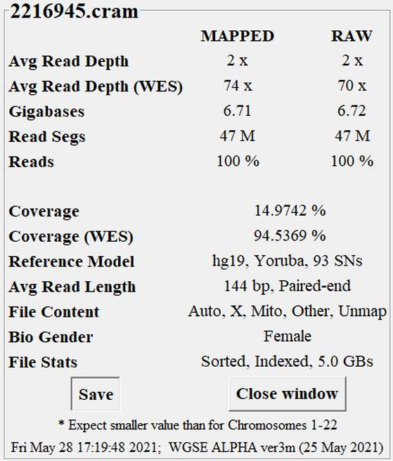
 \
**Figure 2.2: Statistics Summary section**

Notice the summary reporting in **Figure 2.2** for a WES-only CRAM file from GeneDX.  The WES BED file used by the **WGS Extract** may not match well to the WES BED used to enrich and sequence the sample represented in your BAM.  It should be a perfect match to what Dante delivers from their WGZ product as we use the Illumina Exome enrichment BED file that they did.

Suffice it to say that you are looking for a 30x MAPPED average read depth on a WGS to achieve clinical-grade sequencing.  And over an 120x MAPPED average read depth on a WES-only file for similar results. Some DTC WGS companies only promise to deliver 90 RAW gigabases.  This allows them to shave some time off the sequencer run and ignore any issue of sample contamination. The closer the read length is to the maximum of the technology (150) the better.  Numbers around 100 or 120 are from older technology sequencers and yield results that are harder to align (think STRs with repeat patterns nearing or surpassing 100 base-pairs). The [qual.iobio.io](https://qual.iobio.io/) tool has taken the rough guidelines in the document above and color coded the results accordingly.  200 to 250 base-pair read lengths are starting to become available with NGS.

It is not unusual to have 5-10% of the reads not mapped to the human genome.

## 2.5 Some background

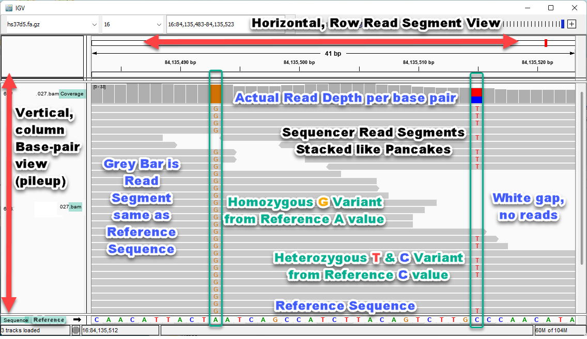

**Figure 2.3 IGV view of Chr 16 from 84,135,483 to 84,135,523**

Figure 2.3 above shows such a view from the IGV Genome Browser for a given sample BAM file from Dante Labs.  Key with such a browser is you have to zoom very far in.  So only about 50 base-pairs are depicted out of the tens to hundreds of millions for any given chromosome. The reference genome sequence is shown across the bottom (in this case) with the letters of the four bases.  Each of the four bases is colored uniquely.  The stacked segments are depicted above.  White area is space between stacked segments not being covered by a read segment.  To make it easier to see changes, parts of segments that match the reference below are just depicted as a gray block.  As you can see, most of the segments are gray.

There are two SNPs shown. One at Chromosome 16 position 84,135,493.  The other at Chromosome 16 position 84,135,,515 . Otherwise, all the bases in all the segments are matching the reference.  The first SNP is homozygous and derived.  Meaning both copies of chromosome 16 have the alternate allele of G instead of the reference A.  The second SNP is heterozygous. Meaning one chromosome 16 copy has T’s instead of the reference of C. While the second copy retains the reference value of C.  So roughly half the segments have a colored T and the other half are still gray. This is essentially how a variant caller is working.  And only reporting on the occasional cases where values are different from the reference.

Often, you may see an occasional single colored letter in only one segment. This is likely a read error.  There are still 1 in 1,000 to 1 in 10,000 read errors that occur and so often a few will appear on a screen like above that is depicting roughly 40 bases wide by about 30 read segments high. This particular sample has a very low error rate in this area.  Occasionally, you will see a segment that has every 10th or so base-pair colored (in the same row).  This is either a mis-aligned segment OR a very poor read segment with low read quality values. The quality of the reads is not depicted in a viewer like this but is important to consider when making a variant call. This is why you sequence to get more read depth though.  To be able to throw out obvious read errors and understand if a site is heterozygous in the two copies in the autosome.

## 2.6 Average Read Depth and Breadth of Coverage

The size of a vertical slice in the stack is the **read depth** for that base-pair.  The width of a particular segment, often pretty regimented at like 150 base-pairs, is the **coverage** of that segment over the model.  If you were to look at every base pair in the reference model (over 3 billion of them), you could calculate the **average read depth** and total **breadth of coverage **for your whole genome.  This later value can only be accurately determined by doing the analysis per base-pair. **Breadth of Coverage** represents the percentage where every base-pair has some minimum number of read values (1 or more is often used). Usually, the higher the average read depth, the broader the coverage.

The **Average Read Depth** is often estimated using simpler approaches. For example, take the total number of base-pairs output from the sequencer and divide it by the number of base-pairs in the reference model.  Thus a 30x average read depth is obtained if 90 gigabases have been sequenced over the roughly 3 billion base-pairs in the reference model. 


**Note**: 30x is a clinical, minimal standard read depth to get values from the sequencing results in over 99.97+% of the genome. Each 0.1% difference represents 3 million base-pairs not being read.


Whole Exome Sequencing (WES) (as opposed to Whole Genome Sequencing or WGS) requires a 130x **Average Read Depth **to achieve the same level of results of a 30x WGS.  This is because they PCR enrich the sample and need the extra reads to counteract any PCR duplication errors.  More on the **Average Read Depth** is found in ([1](http://bit.ly/304ciw0)), ([2](http://bit.ly/2tYN6ei)) and ([3](https://bit.ly/3thOT7w)). \
 \
Many use the term **Coverage** for both the **read depth** and the **breadth**.  To avoid confusion, we are strict and only use the term **Coverage** with **Breadth of Coverage** and simply talk about **(Average) Read Depth** separately.

**Figure 2.4: Cumulative Average Read Depth for WGS all (left) and Y-only (right)**

Figure 2.4 has plots that show cumulative average read depth coverage over the whole genome (left) and for Y only (right). This is from a tool called Mosdepth that is not provided in **WGS Extract** but used to illustrate what your results should appear like if it were available.  Each colored line represents a different WGS result.  The whole genome only reaches about 93% coverage with one or more reads. Actually indicating the nearly 7% of N’s (or unmappable regions) in the reference model (for Build 37 in this case). For Y only, you see it barely reaches 0.4 coverage (~38%) with one read or lower.  The green lower left line in the second plot is the Y chromosome for female testers;  where some of the X has been mapped to the Y region.

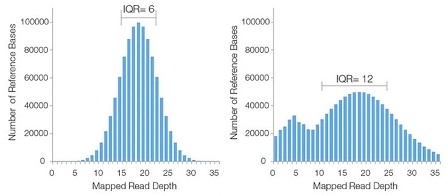
 \
**Figure 2.5: Histogram of Average Read Depth **[^1] 
The above **figure 2.5** is another way to look at the data; some would argue the better way.  It is a histogram showing the distribution of average read depth.  The sharper the vertical rise in the cumulative plot like **figure 2.4** above then the tighter the distribution (lower IQR value).  A tighter distribution is desired. We added a standard deviation or InterQuartile Range (IQR) to the **WGS Extract** tool so you can get a sense of the vertical rise of your results. \
 \
These same mapped read depth plots can be obtained for your sample from a tool called [bam.iobio.io](https://bam.iobio.io/). See **Figure 2.6** below showing read depth plots from [bam.iobio.io](https://bam.iobio.io/) for several samples. The red bar is the 8x read mark and the usual minimum for valid reads in the Autosomes. We moved it to 4x for FTDNA's BigY as 4 is the minimum valid read for Y. The blue bar is the expected average read depth (nominally 30x for clinical testing). Normally one should expect a distribution that peaks around this blue bar.

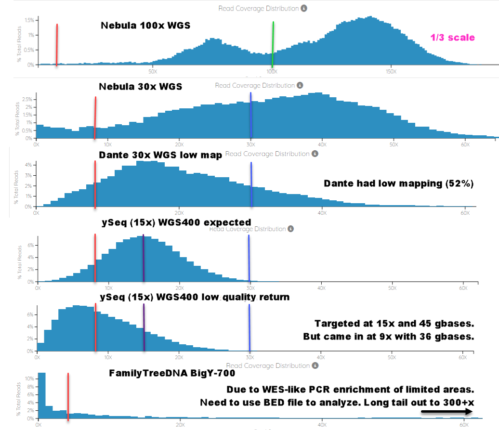
 \
**Figure 2.6: Histogram of Average Read Depth (actuals)**

A Nebula 100x plot is shown but at ⅓ scale to fit it in.  The two ySeq WGS400 test results are only targeted at 15x . But one, like the Dante shown, was delivered with a much lower result. We chose the samples simply to show how the curve shifts with the measured mapped average read depth and also correlates to the mapped gigabases.

FTDNA enriches their sample similar to that done for WES testing.  Many of the low reads are likely outside their enrichment area. They actually use a minimum of 10 reads for a call due to get around PCR duplication induced errors; just like in WES testing where 130x is the expected clinical mapped average read depth.

An for completeness and a different view, here are the mosdepth cumulative plots for most of these same samples:

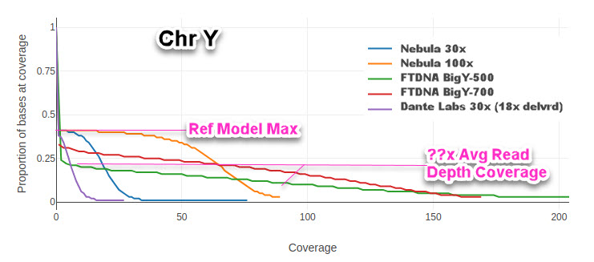
 \
**Figure 2.6: Histogram of Average Read Depth (actuals)**

 \
(A Chrome extension named [Docs Image Zoomer](https://chrome.google.com/webstore/detail/docs-image-zoomer/cflcffjlkchkdaljonjmfljdfilfnhkm?hl=en) allows one to click an image to see a full screen version. Otherwise, right-click, save and view the image externally to see it larger.) \


The typical reported **breadth of coverage** in **WGS Extract** and other tools using a minimum depth of 1 may be considered artificial.  After all, you likely need more than one value to verify it is truly a valid read.  Some use 4 as a minimum.  Others 8 or 10 when considering the Autosomes that may naturally have two values due to there being two different chromosomes measured.  The FamilyTreeDNA BigY-700 uses a minimum of 10 even though there is only a single Y chromosome to measure.  Due to their PCR duplication introduced errors.

Another factor is the quality of the reads.  Maybe only reads with a minimum base quality of 20 (often the value used for variant calling) should be considered. Many of these parameters to consider are options to the `samtools coverage` command and something you can run yourself with the underlying bioinformatic tools installed for you. Stats here do not take the quality of the read into account.  But are important and used when generating valid variant calls.

## 2.7 Bin Coverage Feature

Introduced with v4 is a **Bin Coverage** feature.  This offers another step in refinement to judging the quality of the results; and is available on a per chromosome basis. **Bin Coverage** is taking the above plots of read depth and slicing it up into non-overlapping bins or buckets. Then reporting a percentage **Breadth of Coverage** for that bin (based on an overall coverage of the reference model)  \


The basic **Breadth of Coverage** stats as described earlier simply looked for 1 or more reads at a base-pair location to claim there is coverage.  But in most instances, a minimum of 4 “quality” reads are needed before a variant call will be made.  This jumps to 8 for the Autosomes (and X in some cases) as the values can be heterozygous -- that is, two values instead of just one as there are two independent chromosome copies. So many want to know not the basic coverage of reads at a location but if 4 or more or 8 or more reads exist.  That is the concept of **Bin Coverage**.

In **Bin Coverage**, one separates the base-pairs into bins of no (Zero) reads, 1 to 3 reads, 4 to 7 reads and 8 and above reads.  Then you determine the breadth of coverage of each bin..Especially when looking at this per chromosome, you can then more accurately determine the **breadth of coverage** using the bin of concern.  (Often 4 or larger for Y and mtDNA; 8 or larger for autosomes and also X in females.)

The basic **Breadth of Coverage** summary used earlier is calculated by using the `samtools coverage` command.  This **Bin Coverage**, like the **WES Coverage** (all forms) is using the `samtools depth` (similar to the `mpileup`) command and reading the number of reads for each base pair location. The **Bin Coverage** is automatically determined with the WES **Breadth of Coverage** calculation for WES files. Clicking the **WES Bin Coverage** is instant if the **WES Coverage** has already been run.  The **WGS Bin Coverage** is a different run than the general **Breadth of Coverage.**  So its button will only be an instant response if it was run previously and the result saved in an **Output Directory** CSV file. \
 \
If a bin is created for every read depth integer value, then a histogram as shown in the previous section could be generated.  This is likely a next logical step, along with determining a standard deviation, to getting a better understanding of the overall quality of the result.

Still missing but important is incorporating the quality metrics of each read as are used to determine valid Variant calls in creating VCF files downstream.

## 2.8 Read Insert Size

Another important stat, that is now reported in v4, is the read insert size.  Also referred to as the read span or read fragment length.  This is equal to the number of bases from the leftmost mapped base in a read pair to the rightmost mapped base.  Thus 2x the actual sequencer read length plus the read gap. The read gap is more formally known as the mate inner distance.

Most WGS runs are using a paired-end sequencing technique. After pulverizing the DNA into short fragments (target size is often 2x the read length of the sequencer), the sequencer will read from one end of the fragment to its limit; and then proceed to read from the other end of the fragment to its limit.  Thus creating a paired set of reads for the same DNA fragment.

If the fragment length is 2x the read length, the whole fragment is read and the paired-reads can be treated as one longer segment.  If the fragment length is shorter than 2x the read length, the reads will overlap and this will be detected during alignment.  If the fragment length is much longer than 2x the read length, then there will be a gap between the reads after alignment.  This assumes the aligner was successful in placing the two read segments near each other in the reference model. So after alignment, assuming proper alignment, this gap can be determined and thus the total original fragment length also determined. This gap is often termed the mate inner distance and can be negative; indicating an overlap of the paired-end read segments.

 \
**Figure 2.7: Histogram of Read Insert Size**

 \
The goal is to keep this gap as close to zero as possible. Especially for being able to accurately determine CNVs (STRs). To date, you can get the graph of this fragment length from the [bam.iobio.io](https://bam.iobio.io/) tool; as is shown in **figure 2.7** above for four different BAM results.  Note how Nebula has used very long fragments with larger gaps (on average).  Dante is closer to the optimum, on average, and FTDNA shorter than optimum (thus yielding overlap between most paired reads). This likely explains why Nebula runs have the worse STR extraction rate on the Y chromosome compared to the other labs. And Dante the best. ***An STR repeat length larger than the read fragment length cannot be determined from a WGS test result.*** (note: Nebula in late 2021 has adjusted their insert size down to closer match the Dante one so STR extraction in the Y and elsewhere is much better now.)

Single-end sequencers are often simply paired-end sequencers running with extra processing.  They only retain the paired read segments that align near each other and have a zero or negative gap size. You thus will see read lengths very close to the target with no variance.  The insert size of single-end sequence results is not defined and thus not reported.

# 3 Microarray RAW file generation

(note: it is known there is repeat / overlap of content here. Working to prune and rewrite.)

BAMs from WGS tests can be used to generate the equivalent of **microarray test super-kits on steroids**. Basically, 2x or more the number of SNPs that the “best possible” super-kit made just from microarray test results can do.  Super-kits are made by a merger of microarray test results. The **Super-kits on steroids** is mentioned because it is unlikely a single tester used all the various test versions offered over the extended time period that would be needed to create a true, complete superkit.  The tool here using the WGS result can generate any of the results, more accurately, than the original microarray DNA test could. (NGS Sequencing tends to have higher, more accurate call rates than the microarray tests themselves.)

Unfortunately, most of today's match tools cannot handle super-kit files like this. Tools are set up to see only the smaller subsets of tested SNPs (or variants) from a single test or maybe two kits at best.  So you may have to wait for the tools to catch up before using the full power of your available WGS tested SNPs. To date, only GEDMatch and Geneanet can receive a CombinedKit Everything file (super-kit) generated here.

The [overlap of SNPs tested](https://isogg.org/wiki/Autosomal_SNP_comparison_chart) in the various kits can be small.  So decide what file is best to generate and feed into each test site.  We have found 23andMe v3 and v5 are the most widely accepted and best result kits to generate and load into tools that accept outside test results. v3 for just about everywhere with v5 especially good for LivingDNA, MyHeritage and FTDNA as that is the same chip used in the predominant local-tested results there.  See our [companion document on file formats](https://h600.org/wiki/Microarray+File+Formats) that gives you more information.

Note that, oddly, most sites will not accept an import of a file in the same format as they generate.  So even though you can generate a MyHeritage v2 file as if you tested on their site with their microarray, they generally do not allow you to import that format file.  That would be optimal because you would have the same SNPs in the file that their native test result does.


**Note**: *You might even get away with a merged 23andMe v3 and v5 file.  With WGSE v4, you can generate that directly. Otherwise, use **[DNA Kit Studio](http://dnagenics.com/dna-kit-studio/)** to create a merged file for upload from the various files generated here. DNA Kit Studio is a Windows program.*


At the current time, only GEDMatch and Geneanet can accept the CombinedKit “Everything” (super-kit on steroids) option.  And even then, throws much of it out on import. Hence, for compatibility in the current market, you are given the option to generate just a single version of a single company test. Maybe, eventually, someone will build a new autosomal match system that can utilize WGS results and super-kits generated from merged microarray test results. Or better yet, work directly off the results to deal with the various alternate contiguous regions used in the model patches. This will be key to providing accurate matching to non-white europeans that the current human genome reference models are built on.

The autosomal extract tool here was originally inspired by [Thomas Krahn’s Extract23](https://github.com/tkrahn/extract23/). That tool, as released on GitHub in 2016, can only generate a 23andMe v3 file from an HG19 BAM.  So the tool here has been greatly expanded to support all the variations from all the vendors over time. Our limitation in handling InDel’s stems from that original script divulged there.

This tool may appear similar to what [Wilhelm H-O’s DNA Kit Studio](http://dnagenics.com/dna-kit-studio/) is doing when processing and accepting RAW and VCF files and putting out similar microarray test files.  But with this tool, you are starting with your BAM file which has everything. Not even just the CombinedKit “Everything” of the merger of other microarray tests, but everything in your DNA itself. Also, the VCF accepted in that tool  is only the identified variants.  You cannot simply impute or assume the non-listed values are ancestral or what the human genome reference model indicates. Hence this tool more accurately generates the complete microarray files as if you natively tested with each company.

If you are trying to compare a WGS test result with a microarray test result (from the same person in each result), then choose the same version and company as that test result.  Either load the WGS generated file back into the original test company database (if possible) or load the original and your WGS generated file into GEDMatch or Geneanet for comparison there.  Either way, you are looking to see that you appear as your near identical twin.  Possibly even just to validate your WGS test result is really yours. You can also do this by comparing with a close family member (sibling, parent, 1st cousin, etc;) where the match strength is known with a tight tolerance.

Comparing your CombinedKit “Everything” from your WGS with an original test from one of the microarray companies may not show as close an identical match as you like (still 99.9+% but not 100%). This has to do with the match algorithms at these sites, your extra SNPs available in the “Everything” file, and even due to a slight variance in a few SNPs as read by the two different test techniques. In general, for those variances, the NGS test will likely be the more accurate.  The match tools are not so strict about exact matches knowing the small inaccuracy in testing.  They look to see a number of SNPs different before calling the match terminated.

The WGS test returns millions of SNPs for the Autosomes and X.  It does not help to load SNPs that cannot possibly be matched.[^2] And only serves to confuse the matching algorithm when it sees little overlap in your results and the other test you are comparing too.  So all the options are to generate a subset of your WGS test result that most closely resembles only one of the test company results at a time. You can use DNA Kit Studio to merge multiple test results into super-kits for sites that accept the smaller super-kits than generated here. We are not aware of any working, loadable super-kits in other sites than already mentioned. But people report varying success on different groups and blogs.

Even the CombinedKit “Everything” option is a subset of what actually exists in the WGS BAM file. It is “everything" that might exist in each of the test company file versions if all were generated and merged.  A merger of all the other possible microarray formats than “everything” in your WGS result. Your WGS result still has more. Until a WGS-result Match Database comes about, this is the best you can hope to use on any existing microarray result match and analysis site. Eventually, we will see Autosomal match sites be able to read the BAM files directly; like being done for Y now.

The WGS test returns values for ALL your SNP’s; whether derived (positive for change) or ancestral (negative for change) from the reference model.  As do the test company microarray RAW result files.  It is important to include all these values when submitting to a match database.[^3] So the processing here is making sure to deliver them all.

VCF files contain only your "derived" values. This was an issue with early use of only traditional VCF files to generate RAW microarray format files.[^4] To properly use a VCF file, one has to have an all-call VCF file (similar to the RAW file that comes out of the variant call process as an intermediary).  One cannot simply assume anything not mentioned in the VCF is ancestral and thus use the reference model value.  Sites like GEDMatch, because they rely on a sparse match matrix of uploaded kits, will check if too many reference model files exist, leading to too many matches in their database, and disallow the upload of such files.  That should never happen with any file generated here as there are never any imputed or reference model fill-in values.

There are still 4 to 26 millions more autosomal SNPs identified that are not included in even the CombinedKit file (as identified by different sources). A typical SNP VCF file for any 30x WGS tester will often have 3 million or more entries.  A typical tester with a CombinedKit file, even though it has nearly 2 million values, only has around x00,000 SNPs that would appear in the VCF file. Thus there are often 10x the true variant values in a typical 30x WGS test result compared to the CombinedKit microarray file.  Until the genetic genealogy community catches up, one has to settle with using the CombinedKit or a particular company microarray file to feed into the respective match databases.

23andMe and Ancestry do not allow any outside result files to be imported. But they comprise the largest base of testers and the majority of entries in the other company test databases (due to transfers).  So best to include those SNPs (contained in their file formats) in any file you plan to import elsewhere.  Hence why the CombinedKit “Everything” option exists.

In the future, we may recognize if the CombinedKit file already exists and save the hour processing time by simply utilizing it.  This will allow for any easy and quick generation of any format you missed on the first run. For this reason, we always suggest you generate the CombinedKit file.  It never delays the processing and will thus retain the file already being generated anyway.

The Y and MT values (variants or in-common allele values) are included in the files if in the original format from the test company. They are part of the WGS BAM file.  So you can use these output files just like you would use the originals from the test company (sans incorrect InDel values). For example, feeding the file to [ytree.morleydna.com](http://ytree.morleydna.com/) to get a Haplogroup determination from their 2016 Experimental ISOGG tree. These are the full, microarray file formats as normally provided by the test company. And in fact, with many of the no calls now filled in. The WGS test tends to have better coverage and accuracy than the microarray test results being mimicked. X is always included in the FTDNA files.


**Note:*** National Geographic Genographic NextGen (2.0) Plus output is not yet available.  It includes a full Autosomal panel as well as 13K+ Y SNPs. FTDNA accepts the Y SNPs from National Geographic only if provided as an internal, company-to-company transfer and not via an autosomal import file. FTDNA historically **<span style="text - decoration: underline;">only*</span>* accepted Y SNPs from the National Geographic Genographic test and **<span style="text - decoration: underline;">only*</span>* as an internal transfer between organizations. As the NatGeoGeno public site is now defunct (Jun 2020), there is no longer a Y import path available.*


## 3.1 Microarray Generator Testing

Marko compared personal microarray tests conducted with 23andMeV4, 23andMeV5, AncestryV2, and FTDNAv2 with the output generated here.  Comparing identical SNPs and the few differences. Additionally, he compared the files after uploading on GEDMatch.  Details forthcoming.

MyHeritageV1 is testing nearly the same SNPs as FTDNAv2. For similar reasons, MyHeritageV2, FTDNAv3, and LDNAv1 are very similar in SNPs to 23andMeV5. In this latter group, they are all based on the Illumina Global Screen (micro)Array. So similar chips and equipment were used in the microarray tests of those versions from those companies. And thus if trying to match a kit in that format, using one of the similar formats will be optimum.  LivingDNA v2 uses an Affymetrix chip customized to provide a mid-range SNP overlap with all the other chips. The FTDNAv1 also used an Affymetrix chip that is much older and different than what LivingDNA now uses.  See the [ISOGG Autosomal Comparison chart](https://isogg.org/wiki/Autosomal_SNP_comparison_chart) and our earlier [Test Chart Comparison](https://h600.org/wiki/Genetic+Genealogy+Testing#Comparison_of_Major_USA_Testing_Companies_SNP_coverage) for a few more numbers.  The latter was inspired early on by [Felix Immanuel's Venn Diagram](https://web.archive.org/web/20160329114417/http://www.fi.id.au/2015/01/venn-diagram-snps-in-dna-kit-versions.html) and long before ISOGG picked up and started cataloging the kits to highlight the match issue.

Out of credit to Marko, this is the largest unique effort of this tool; and benefits the genetic genealogy community the most.  It takes WGS test results and transforms them into the standard file formats used in the industry today. Thus providing a bridge from WGS testing into the genetic genealogy community until the industry catches up and starts generally accepting and processing BAM files directly. This has started with Y and mito DNA BAM files already.

Although based on the initial concept of the publicly available Extract23 by Thomas Krahn, this tool goes much farther.  Marko collected all the various file formats and spent much effort to fully characterize and merge them to create the Combined Kit in each human reference genome model.  He then modified the original Extract23 script to simply generate a Combined kit instead of the 23andMe v3 one that it solely handled.  Finally, Marko wrote the code to take the Combined Kit and extract the subset of values from it that is used for each format. He delivers each file with the appropriate header and a few other subtle differences they each exhibit.  The programmatic accuracy of the various company models incorporated in the base reference files and the code to extract is a true work of art. Although inspired by Extract23 and its initial work to variant call from the BAM and then match to a template file, this effort is so much more than that original, simple code base. To the extent of only being inspired by Extract23. Similar to how a Hollywood movie may be based on an initial magazine short story article but is then such a larger, more detailed body of work. Or how the vastly intelligent being “V’Ger” in “Star Trek: The Movie” is based on gobbling up the Voyager spacecraft and following its initial, simple guidance.

A companion tool to use with Microarray RAW Format Files generated here is Wilhelm H-O’s **[DNA Kit Studio](http://dnagenics.com/dna-kit-studio/)** (Win10 only). While **[DNA Kit Studio](http://dnagenics.com/dna-kit-studio/)** is mainly used to manipulate the microarray RAW files, it does have an option to read VCF files. Using standard 30x WGS VCF files is <span style="text - decoration: underline;">NOT</span> sufficient to generate a useful microarray file though. VCF files typically only contain variants from the reference.  A microarray file contains all tested values of which, typically, only 10% are variants.

# 

# 4 Haplogroups and Other Analysis

We use this section to provide more background on the Haplogroup caller features to help initiate those to Phylogenetic Trees of Haplogroups (erroneously shortened to Haplotrees by some). There is a [glossary available](https://h600.org/wiki/Glossary) for even further background. The section is introduced in the description of the [frame covering Haplogroups in the Analysis tab](#heading=h.tpnsed5pm10n) above.

## 4.1 Haplogroup caller based on yLeaf v2.2

yLeaf v2.2 is the primary source of the Y haplogroup caller in **WGS Extract.** yLeaf uses a stored copy of the 2019 ISOGG tree SNP list to match variants output from the tool here. The calling is thus subject to the frequency of updating that stored list. As well as the depth of that particular tree at any point in time.


**Figure 4.1: Y Haplogroup Result Window**

ISOGG still names their haplogroups using the [YCC Long Format](https://h600.org/wiki/YCC).  Whereas most other trees are using the Short form that simply names a haplogroup by one of the defining SNPs within it. This long (or lineage, path) format can be difficult to read.  And more importantly, difficult to track when tree restructuring occurs.

The Haplogroup caller puts out the lowest (in the tree, most recent in time, farthest from the root) mapped haplogroup it can find in the reference tree (ISOGG 2019).  It then lists the SNPs found in the BAM file from only that haplogroup.  And only a few SNPs at that; there can be tens to a hundred or more in some haplogroups.

You are then referred to other trees where you can look up those SNPs and find their equivalent branch.  The biggest problem is that the trees do not necessarily name the haplogroups nor SNPs with the same name. Sometimes it is due to parallel, simultaneous development.  Often due to a lack of cooperation.  Here are some pitfalls you may find explained by looking at one example haplogroup.

We start with looking at a Haplogroup shown in figure 3.1 below from a few years ago.  It happens to be an older, well known haplogroup deep down the R1b-P312 path. It is most commonly called L20 or sometimes R-L20.

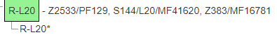

**Figure 4.2: R-L20 on the haplogroup-r.org PhyloGenetic Tree**

R-L20, as named here, contains three SNPs that define it.  Each SNP has 2 or more aliases.  That is, different names for the same SNP.  Generally, if you are in this haplogroup, or below, you are positive for change in all three of these SNPs.  Most SNPs start with a letter designator of who named the SNP, followed by a sequence number the namer assigned to make it unique.  Key behind each name is the chromosome and position in the chromosome that defines it.  Sometimes an rsID number more formally and uniquely naming it as well.

Here is that same haplogroup in yFull’s tree:

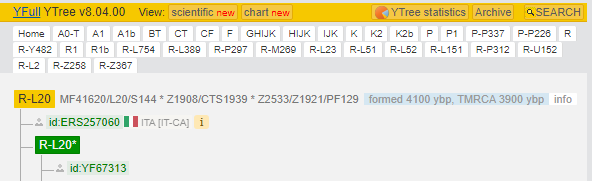

**Figure 4.3: R-L20 on the yFull Phylogenetic Tree**

Luckily, yFull happens to name it the same, using the R-L20 designation.  In their nomenclature, they use asterisks (*) to separate different SNPs that makeup the haplogroup.  They also have put the SNPs in a different order and even have an additional alias for PF129.

Notice the tabs across the top. These are representing the haplogroup names from the root (Home) down to this branch R-L20.  They somewhat correspond to the similar R1b1a1b … designation given by ISOGG.  In fact, the ISOGG Tree 2020 designation for this haplogroup is

R1b1a1b1a1a2b1a1.

Let’s go back to the haplogroup given in our example output. And crop to just that haplogroup name and show an over-under of the previously inline information so you can see it more clearly.

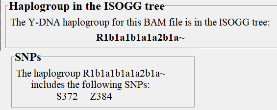

**Figure 4.4: Y Haplogroup detail**

In yFull, this haplogroup is found in a location a few branches above R-L20 already shown.  In fact, here is R-Z258 two steps earlier in the tree.


**Figure 4.5: yFull Phylogenetic Tree for R-Z258**

But wait, the designated SNPs are listed as S372 and Z384 in the tool.  yFull says this haplogroup has one SNP named Z258/S372. Ahh, S372, we have seen that before. So Z258 in yFull is the same haplogroup as R1b1a1b1a1a2b1a~ in ISOGG.

And in fact, here is the ISOGG tree as designated from the program. It itself shows the alias Z258 for SNP S372. So we get closure.

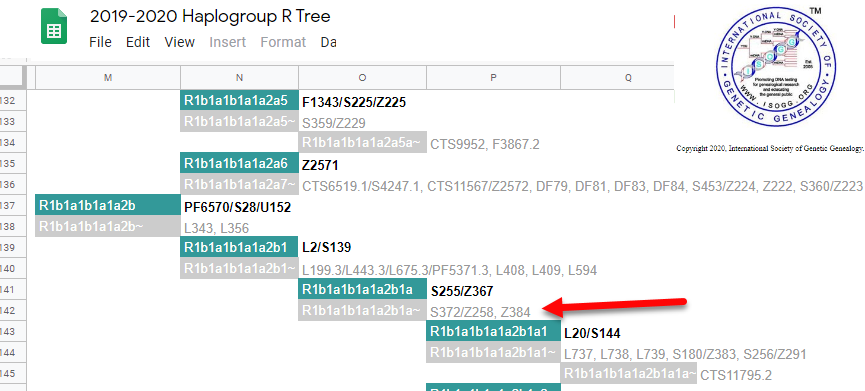

**Figure 4.6: ISOGG Phylogenetic Tree for S372***

So we now see that Z558 is an alias (or equivalent name) for S372 in both trees. Just each tree chose a different alias of the same SNP to list as the primary name.

And in fact, if we start to follow the tab path in yFull and compare it to the ISOGG path, we get:

```
R     1     b     1     a     1     b     1    a    1     a    2     b     1   a  ~
M207  M173  M343  L754  L389  P297  M269  L23  L51  P310  L151 P312  U152  L2  -  -
```
**Figure 4.7: YCC path (long) versus SNP (short) haplogroup naming**

yFull has inserted an extra branch named Y482 just below R that ISOGG has not given. ISOGG lists L389 as L388.  ISOGG has a branch S255 (shown as final ‘a’ above) which yFull names Z367. But between L2 and S255, yFull also has a branch Z258.

In fact, this Y Haplogroup call in yLeaf of S372 is actually for a tester that is well below L20 in most of the trees.  The deepest ISOGG goes is L20 for this tester though. But the tree yLeaf has used does not recognize this.  yFull is even deeper than FamilyTreeDNA for the terminal branch due to some non-FTDNA test samples included.  You can get [more information about what is actually in the BAM for this tester on their website](https://h600.org/wiki/B10DNA#Measuring_this_Haplogroup_with_various_test_services).

This particular one was a bit easy.  SNPs with aliases were listed in both sites.  The paths were near the same and many of the same SNPs were used to name the haplogroups.  There are many other areas not so easy to trace and determine.  Especially when you get to SNPs in FTDNA starting with FT (their own recently discovered SNPs), ones in yFull named Y (their own recently discovered) and ISOGG not having either.

[ybrowse.org](https://ybrowse.org/) is an industry-normal place that researchers register their SNPs before the more formal process of creating an rsID with the USA National Institute of Health. Key is you have to determine the location of the SNP in the chromosome to then determine if SNP names are equivalent. But the newer SNPs by the tree companies are not necessarily given with a location yet. yBrowse is run by Thomas Krahn; now of [yseq.net](https://yseq.net/), but who was with FTDNA when he started it.

So we see SNPs can have aliases (or equivalent names).  And that different trees will have different haplogroups / branch points in different places based on data they have.  But there are even cases where the trees have unique SNP names not found in the other.  Either because it has not been determined an equivalent name exists (so they are cross listed on both trees) or they are too new and not divulged yet.  Add to this that the different trees have access to different samples and data; thus allowing them to infer different branching. And they are changing daily.  Well, you can begin to see why it is a wild and wacky world in the phylogenetic tree community.  It is not that anyone is necessarily more wrong or right. Just different due to their myopic views and procedures to create and maintain their tree.

For other Y Phylogenetic Trees of Haplogroups (and their SNP lists to search), see:
| Tree | SNP Search |
| --- | --- |
| [ISOGG Tree](https://isogg.org/tree/) | [Search ISOGG for SNP](https://isogg.org/tree/ISOGG_YDNA_SNP_Index.html) |
| [yFull](https://yFull.com/tree) | [Search yFull for SNP](https://yfull.com/search-snp-in-tree/) |
| [FamilyTreeDNA](https://familytreedna.com/public/y-dna-haplotree/)<br>BigY Blocktree (requires their BigY test to see their BigY Block tree) | [Search FTDNA for SNP](https://familytreedna.com/public/y-dna-haplotree/)<br>Note: Change from "View by Country" to "View by Variants" once on the page and then do a browser search for the SNP name |
| [yTree BigTree](https://ytree.net/)<br>(only R1b-P312 and below) | [Search yTree for SNP](https://www.ytree.net/SNPIndex.php) |
| [Haplogroup-R](http://haplogroup-r.org/tree/R.html)<br>(currently, only R and below but expected to expand to a full tree) | [Search Rtree for SNP](https://haplogroup-r.org/variants.html) |

**Figure 4.8: Y Phylogenetic Trees**

Historically, ISOGG’s tree has been an academic, research one where only branches developed and cited in scholarly articles were included in the tree.  As opposed to yFull and FamilyTreeDNA which have programmatic tree development based on more automated analysis of large numbers of submitted BAM samples. This latter technique may be more subject to eventual human verification / intervention but as a process can add thousands of branches a month to the existing trees. These trees are constantly tuning their algorithms and manual guidance to improve the output. The ISOGG tree tends to be far less developed; especially in some fast growth areas of development like U152 or M222, than the other programmatic trees like FTDNA and yFull.

From a compiled set of comments by Thomas Krahn in [Dante Labs and Nebula Genomics Customers Facebook grou](https://www.facebook.com/groups/373644229897409/permalink/508947183033779/)p:

HG19 doesn't belong to a single person. For the most part the Y chromosome sequence comes from an R1b-U152 > L2 > L20 > CTS9733 > CTS7275 person, however there are still some parts of a hg G person. Those hg G parts were eliminated in hg38. … Most SNPs were properly oriented with their ancestral and derived states after analyzing the most distant A00 haplogroup NGS sequences. Most of this work was done by Greg Magoon from Full Genomes, the YFull team and myself. This is a good example of how companies can work together.

So for Y Chromosome, they were able to do what RSRS is trying to do for Mitochondrial analysis. Make the mitochondrial Eve be the root (ancestral) for all SNPs and thus the sequence itself.

For more information on Y Haplogroups, see

- Wikipedia ([https://en.wikipedia.org/wiki/Human_Y-chromosome_DNA_haplogroup](https://en.wikipedia.org/wiki/Human_Y-chromosome_DNA_haplogroup))

- Eupedia ([https://www.eupedia.com/genetics/phylogenetic_trees_Y-DNA_haplogroups.shtml](https://www.eupedia.com/genetics/phylogenetic_trees_Y-DNA_haplogroups.shtml))

- H600 Project ([https://h600.org/wiki/Haplogroup](https://h600.org/wiki/Haplogroup))

- ISOGG ([https://isogg.org/wiki/Portal:Y-chromosome_DNA](https://isogg.org/wiki/Portal:Y-chromosome_DNA)) *  \
* oddly ISOGG does not have a single definition of a haplogroup nor a list of available phylogenetic trees

## 4.2 Mitochondrial Haplogroup caller based on Haplogrep v2.4

TBD section

The mitochondrial reference model has developed somewhat independent of the main Human Genome Reference model.  (As has one for Y but its changes were folded into the standard Human Genome model.)  For an introduction to the various models, see a Haplogrep help page titled [rCRS vs RSRS vs HG19 (Yoruba)](https://haplogrep.i-med.ac.at/2014/09/08/rcrs-vs-rsrs-vs-hg19/).  Mitomap is another good resource with their [Yoruba to rCRS table](https://www.mitomap.org/foswiki/bin/view/MITOMAP/YorubanConversion) informative.  Although a bit dated, there is a nice detailed description of comparison on the [SNPedia MitoDNA Conversion Chart](https://www.snpedia.com/index.php/MtDNA_Position_Conversions) (especially critical to showing the change in 23andMe generated files).

James Lick[ mtdna Haplogroup analysis site](https://dna.jameslick.com/mthap/)

[mitoverse](https://mitoverse.i-med.ac.at/) (already in tool recommendation) (haplogrep and more; online)

Here is a rough summary table of the models:

| Model | Year Introduced | Length (in base-pairs) | Reference Sequence | Models Used | Notes |
| --- | --- | --- | --- | --- | --- |
| rCRS / CRS | 1999 / 1981 | 16,569 | H2a2a1 | GRCh38, HG38,<br>(hs37d5) | 3107N in rCRS |
| Yoruba |  | 16,571 | L3e2b1a1<br>(African Yoruba) | GRCh36, HG18, HG19 | In Yoruba, 310, 317 and 16961 are insertions compared to rCRS. 3107 from rCRS (a deletion and N value) does not exist. |
| RSRS | 2012 | 16,569 | mito Eve (root) | none | 523N, 524N and 3107N |

**Figure 4.9: Mitochondrial Reference Models**

### 4.2.1 Yoruba Reference Model warning

So you got the dreaded pop-up on the Yoruba reference model:

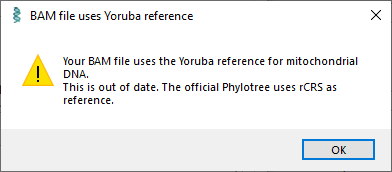

**Figure 4.10: Yoruba reference model warning**

This comes from either the Haplogrep button for mitochondrial haplogroup calling or the mtDNA FASTA file generator for transferring data to other tools.

Most of the tree sites work off of the rCRS model of the mitochondria.  But some of the models delivered by WGS testing come with the Yoruba model mapping.  **WGS Extract** issues a warning but may allow you to proceed (FASTA generation) or simply returns without further work done (Haplgrep v2 Haplogroup caller).  What really needs to happen is for Yoruba reference model BAMs need to be converted to rCRS ones before processing.  The tool already does other “simple” things (like creating a missing BAM Index file), so this should be added.  But it is not yet available. \
 \
Easiest, if wanting to use **WGS Extract**'s implementation of Haplogrep, is to convert the BAM from one model to the other yourself.  First extract the mtDNA only to a new BAM, then create the FASTQ files from that (not an extracted FASTA mtDNA BAM), then map/align to a new model (say GRCh38).  You will now have a rCRS mapped mtDNA-only BAM that you can use in **WGS Extract’s **call of** **Haplogrep.  The [Bioinformatics for Newbies](http://bit.ly/38jnxnK) document gives the various commands for these operations; if not then the Facebook group Files section.  It is a bit of a pain today. 

There is a [hand mapping or liftover process described](https://www.mitomap.org/foswiki/bin/view/MITOMAP/YorubanConversion).  The models are really that similar.  There is even a [tool to convert SNP names](https://mseqdr.org/mvtool.php), which have several variations.  Yoruba was in the Build36 / HG18 reference model and still included by UCSC in their initial HG19 release.  GRC37, which was based on HG19, did do the mitochondrial model update to rCRS.  Hence leading to the confusion. Technically, there are even more variations than just Yoruba and rCRS (Andrews et al., 1999). See RSRS (Behar et al., 2012). RSRS is rarely seen and never caught on. Also name variations exist of chrM in hg19, chrMT in a hacked hg19, and MT in GRCh37 and 38 models. See [the reference](https://haplogrep.i-med.ac.at/2014/09/08/rcrs-vs-rsrs-vs-hg19/) from the creators of Haplogrep. (in that paper, they claim their v2 tool will accept Yoruba).

## 4.3 Unmapped Read Analysis

Although not really haplogroup analysis, the unmapped read analysis falls into a similar concept like Haplogroup analysis for Y and Mitochondria.  You are taking the reads that did not map to the human genome and seeing if they map to a wide variety of bacteria and possibly viruses.  Some genome analysis models have decoys to capture this (e.g. EBV in the 1KGenome models; a common bacteria found in blood samples) which will not appear in the unmapped file.

cosmosID -- recommended in the tool interface; online; was mostly free. Takes in the BAM or FASTQ files we generate here

Daehwan Kim Lab Centrifuge -- mostly c++ desktop tool; see use by David Huen to understand possible bacterial contamination in Dante Lab samples.

# 

# 5 Unalign, Align and Realign

This is the largest single task supported by this tool.  An important one in order to get both forms of BAM files needed for optimum results for various analysis.  It also allows you to start with FASTQ files and get to a BAM needed by all the other tools. This is a resource intensive, multi-part task with many steps / stages. \
 \
Alignment is the mechanism of creating a BAM file from the FASTQ results of the sequencer.  It is the action of mapping the jumbled sequencer read segments onto a (Human Genome) Reference Model. That is, determining on what sequence (chromosome, mitochondria) and where in that sequence the read segment most likely belongs. Unalignment goes from a BAM back to a FASTQ (mapped to unmapped read segments).  **Align** goes from the FASTQ to a BAM.  **Realign** goes from a BAM to a BAM by doing an **Unalign** and then **Align**. The **Realign** being used to change the reference model used to map the segments in a sensible way.

The **Realign** button in the BAM File frame is simply calling the FASTQ frame  **Unalign** and then **Align** with all options automatically chosen. See the **Realign** button section earlier for how those options are chosen automatically.  

We will describe the **Unalign** and **Align** button actions more thoroughly here. Those buttons are located in the FASTQ frame on the Analysis page.  Only the **Align** button, when clicked directly, has a number of pop-up windows to set the three needed options.

Here are the major steps of the **Realign** button; each with its own “Please Wait” pop-up:

- **Unalign BAM (that is, BAM to FASTQ’**s  (1-2 hours) \
(add 45 minutes if CRAM; <span style="text - decoration: underline;">final disk</span> space 1x BAM size in Output Directory; intermediate about 200 GB in Temporary Files directory during the collate sort function)

- **Create Reference Model Alignment Indices**  (2-3 hours) \
(5 GB <span style="text - decoration: underline;">additional disk</span> space in Reference Library; until you delete it)

- **Alignment (BWA MEM)**:  (8-160 hours)** \
**(**final **disk space 1-2x BAM size in Temporary Files directory)

- **Alignment Cleanup** (Fixmate, coordinate sort, mark duplicates) (2-3 hours) \
(final disk space 3x BAM size in Output Directory. Intermediate about 200 GB in Temporary Files directory during sort function)

- **BAM to CRAM**: (If you start with a CRAM; you will end up with a CRAM): (1 hour) \
(final disk space is no greater as it deletes the BAM after making a CRAM. CRAM is ½ the size of the BAM.) \


The first bullet is the **Unalign** button.  The last four are the **Align** button. **Realign** does both.

So 13 to 175 hours total to do a realignment. Or half a day to 7 days, depending on your computer.

The first two steps are only done once unless you delete the result files (FASTQs and Reference Genome Library Index).  The tool will look for existing files and reuse them. Thus saving a few hours on any subsequent runs with the same or similar BAMs.

Note that the reference model index is needed for the final (going to) reference model.  Not the current BAM reference model. If you align another BAM and it uses a different reference model as the target for an alignment, then that new reference will need its own index files.

In general, Alignment is the biggest job you will ever run.  It will take 8+ GB RAM and 160 hours of CPU time (8-16 wall-clock hours on a 8 to 16 logical core CPU).  On a single core CPU, the job will take over 160 wall clock hours (or 6+ days).  In testing we have never been able to keep a Windows 10 single-CPU machine up long enough to complete the 6+ day job. (Microsoft tends to force a reboot for updates that frequently.)  So do not expect much luck on a single core CPU doing an alignment. During alignment, resources such as memory and CPU are “pegged”.  You cannot likely expect to do much else on the machine.


**Note:** *On Win10 systems, we have developed a specialized BWA that runs parallel under Cygwin64. The original BWA runs only on a single CPU under Win10 due to limitations in CygWin64.  Our new one utilizes all the CPUs just like the Unix/Linux/MacOS version.  Although the new one uses all the CPU’s under Win10, it is still nearly 4x slower than the WSL2 Ubuntu version of BWA.  As this is the longest running task, we have developed an option in the program to utilize a WSL BWA program.  See **[Appendix entry on enabling the WSL BWA Patch](#heading=h.mc0pc67qz2xr)**.*

The alignment generates a 300+ GB SAM file.  But we pipe the output directly to BGzip compression to limit that to the size of your original BAM (or FASTQs combined).  The little bit of extract time (30 minutes or so) helps reduce the intermediate disk space required; often by 6x.


**Note**: *We have had *`samtools sort `*(the first step in the cleanup phase)  take 12-14 hours to finish even on high performance machines. Occasionally, the *`markdup `*also seems to take forever or even hang. As a result, we have split the cleanup stage into two substages.  The fixmate and sort first stage (_raw to _sorted).  Then the mark duplicates (_sorted to final BAM file). Unfortunately, the sort must be completed to get a final BAM.  \
 \
But the *`markdup `*is not always needed (mostly an improvement for some Illumina sequencer results). You can stop the program by clicking the window close on the ****PleaseWait**** pop-up.  **In the ****Output Directory**** will be a file ending in *`_raw.bam`* and one in *`_sorted.bam`*   Delete the *`_raw.bam`* file and (if **desired)** remove the *`_sorted`* portion from the file name.  This *`_sorted`* is your new, final BAM. You can restart ****WGS Extract**** and select and index this new BAM file. The *`_sorted`* BAM can be used as is (just without the *`markdup `*optimization).*


If any one of the steps fails part way through, then upon initiating the button command again, the tool should pick up with the start of the stage that failed.  This assumes the intermediate files are still around. That will be the case if the **WGS Extract** program crashes in error or if DEBUG_MODE is turned on which prevents the **Temporary Files** directory from being cleared. Note that DEBUG_MODE can leave many large, intermediate files in the **Temporary Files** directory..

## 5.1 Align button options (when not in a Realign)

When clicking the **Align** button directly, there are three key options that are queried for in pop-up windows.  These options are known when doing a **Realign** and so not asked for.  The options in **Align** are: (1) FASTQ source file(s), (2) Reference Model target, and (3) Output BAM/CRAM file name. Each is covered a little further below. \
 \
(1) The FASTQ files may be ones supplied by your test vendor.  Or those generated by the **Unalign** button.  If paired-end, then two files must be selected that represent the paired-read FASTQ results of the sequencer.  A standard file selection dialog pop-up is used with only `.fastq.gz` or `.fastq` file extension files shown for selection. The tool will attempt to find the files and reuse them during an **Unalign**.

(2) The Reference Model selection pop-up is the same given when a BAM is loaded and the reference model cannot be identified.  With the caveat that <span style="text - decoration: underline;">all</span> reference models are available for selection.  Whereas, in the BAM pop-up, the list of available buttons to select is limited to what content in the BAM indicates the reference model could possibly be. Once you select the desired reference model, click done.

The most common and suggested reference models are in the left column of the two columns shown. 1K Genome project models are suggested and what Dante Labs and Nebula Genomics use.  UCSC HG models are the next possible choice and what is used by ySeq and FamilyTreeDNA.  The last row are the two EBI GRCh reference models. See the [special section on reference model selection](#heading=h.og6mbij1659x) below for more information.

 (3) The Output BAM file name is specified via a File Save Dialog pop-up.  No suggestion or pre-population of the name is given. This is because FASTQ files tend to be very uniquely named with complex forms.  The file name specified must end in` .bam` or `.cram`.  Which one indicates the final file format desired. The file will always be placed in the currently selected **Output Directory**. The path in the Save Dialog is ignored but can be useful to select a name similar to other files already in your system.

As part of alignment, in a final clean-up step (for BWA alignments), there is a mark duplicates phase.  The output of this phase is captured in a text file and placed in the **Output Directory**.  A sample of which is:

```
COMMAND: samtools markdup -s -d 2500 -@ 16 - 60820188481027_hs38.bam
READ: 856294256
WRITTEN: 856294256
EXCLUDED: 29955961
EXAMINED: 826338295
PAIRED: 825553904
SINGLE: 784391
DUPLICATE PAIR: 65996663
DUPLICATE SINGLE: 440396
DUPLICATE PAIR OPTICAL: 25779036
DUPLICATE SINGLE OPTICAL: 23323
DUPLICATE NON PRIMARY: 0
DUPLICATE NON PRIMARY OPTICAL: 0
DUPLICATE PRIMARY TOTAL: 66437059
DUPLICATE TOTAL: 66437059
ESTIMATED_LIBRARY_SIZE: 3841672169
```
**Figure 5.1: Captured Mark Duplicates result text file**

## 5.2 Estimating your time to Align

```
--- Exec: ButtonAlignBAM.sh, started @ Thu Mar 18 13:55:09 2021
+ wsl bwa mem -t 16 /mnt/c/WGSE/Dev/reference_library/hs38.fa.gz /mnt/c/WGSE/Regression/WGSEv3i/608*_R1.fastq.gz /mnt/c/WGSE/Regression/WGSEv3i/608*_R2.fastq.gz
+ C:/WGSE/Dev/win10tools/bin/bgzip.exe -@ 16
++ C:/WGSE/Dev/win10tools/bin/grep.exe -v pestat
[M::bwa_idx_load_from_disk] read 0 ALT contigs
[M::process] read 1078066 sequences (160000271 bp)...
[M::process] read 1077876 sequences (160000127 bp)...
`[M::mem_process_seqs] Processed ``1078066 reads in 642.328 CPU sec, 43.505 real sec`

….
[main] Version: 0.7.17-r1188
[main] CMD: bwa mem -t 16 /mnt/c/WGSE/Dev/reference_library/hs38.fa.gz /mnt/c/WGSE/Regression/WGSEv3i/60820188481027_R1.fastq.gz /mnt/c/WGSE/Regression/WGSEv3i/60820188481027_R2.fastq.gz
`[main] ``Real time: 35609.366 sec; CPU: 526970.609 sec`

--- SUCCESS: 9.9 hours to run: ButtonAlignBAM.sh (finished @ Thu Mar 18 23:48:38 2021
**Figure 5.2: Log from BWA Alignment**** **

```
You can get an estimate of your expected time from the periodic messages from BWA of “Processed 1078066 reads”.  It gives you a CPU used seconds and real-time (wall clock) seconds.  Look at your stats page and see how many hundreds of millions of RAW read segments you have (often 600 million or more; 853 in this case).  Divide that by 1078066 and multiply by the real seconds.  That will give you an estimate, in seconds, of the wall-clock time to align.  In this case we get 9.9 hours which is what it took. There is often about 30 minutes of additional time for compression but that is noise in the overall estimate. And remember 2 hours for cleanup (sort, mark duplicates, etc) at minimum. Be worried that if your CPU seconds are close to your real seconds, then this implies you have no parallel processing and are in for the full 6 day run. The above captured log is from a Win10 16 virtual core system with WSL BWA enabled.

## 5.3 Indexing the Human Genome Reference File

A large job before you even start may be to index the human genome reference file you will use for the alignment process.  A human genome reference is about 1 gigabyte in size.  Its indices needed for the aligner are another 5.5 GB and take over an hour to create.  The files created and their approximate size are shown below (example for the hs37d5 reference):

| Index File Name	| Size (MB) |
| :--- | ---: |
| hs37d5.fa.gz.bwt	| 3,138 |
| hs37d5.fa.gz.sa  | 1,570 |
| hs37d5.fa.gz.pac	|   784 |
| hs37d5.fa.gz.amb	|     0 |
| hs37d5.fa.gz.ann	|     0 |

**Figure 5.3: Reference Genome Indices for Alignment**

This process takes a single CPU and so will not likely stress your machine resources. Most likely your reference library is around 1-10 GB depending on how many models you downloaded. Each set of alignment indices adds another 5 GB of files.  Manage your reference library carefully if you are limited on storage space.  Or move the reference library to a disk where the file sizes are most optimally stored. The alignment indices are not destroyed once created.  But you can delete them if not needed again. Overall, the reference library is small compared to your BAM file and its intermediate forms stored in the Temporary Files directory.

## 5.4 Selecting a BAM Reference Model

One of the first tasks performed by the WGS Extract program, after a user selects a BAM or CRAM file, is to determine its reference genome model.  The model characteristics are displayed immediately below the BAM file name when determined. It consists of the primary chromosome model class, the mitochondrial model name, and the number of sequences (SNs) defined in the reference model used by the BAM.

If the reference genome used to create the BAM cannot be automatically determined from this information, a pop-up query for the reference model from a list of those known will be made similar to shown in figure 5.4. This is also used by the Align button to query the target reference model to be used to align the FASTQ files to create a new BAM. What is known about the current BAM will be displayed above the selectors.  For the Align button, all models are available for selection.  For picking the closest model to a loaded BAM, only models in the same Build and Chromosome name format are available for selection. The others are grayed out.  The BWA aligner cannot process the EBI GRCh models and so those are grayed out in the Align command.

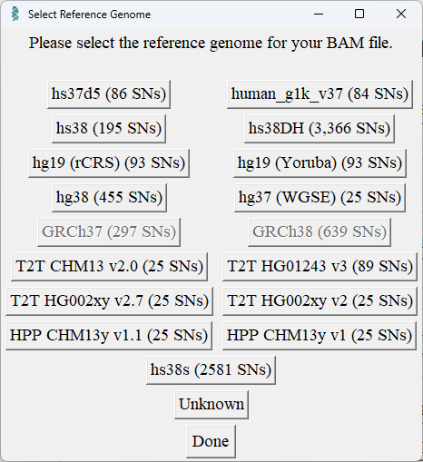
**Figure 5.4: Selecting the Reference Genome**

Characteristics of the BAM file are given above and some buttons grayed out (inactive) if they would clearly not fit those characteristics.  But if being asked with this pop-up, it is because the program could not specifically identify the correct reference genome from a BAM.  Some tools will fail if the exact reference genome used to create the BAM file is not selected or available for selection.  So this is really a last resort to get something useful done..  

If you do not know the reference genome, you may want to exit out and select a different BAM. In almost all cases, the tool can determine the reference genome from the file content and should never have to ask. It is often only in corrupted or incorrectly formatted BAMs that the reference genome cannot be determined See the separate document [Determining your BAM Reference Model](https://bit.ly/34CO0vj) for more information on reference genome model types. A little more detail is given in a special chapter on [Reference Genomes](#heading=h.qzqmhqmfz1kz) that follows next as well.

# 6 Reference Genomes

In general, you will only ever need one or two reference genomes.  Often the file for the build your BAM / CRAM file was created with.  And its “mate” so you can do a Realign and have the “other” build model available.  For most users, you can avoid downloading any reference genome until the program tells you what it needs.

In v2, five reference genomes were delivered in a **reference_genomes/** directory. If you upgrade from v2, the original 5 reference genomes are saved and transferred over. In v3, there is the introduction of numerous support files in the **reference/** folder. Like in v3, v4 starts with an empty reference genomes folder and will download on demand as needed.

## 6.1 Reference Genome Library Install

The Reference Genomes in the** Reference  Library** are downloaded and set up on demand during program execution.  But there is a Library command available to do this ahead of time. To start the  **Reference Genomes Library Installer**, click on the `Library.xxx` script in your installation directory. \
 \
You can run the **WGS Extract** program while the reference genomes are being downloaded. You can run the **Library installer** while the** WGS Extract** program is paused with the dialog telling you a reference genome is missing.  Once you load the missing reference genome, click the button to continue in **WGS Extract**. \
 \
**WGS Extract** gives you the option to download a specific missing reference genome when discovered. To aid this process, there is a new setting for the preferred server you want used: NIH or ABI. Most reference genomes are on only one server. \
 \
Once you start the `Library.xxx` command, you should see a menu similar to **Figure 7.2 **below.

```
--------------------------------------------------------------------------------
WGS Extract Reference Library REFERENCE GENOME Installation and Update
--------------------------------------------------------------------------------
Version 7 located at /mnt/c/wgse/dev/reference/
[See the Users Manual for more information about these Reference Genomes]
` 1) Exit                           20) hg38+hg002y_v2 (by ``ySeq`</span>`) 3x`

` 2) ``Recommended`` (``@US NIH``)          21) hg19 (yoruba; early ``Dante`</span>`)`

` 3) ``Recommended ``(``@EU EBI``)          22) hs38a (1K Gen)`

` 4) T2T_v2.0 (PGP/HPP chrN) (``Rec``)  23) hs37 (1K Gen)`

` 5) hs37d5 (``Dante`</span>`) (``NIH``) (``Rec``)     24) hs38d1v (Verily; unique)`

` 6) hs38 (``Nebula`</span>`) (``NIH``) (``Rec``)      25) hg37 (rCRS; WGSE v1; BAD)`

` 7) hs38d1 (``Nebula`</span>` new) (``NIH``)      26) hg01243v3 (PuertoRican1)`

` 8) hs38DH (aDNA) (``NIH``) 3x         27) hg002xy_v2.7 (T2T)`

` 9) hs38d1a (1K Gen+) (``NIH``)        28) hg002xy_v2 (T2T)`

`10) human_g1k_v37 (``NIH``)            29) chm13y_v1.1 (HPP)`

`11) hs37d5 (``Dante`</span>`) (``EBI``) (``Rec``)     30) chm13y_v1 (HPP)`

`12) hs38 (``Nebula`</span>`) (``EBI``) (``Rec``)      31) T2T_v1.1 Draft`

`13) hs38d1 (``Nebula`</span>` New) (``EBI``)      32) T2T_v1.0 Draft`

`14) hs38DH (aDNA) (``EBI``) 3x         33) T2T_v0.9 Draft`

`15) hs38d1a (1K Gen+) (``EBI``)        34) T2T_v2 (PGP/HPP Genbank)`

`16) human_g1k_v37 (``EBI``)            35) GRCh38 (Ensembl) (patched)`

`17) hs38d1s (by ``Sequencing`</span>`)        36) GRCh37 (Ensembl) (patched)`

`18) hg38 (``ySeq`</span>`)                    37) GRCh38- (Gencode) (primary)`

19) hg37 (rCRS; ySeq)              38) GRCh37- (Gencode) (primary)
Choose which Reference Genome(s) to process now (1 to Exit):
**Figure 7.2:** Reference Genome Download and Processing selection


**Green** is identifying the three **recommended** reference genomes. ** Blue** is for the US NIH server and **Red** for the EU EBI server version of the same file. Some models are not compressed on the source server and so take 3x longer to download. They are marked as such.


(1) **Exit** will bypass any further processing and exit. 

(2) **Recommended** (**@US NIH**) will install the three reference genomes you will likely need (individually as items 4-6 and marked with **(Rec)**) using the US NIH server.

(3) **Recommended** (**@EU EBI**) installs the same three recommended models except using the UK based EBI server (items 4, 11-12).


The script keeps querying for another option until the <span style="text - decoration: underline;">(1) </span>**<span style="text - decoration: underline;">Exit**</span> option is chosen. The **<span style="text - decoration: underline;">Recommended**</span> options are the same as selecting the individual ones (items 4-6, 11-12).


Some discover they have problems downloading the four 1K Project reference genomes from the **USA NIH** servers.  And hence the option for the **EU EBI** server versions.  *Which server is better depends on your internet service provider and not necessarily where you are physically located*. If you see errors during the (2) **Recommended** (**@US NIH**) when processing any genomes, then select (3) **Recommended** (**@EU EBI**).  Hopefully one of these two site locations will work for you. Both work for most and they are identical in content.

```
There are a few more models beyond the recommended that exist on both servers (7-10, 13-16). Most of the various 1K Genome project models useful for analysis are part of this group. Nebula has switched to the hs38d1 model in 2H2022  (7, 13). Ancient DNA tends to use the hs38DH model (8, 14). GeneDX tends to use the human_g1k_v37 model (10, 16)  We are not aware of any use of hs38d1a but provide it for completeness (9, 15). \
 \
(17) hs38d1s is a custom model created by Sequencing.com for their BAMs. Their unique model was recreated here for your convenience. Sequencing has not provided the model nor publicly acknowledged they are using a unique model. (18) through (20) are hg3x models from and used by ySeq. The last being their special T2T realignment model. (21) is the old, original hg19 model with the Yoruba mitochondria model that was used early on by Dante with their 100 bp 30x WGS using MGI sequencers.  \
 \
(22) through (25) are there for completeness but should generally never be used except to decode an existing CRAM based on them. (22) and (23) are the remaining 1K Genome Project analysis models.  (24) and (25) are considered in error, unique models that should be avoided.

(26) is the PR1 (Puerto Rican) model from the T2T consortium like the (4) T2T recommended model. It is the second to come out of that project and has its own matching X and Y.  (27) through (34) are various versions of T2T / HPP / PGP models provided for completeness in case you have an early realignment to the early versions. \
 \
Models (35) through (38) are the true GRCh models, known in the traditional sense by those labels.  The first two are the only fully “patched” models. All others are the original release for that build.  The latter two are the unpatched, original release but using the numeric naming.  None of these models have been optimized for Analysis.

If you upgrade from v2, all 5 reference models from the original v2 release are moved.  If upgrading from v3, the models you downloaded remain.The T2T / PGP models are completely new in v4 and will not be in your library already.

All download attempts are retried 5 times and restarted where left off if interrupted in the middle. Depending on the reason for the stoppage, restarting the download by rerunning this script may not restart where it was interrupted.

Each <span style="text - decoration: underline;">human reference genome</span> is around 1 GB in size and takes from a minute to an hour to download, index and process.  When doing an alignment, an additional 5 GB of index files are created alongside the reference genome.  \
 \
All model options will delete any existing reference genome file before trying to download the requested one.  Thus clearing out any downloaded partially or in-error.

## 6.2 Reference Genome Types

This expansion of information on the reference genome types is to help explain the [BAM Reference Model](#heading=h.og6mbij1659x) and the [BAM Realign button](#heading=h.2ihfw29772r8) sections more fully. More information on downloadable reference genomes is in an external [Determining Your BAM Reference Model](https://bit.ly/34CO0vj) document.

We start by giving a chart of how reference models are automatically selected by the Realign button. Table 6.1 below is a rough summary.

| &nbsp;&nbsp;&nbsp;&nbsp;Build<br>Class&nbsp;&nbsp; | Build 37 | Build 38 |
| --- | --- | --- |
| UCSC / HG | hg19 *,  hg37 | hg38 |
| 1K Genome | hs37d5,<br>human_v37_g1k, hs37 | hs38,<br>hs38a, hs38d1, hs38d1a, hs38DH |
| EBI / GRCh | Homo_sapiens.GRCh37... | Homo_sapiens.GRCh38... |

**Figure 6.1: Mated Reference Model Classifications**

* hg19 with a Yoruba model will always be taken to an hg38 rCRS model in BAM realign.  hg38 will always be taken to hg37 (the hg19 model with the rCRS mitochondrial model).

All T2T models that are not T2T v2.0 are realigned to T2T v2.0.  T2T v2.0 models are realigned to Build 38 (hs38). You cannot use the Realign button to target a T2T model.  Instead, use the separate Unalign and then Align which lets you choose the target model.

Basically, the tool will automatically determine and try to report a major model type of either Build **38** or Build **37 **(aka **19**). And a subtype or class within that of **1K**, **HG**, **EBI** or **NCBI**. The new T2T / HPP / PGP models are an exception as they are not a recognized build type yet. Each T2T model has its own characteristics and does not conform to the Build and Class identifiers.

The 1000 Genomes project (**1K**) is the most common and suggested model class to always use.  **HG** (for historic, UCSC released Human Genome project models) and **EBI** (for the EBI <span style="text - decoration: underline;">Ensembl</span> database) are two other common ones. **NCBI** is a fourth class and represents the original reference model with no changes for analysis. They are generally never encountered and not covered here.

**EBI** models are sometimes mistakenly referred to as the newer Genome Reference Consortium - human (or **GRCh**)** **models. They traditionally are known for their numeric sequence naming and minimal changes from the reference genomes. But this only applies to the **Ensembl **database models on the **EBI** servers.  These are not to be confused with the **EBI** distributed <span style="text - decoration: underline;">Gencode</span> consortium models that use the **HG **sequence naming and analysis set conventions found in the 1K Genome models. Gencode is a new consortium that includes UCSC, NCBI and others.


**Note**: In an August 2021 patch release of WGSE v3, we have added a [HPG](https://humanpangenome.org/) [Telomere to Telomere](https://sites.google.com/ucsc.edu/t2tworkinggroup) [CHM13 + HG002/NA24358](https://github.com/marbl/CHM13) model as a “reference” genome.  BAMs based on this model are not as processable as we do not have complete definitions of SNP positions within them to generate VCFs.  For more information, see the [article on the T2T model](https://h600.org/wiki/article35) and the [BAM Reference Model](https://bit.ly/34CO0vj) document as well as the [HumanPanGenome repository](https://github.com/human-pangenomics). \


Historically, many had used subtype classifications of **HG** (UCSC) and **GRCh** and had that classification imply both the model class (value set) and sequence (chromosome) names used.  This is an incorrect practice and not consistent.  The **EBI Gencode** models include **HG** (UCSC) style chromosome sequence values and Sequence Names (SNs) but file names that start with **GRCh**. This as opposed to the **EBI** **Ensembl** models that are their own subtype (with regard to reference sequence values), have file names starting with `Homo_sapiens.GRChxx`, and use the numeric sequence name convention of **GRCh**.  We try to avoid using **GRCh** for anything other than as a generic name for any modern human reference analysis model. Worse case, we try to use **Build** nn as the generic name.

We only use the Build **19** designation IF the model has the Build **18 / 36** carryover of a Yoruba Mitochondrial model included.  Otherwise, the designation Build **37** is used if based on the rCRS mitochondrial model. This is true even for UCSC released models that may have the **HG** naming convention of **chrN**, where we identify them as hg37 even though their file names may state hg19. Numbers HG1-19 are from the Human Genome Project (HGP) release process that UCSC helped manage.  And NCBI 1-38 from the USA NIH general model release capture and accession process that came concurrently or after.  With 18 == 36, 19 == 37 and 20 (never used) == 38.  HGP was reformed as GRCh and essentially adopted the NCBI build numbering. Often called GRCh37, GRCh38, etc. It is confusing.

The 1000 Genome project source models originated with the short model names starting with “**hs**”; but then go by many different names in practice.  For example, **hs37d5** is a superset of **hs37** which is a superset of **human_g1k_v37**. For convenience and a shorter designation, we name the latter as **hs37-** in the tool. This last one is derived from the original **NCBI37** reference model. \
 \
All 1K Genome models are generated by the <span style="text - decoration: underline;">bwa.kit</span> program that came out of the 1000 Genome project and its BWA aligner tool.  The Build 38 models from the 1K Genome project are **hs38**, **hs38a**, and **hs38DH**. **GCA_000001405.15_GRCh38_no_alt_analysis_set** is the name often seen for **hs38** as it was captured and named that way in the NCBI archive server.  Often, NCBI is the only online source of these models. **Hs38a** also goes by **GCA_000001405.15_GRCh38_full_analysis_set** for similar reasons.  And **hs38DH** is the original name for the commonly seen name **GRCh38_full_analysis_set_plus_decoy_hla**.  We recommend these 1K Genome sourced models be used as much as possible and encourage the shorter, easier to recognize names for them as well. There is also an additional **hs38d1** and **hs38d1a** model that did not come out of the 1K Genome project but were derived later from them.  We have given them this shorter name for convenience here. They tend to only be known by a longer **GCA_000001405.15_GRCh38_xxxxx** name like the others.

The recommended reference genome models in the WGSE v4 Reference Library are as follows:

| File Name | Class | Num of<br>SN’s | Notes |
| --- | --- | --- | --- |
| hs37d5.fa.gz | 1k37g | 86 | 1K Genome project model for Build 37 (with EBV) |
| hs38.fa.gz | 1k38h  | 195 | 1K Genome project model for Build 38 (aka GCA_000001405.15_GRCh38_no_alt_analysis_set) |
| chm13_v2.0.fna.gz | T2Tv20h | 25 | A unique, experimental model from the Telomere to Telomere consortium (New) |

**Figure 6.2: Details on Recommended Reference Genome Models**

See the separate document [Determining your BAM Reference Model](https://bit.ly/34CO0vj) for more information on reference genome model classes.

1K, HG, and EBI class names determine the primary chromosome sequence model content (all models with the same classifier are identical in the primary chromosome sequence values).  Build 37/38 provides the major NCBI release build number that the analysis models were built from.  Build 19 is a special nomenclature for UCSC models that retain the originally released Yoruba mitochondrial model (as all Build 18/36 models have). The trailing ‘h’ is for “chrN’ sequence naming and ‘g’ for “N” (numeric-only) sequence naming. With the caveat that X and Y are used for theallosomes instead of an “N” and chrM or MT for the mitochondrial sequence names in ‘h’ and ‘g’; respectively.  ‘h’ is short for HGP (original) nomenclature and models.  ‘g’ for GRCh new nomenclature.  Both are captured by NCBI in their database.

A summary chart of the more common models seen that are available in the v4 library installer is given in figure 6.3 here.

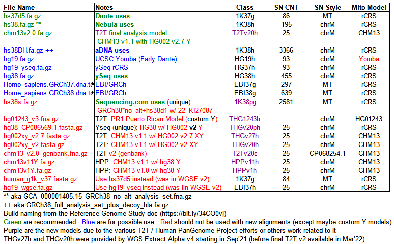
 \
**Figure 6.3: Summary of Reference Genome Files Available in WGS Extract**

For reasons on why to use one model over another, see [Heng Li’s blog post](https://lh3.github.io/2017/11/13/which-human-reference-genome-to-use) on the subject.  hg19_WGSE suffers from issue 7 listed there (that no others do) and thus the main reason it should not be used.  hg19_WGSE is not available from any other source. \
 \
Some use the term GRCh37 and GRCh38 to imply only the original major build and not the analysis models.  Others to imply the Ensembl numeric naming convention in reference files. We try to avoid the use of the GRCh and HG terms in this document.

## 6.3 Chromosome models for Phylogeny

Some are doing WGS tests with a primary goal of feeding their Y and/or Mitochondrial results into Phylogeny analysis tools.  To help you be better aware, below are stats on the effective length of the various models available and used today.  This has dramatically changed recently with the numerous T2T / HPP full sequence Y models. See figure 6.5 below for more details.

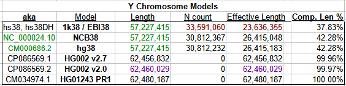
 \
**Figure 6.5: Available Y Chromosome models for phylogeny**

The first three models are simply identifying the traditional Build 38 model included in the four major groups of Build 38 models.  Most are not aware that each major group has slight differences (tweaks) made to the primary chromosomes beyond the original, released Build 38 source model.  The 1K Genome Project models had the most tweaking; nearly 3 million more bases are masked out and not available for alignment.

The last three models are the long-read sequence created telomere to telomere models.  Two are versions (variations) of the HG002 sample (a haplogroup J1 individual). The latter is known more commonly as the “Puerto Rican” PR1 sample and is down the R1b-DF27 clade not too far from the original Build 38 reference model below R1b-L20. PR1 has the longest Y definition and so comparisons in length are made to it.

Key to using these models is understanding the NRS (Non Reference Sequences).  This is what the Pan Genome Project is all about.  Studies in the last 10 years have shown there are well over 50 million base pairs across the genome that are not represented in the current build 38 reference model. Sequences that are important and unique to certain populations in Africa, China, South America and the like. This also appears within the Y chromosome itself.  So people from those populations with those variances will not be represented when their sequencing results are mapped to the current, generic “Western European” build 38 human genome reference model.  Both the HG002 (East European Slavic Ashkenazi Jewish) and HG01243 (African origins Puerto Rican) have areas on the Y that do not appear in the current human genome reference model build 38.

## 6.4 The new T2T / HPP Reference Models

Much excitement has brewed since the summer of 2021 when a couple of whole genome haploid FASTAs were released of particular cell samples (CHM13, HG002, HG01243).  These are the first coming out of two activities that are somewhat working toward common goals.  The Telomere to Telomere (T2T) Consortium led by UCSC and NIH.  And the Human PanGenome Project that is the follow-on to the previous human reference model groups.  The T2T has formalized the process, tools and methods to develop true Telomere to Telomere sequence creation of cell lines from mainly PacBio HiFi long read sequencing.  They also use Oxford Tech Nanopore long read and traditional Illumina short read (with 250 bp length but higher accuracy) to augment and polish.  Key is that they do de Novo assembly of phased chromosomes. So accurately recreating and not trying to map short-reads to a model.  Remapping short read results to these new “assemblies” has been useful to highlight the many, now better known, non-reference-(model)-sequences (NRS) known to exist.  Over 50 megabases have been identified so far.  The Human PanGenome Project (aka HPG and HPP) is attempting to figure out how to build a non-linear, human genome reference that incorporates all this variation.  Here are the models we have incorporated into the tool so far:

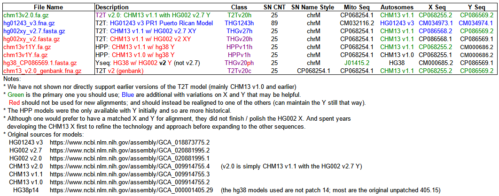
 \
**Figure 6.6: New T2T / Human Pangenome Project (HPP) Models**

# 

# 7 Installing and Starting WGS Extract

The latest **WGS Extract** installer can be downloaded from:

**[https://wgse.bio/](https://wgse.bio/)** 

The downloaded `.zip` archive file is an installer and approximately 32 KB in size.  It is purely the script to install the program and its dependencies.. The installation process will install dependent software as well as the needed libraries and actual program scripts and templates.

Starting with v4, there are now three release tracks you can choose from (or change between).  **Beta**, **Alpha** and **Dev**(eloper).  **Beta** releases are every quarter to year and more thoroughly regression tested.  **Alpha** is released every month to few months and has been tested for operation on the platforms supported but may still have bugs for new features being added. Old features in **Beta **should still be fully operational in **Alpha **releases.  **Dev**(eloper) is released weekly to monthly and is a raw dump of the current development release.  No guarantees on anything; either new features or fixes to ones that may have been broken.  Minimal testing. But bleeding edge capability.

Make sure to read the appropriate section for your Operating System (OS) Platform:

- [Windows 10 / 11 Desktop](#heading=h.1ea7z0o40dk7)

- [Apple MacOS X / 11 / 12 / 13](#heading=h.keb2e7zgybc7)

- [Ubuntu Linux LTS 18 / 20 / 22](#heading=h.coxuyzccr75l)

Read the section on Upgrading within each OS-specific install section if you have a previous release AND wish to transfer your reference genome library to the new one. Reference genomes are the largest files in the installation and take the most time to download and prepare.

## 7.1 Quick Summary

1. Download the Installer (a .zip compressed archive); double / right click to uncompress (extract all) if not done automatically during download

2. Move (cut and paste) the extracted `WGSExtractv4/` folder to your favorite place for applications (`/Applications` folder on MacOS, `C:\Program Files\` for Windows, or simply your home directory – not `Documents/` or `Downloads/` though.)

3. (Double / right) click the Installer for your OS inside the `WGSExtractv4/` folder. Be prepared to enter your password on non-MS Windows systems as the tool is installing programs like Python and Java into the system area. YOU MAY NEED TO RIGHT CLICK (CTRL-CLICK on MacOS) THE FIRST TIME. SEE EACH OS SECTION.

4. (Double) click the `WGSExtractv4.xxx `file to start the program.   The `WGSExtractv4.xxx `file and `Library.xxx` manager are added inside the `WGSExtractv4/` folder once installation finishes. These files (including the `Install`er and `Uninstaller`) are unique and available for each platform.

- If upgrading from a previous **WGS Extract** release,  then once the installer is extracted and before you run it, copy the <span style="text - decoration: underline;">content</span> of the new `WGSExtractv4/` folder into your current installation directory (replacing any files with the same name). Then follow the instructions above. This instruction is for those running v1-v3. The installer will update what it needs to in that directory and clean out any old release files no longer needed. This can save lots of time this way  by reusing reference genomes you may have downloaded in a previous installation. If you have moved your reference library, it will find the new location in your saved settings. For v4 releases, simply rerun the installer and everything will upgrade itself; if needed. No need to download any files directly.

 \
The options for **OS** in the` ``Install_OS.xxx` (and `Uninstall_OS.xxx`) script names are:

-  _`macOS.command` (Apple MacOS X, 11, 12 & 13; x86 and M1/M2 architectures), 

- _`ubuntu.sh` (Linux LTS 18, 20 and 22 on x86_64), and 

- `_windows.bat` (Microsoft Windows 10 and 11 on x86_64).  

(note: if installing in a Virtual Machine like Windows 11 WSL2 or VMWare, this is the virtual machine guest OS and not your host OS.)

During install, the other OS files will be removed. What is remaining is a start script named  `WGSExtractv4.xxx`, a Library management tool `Library.xxx`, an Uninstall script `Uninstall_OS.xxx` and of course the `Install_OS.xxx` script.

The `Install_OS.xxx` script is re-entrant. It can be run again to **Update **the dependent tools and the **WGS Extract** program itself. You should never have to download an installer again with v4.

After giving some additional general release details, we will cover details of installing the reference genomes in the reference library and then details about installing on each platform.  Review all the appropriate sections for your platform.

## 7.2 General Release Details

This v4 release file structure is very similar to the v3 one.  A finished installation directory will look similar to figure 7.1. Note that only the `Install_OS`, `Library`, `WGSExtract` start and `Uninstall_OS` script for your OS will remain after installation. The other OS versions will be removed. You should never locate your data (your original WGS BAM or similar nor any **Output Directory** files) in this release folder. Uninstall will delete this folder.

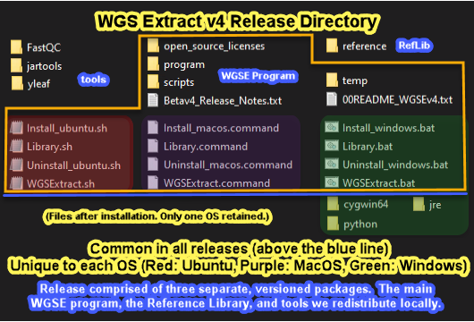
 \
**Figure 7.1: Final Installation Folder content**

The four main scripts for each platform are highlighted in a common color for each platform. All MacOS X/11/12/13 scripts end in `.command`, Windows 10/11 scripts end in `.bat` and Ubuntu 18/20/22 Linux scripts in `.sh``. ` You can simply click on the appropriate **Install, Library,** **WGSExtract** start or **Uninstall** script** **file for your OS. *Each OS has its nuances on the first-ever click of these scripts as they are not delivered through the OS vendors’ licensed software store.*

Microsoft Windows installations will have an additional `cygwin64/` and `python/` folder; and some platforms a `jre8/` and `jre17/` folder as well. We install these support programs within the **WGS Extract** installation directory for convenience. Additional folders may get added over time as features are added in updates.  Most notably, expect an `igv/` folder to appear soon.

The `scripts/` directory contains internally called script files. They should not be invoked directly nor edited.

`FastQC/`,` ``yLeaf/`** **and `jartools/` are 3rd party applications we bring in and install with the Tools package during installation  The main bioinformatic tools are installed in a common area dictated by the platform.  Often a system area like `/opt/local`, `/usr/local` or similar. `/usr/local` in the Cygwin environment is located in `cygwin64/usr/local`.

The `reference/`** **folder can be moved to a different location and a setting in the program adjusted to find it.  Similarly for the `temp/`** **folder which is used as a scratch area during processing. This may only be needed later as an optimization once you are more familiar. *These are the only data (non-code) sections of the installation.*

In the `scripts/`, `program/, reference/ and jartools/` folders are `JSON` files that indicate the version installed for that respective subsystem.  When running the installer, the json file is consulted and if a newer version is available, it will be downloaded to replace the existing files (as appropriate). The top level `release.json` file controls which release track you are in and where to find the latest package version information for a release track.  You can edit it to change your track; if you desire. The main **WGS Extract** version is in `program/program.json`.

## 7.3 Planning your Installation Location and Size Requirements

The main installation of **WGS Extract** only takes around 750 MB with an additional 500 MB or so for auxiliary programs like Python3 and Java17 (if not already installed in a system area).  But the overall size can quickly grow.  The two key folders within the `WGSExtractv4/` install folder that may grow are the `reference/` and the `temp/` folders. As a result, both can be relocated by settings in the program to areas where you may have the necessary space.

The `reference/` folder will use about 1 GB per reference genome you download.  In addition, it will take an additional 5 GB per reference genome you use during (Re)Alignment.  So the potential is for it to grow to 20 GB or more.  For most users, they will only (if ever) download one to two reference genomes.

The `temp/` folder is used for intermediate results during processing.  Often, large chunks of the BAM / CRAM file exist there in an uncompressed state during processing.  This is dynamic and cleared out frequently after every operation and at the program closing.  But during Alignment, Sort or other critical functions, it can grow upwards of 6 times the size of your BAM or 12 times the size of your CRAM. So likely 300 GB and upwards to 1 TB may be needed. This must be available free space on the disk where the folder is located.

 \
Before you can load any BAM or similar file when you start the program, you have to specify an **Output Directory**. The **Output Directory** will contain the files created by the **WGS Extract** program. As you can realign, extract FASTQs and similar, this **Output Directory** can become as large if not 2-3x larger in size than your original sequencing company results files directory (that is, the **Source** BAM, VCF, and FASTQs). The **(BAM) Source** and  **Output Directory** are NOT part of the release folder and should never be put there. We mention it here for completeness. \
 \
The **(BAM)** **Source**, **Output Directory**, and `reference/` folders tend to be read or written infrequently during program operation.  So they can be on slower, bulk storage. The `temp/` folder is the most used (like cache memory) and should be on the fastest disk. On an SSD if possible. Not on a network drive or connected over a wireless connection.

In the final installation, there are about 5 megabytes of programs, 250 MB of templates, 500 MB of tools, and 500 MB of additional support programs (Python, Java JRE, bioinformatics tools).  The templates are mostly in the `reference/` library folder with some in the `yleaf/` templates folder. There may be zero to 10+ GB of reference genome files in the `reference/genomes/` folder. \


The installed Bioinformatic tools generally require a desktop or laptop computer to run. Tablets and smart phones do not have enough storage nor memory capacity. A multi-core processor is best. Some commands can take a few hours to run. Realignment, if on a single core processor, can take 6-8 days but only a few hours on a 24 core processor. Intel / AMD x86-64 architectures and Apple’s M1/M2 are supported. You will need a 64 bit machine and OS to run the Bioinformatic tools within **WGS Extract**.

Make sure you have the free storage space available on your computer where you put the installation and where you plan to operate on your files. Likely an internal disk. Cloud and network shares will not have the needed performance for executing the bioinformatic tools. Wireless network connections to access the large files are problematic.  Bioinformatic file processing is resource intensive.

You need elevated privileges to run part of the install (sudo) except on MS Windows. That is, your account must have administrator privileges on the machine you are installing onto. You will be asked for your password in a Terminal command window to elevate the permissions. Except under Windows, the Python interpreter, Java interpreter and Bioinformatic programs are installed in system areas. And hence the needed permission.

There is a companion **Uninstall **script for each installer.  It will remove all or as much of the files added; as you desire. On Windows, ALL installed and dependent programs are in the **WGS Extract** installation folder and get deleted with it. You are given the option in each uninstaller to  relocate the reference library out of the installation folder if you wish to save the reference genomes contained within it.

You can create an alias / shortcut of the **WGSExtract** start script and move it to your desktop, home folder, Applications folder  or wherever convenient to give a button-click-icon access to start the **WGS Extract** program. There is even an icon in the `program/img/` folder you can attach to your alias / shortcut to give it a nice identity in your file explorer or desktop. If and when we build true OS specific installers, this will be handled for you.

### 7.3.1 Release Tracks and Package Versions

Just a quick note about the release track and versions of packages in each.  WIth v4, the program release has been split into 4 (6 for Windows users) packages. Each separately version controlled and released.  Additionally, there are three release tracks: DEVeloper, Alpha and Beta. Just a quick explanation of how these are controlled.

While there are separate links to separate installers for each track, in reality, there is only one minor change in each installer ZIP archive. The change is the setting in the release.json text file in the installation main directory.  That file serves to tell the installer which track you desire and then give the URL to find the definition of the latest releases for each package in that track.

Let’s cover the installation of each OS now.

## 7.4 Windows 10 / 11

Following are separate sections on Installing (or Upgrading), Starting, Library management and Uninstalling on the Microsoft Windows platform. Followed by various special topics.

### 7.4.1 Installing on Windows 10 / 11

Download the **WGS Extract** installer program from the link given above. Extract (uncompress) the files.  This can be done by right-clicking on the downloaded file and selecting “`Extract All …`”.  For convenience, remove the installer program name from the path to uncompress too. This will create the `WGSExtractv4/` installer directory in the same folder as your ZIP archive installer. Move this  `WGSExtractv4/ `directory to wherever you wish to have the program reside.  (note: You can put the directory in your “`Program Files`” folder, your root directory or another drive.)  We recommend dropping the `WGSExtractv4/` folder in your home directory (“**C:\users\<your user name>**”); or maybe “`C:\users\public`” if you wish the program to be available to other users on your machine.

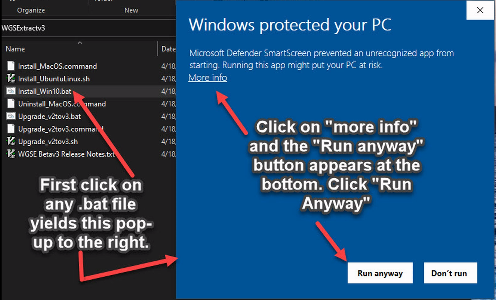
 \
**Figure 7.3: Windows protected your PC pop-up \
**

You can run the **Install_windows.bat**, **Library.bat** and **WGSExtract.bat** script files by simply clicking on them in File Explorer. The first time you do so, Windows will display a pop-up about “Windows protected your PC” as shown in figure 7.3 above.   Click the “more info” link to cause a “Run Anyway” button to appear. Click “Run anyway”.  Our releases are not “signed” as a hefty developers fee and complexity is required.  They are open-source script files you can easily view and confirm what they do. This extra step confirmation is required only the first time each script is run. Afterward, you can simply click the script and it will run.

Double-click on the **Install_windows.bat** script file to start the installation. Starting it should create a command log window to watch the progress more closely. If it does not appear, then open a `cmd.exe` terminal (Start window icon, simply type “cmd.exe” and select). In that window, change directory to where you put the installation files. Something like “**cd c:\Users\yourname\WGSExtractv4**”, Then type “**call Install_windows.bat**” in that `cmd.exe` terminal to start the command and see the log. The log will disappear once installation is complete.

The Windows release installs the Python3 interpreter, a Java JRE (if missing), CygWIn64 Unix tools and Bioinformatics tools all in the release directory.  Microsoft installs “fake executables” for Python and the Unix BASH shell that are simply advertisements to install the program from their Windows Store. We simply grab the public **WinPython.org**, **Azul Java**, and **Cygwin64** public releases to install for you. They are customized and trimmed to just what is needed.

If you have a previous installation of **Cygwin64** on your system, that can conflict with the libraries and tools we install.  Cygwin64 DLLs are not versioned.  If our version does not match what you already have installed, then DLL conflicts will arise.  Windows DLL’s, once loaded in memory, cannot be replaced with different version files. The only workaround is to reboot your computer and not run your Cygwin64 installation before installing or starting **WGS Extract**. This is a complete Cygwin64 Base installation that should not be updated as that will break the bioinformatics tools provided.  The Bioinformatics tools are now moved to `/usr/local` under this Cygwin64 release.  In v3, they were intermixed in the` /bin` directory with the Unix tools..

Just like for the main WGS Extract Program and Reference Library installations, there are two version.json files here to track the version installed and upgrade if necessary. One is in `cygwin64/` and governs the base cygwin64 library used to create the release (see the date in the file for when it was created from cygwin64 libraries of that day). The other is in `cygwin64/usr/local/` and covers the bioinformatic tools compiled and placed there. Beside the version.json, you will see a `make_xxxx.bat/.sh` file which is the script used to create those releases.

### 7.4.2 Upgrading WGS Extract in Windows

If you have a previous **WGS Extract** release, copy the file contents of this new **WGSExtractv4/** installer folder into your previous release folder. So the new **Install*** and other script files should be among your previous files.  Once there, you can then simply double-click on the **Install_windows****.bat** script file.  (Or open a `cmd.exe` or `Powershell `and run the **Install_windows.bat** file directly via `call Install_windows.bat`)  (Upgrade functions are in the install scripts in v4.) \
 \
You can re-run the Installer to upgrade your installation to the latest available.  This will upgrade both dependent tools, like the bioinformatic tools, as well as the **WGS Extract** program itself. Occasionally, when running the Installer, it will ask to restart the installer program with a new, upgraded Installer.

### 7.4.3 Starting WGS Extract in Windows

Navigate into the `WGSExtractv4/` installation folder and double click the `WGSExtract.bat` file located there.  If you prefer, make a shortcut of that file by right clicking and selecting “create shortcut”. Then move the shortcut to your desktop for easier invocation; renaming it as desired. We recommend renaming it to simply `WGSExtract` or `WGSE` -- no extension needed. You can attach an icon found in `program/images/` to your shortcut via properties to give it a nice look. 

The shortcut can also be added to your Start Menu or pinned to the taskbar. See this [description on how to do that](https://www.askvg.com/windows-tip-pin-batch-bat-files-to-taskbar-and-start-menu/).

### 7.4.4 Uninstalling WGS Extract

Sorry to see you go. Here is how you undo everything you did to install and use **WGS Extract**.

- Remove the `WGSExtractv4/` Installation folder

- Remove any relocated **Reference Library** or **Temporary Files** folder if you moved them out of the installation folder.

- If done outside the installation, edit the PATH environment variable to remove the `cygwin64``\bin\``, /bin` and possibly `/usr/local/bin` entries using the windows Settings utility to edit System Environment Variables.

If you use the `uninstall_windows.bat` script, it will remove the **WGSExtractv4** release and **Reference Library** (even if relocated) for you (after asking to confirm). Note you can choose to save the reference library but not the installation.  If you do so, and the reference library is still in the installation, it will be moved out next to the release before deleting the installation directory.

### 7.4.5 Your CygWin64 Environment

**WGS Extract** installs a base cygwin64 environment with a few additional Unix utilities.  Click on the `cygwin64\cygwin.bat` file to start up a BASH command shell.  Type `samtools` to start that bioinformatic program. You will be located at start in your Unix home directory of `cygwin64\home\%user%\`.  You can get to other disks with the path `/cygdrive/c/ or similar`  where c is the drive letter used in windows. \
 \
Note that if you run the Cygwin64 Setup program to update the DLL’s, the bioinformatic tools supplied with this release may no longer work.  Delete the `cygwin64/` directory and rerun the `Install_windows.bat` to recreate the old release.

### 7.4.6 Installing on Windows using WSL-G

As of early 2021, Windows Subsystem for Linux - Graphical ([WSL-G](https://github.com/microsoft/wslg)) is available in the [Win10 Insiders Program](https://insider.windows.com/en-us/) (Development release) and also the Win11 general release. You need at least Windows 10 build 21364 or higher. Type “winver” in a Powershell command window to determine your Win10 version. If your release is up to this build or higher, join the [Windows Insiders Program](https://insider.windows.com/en-us/) to get the pre-release.  Once the latest insiders release of Windows is installed, you can install WSL and it will come with the latest updates including WSL-G features. As of 25 June 2021, the Win10 Insiders build is actually the pre-release Windows 11 (Win11). As of 28 Jul 2021, you can use the Beta Win11 release from the same insiders program (the development release is Alpha).

In a WSLG Ubuntu 22.04 shell window, simply follow the instructions for installing **WGS Extract** on Ubuntu 22.04 Linux from the command line. Running the program this way may be a performance improvement. As the CygWin64 environment used to compile the Win10 executables has some emulated interfaces.  The biggest downside is you have less control / visibility over the placement of files; they generally reside in the WSLG VMDK file space. Which by default is in the `C:\Program Data` or `C:\Users\yourname\AppData\ `area.

With the bioinformatics tools in WSL Ubuntu, they can be executed in any PowerShell or `cmd.exe` by simply prepending the command name with `wsl`.  So “`wsl samtools ….`” to run the Samtools command. Realize though the tools are expecting file parameters with their native Linux path and not a Windows path when run this way. \
 \
Make sure to [set your local config file](https://docs.microsoft.com/en-us/windows/wsl/wsl-config#configure-global-options-with-wslconfig) for the maximum processors and memory that the WSL VM can use. We provide no support for operation of **WGS Extract** in WSLG at this time.

## 7.5 Apple MacOS X / 11 -15

This release is tested on Apple’s M1 architecture in addition to the older x86 machines.  Also on Mojave (10.14), Catalina (10.15), BigSur (11), Monterey (12), Ventura (13), Sonoma (14) and Sequoia (15). Mojave (10.13) is at the end of life and some tools we depend on disappeared and no longer work with that release and earlier.

Grab the actual **WGS Extract** installer ZIP file from the link given above in Safari or your favorite browser.


**WARNING: **By default, Safari automatically extracts a `.zip` archive when downloaded. If for some reason it did not extract the files, you can do so by double clicking on the `.zip` file in your **Downloads** folder. Or use the `unzip` command in the Terminal.

The unzipped installer creates a folder named `WGSExtract4/`.  Likely in your `Downloads` folder in place of the `.zip` file you downloaded. Move this `WGSExtractv4/` folder out of `Downloads` to either your `Home` folder, or maybe your /`Application` folder.  It cannot operate in your `Downloads/`, `Documents/` or similar folders that reside within your `Home` folder. You can find your `Home` folder in the Finder GUI via the Go / Home menu item. If upgrading, copy the contents of this `WGSExtract4/` folder over your previous installation folder; overwriting any files with the same name.

If you prefer, you can download the Installer from a Terminal command line and extract the program as shown shown here:

`cd`` ~		# Easiest to install in your user home area (not Documents!)`

`curl`` -O -L -o WGSExtractv4.zip \ \
   https://1drv.ms/u/s!AgorjTSMFYpjgQQ2d-5pcycvLRyW?e=RLpR5s`

`unzip`` WGSExtractv4.zip`

Check the home page ([wgse.bio](https://wgse.bio/)) for the latest installer. For the remainder of this section, we will presume you have the unpacked files in your home folder area; designated in the Terminal command line examples here as  `~/wgsextractv4`.

### 7.5.1 Install WGSExtract on MacOS

Explore in this `WGSExtractv4/` folder and you should find an `Install_macos.command` file.  Depending on your OS setup, you may need to CTRL-Click and use “Open” when you run the script the first time. This is to grant permissions to run this script that has been downloaded from outside the Apple Store. After the first time, simply click on the `Install_macos.command` file to run it again; or any other commands we provide. \
 \
The installer will start a Terminal to set up required tools and eventually download the **WGS Extract** program itself.

The Installer Terminal window will almost immediately give a prompt asking for your password.  You are giving it permission to install software such as Java, Python, MacPorts and the Bioinformatic tools in the system area. This is required for normal operation. With Sequoia 15, Apple has set a much shorter timer that the password is valid for in a Terminal window.  You will now have to enter the password 3 or more times during the installation process.

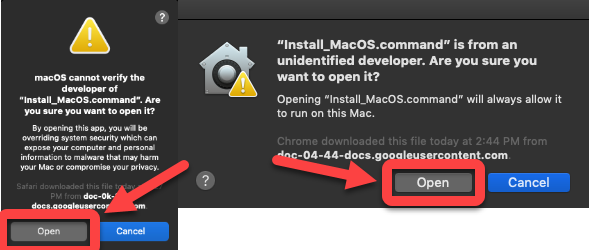

If, after clicking, you see the pop-up like shown above right, then Cancel and Control-click (or right click on a three button mouse) and select “open” from the pop-up menu as shown on the above left.  The pop-up will reappear but now with an additional “Open” button as shown.  Clicking on that Open button will forever register the app.  So you or others can simply double click the icon in the future. We have not paid the fees to be a licensed, registered Apple developer and submit to their code review and distribution via the AppleStore which incurs a distribution fee now. All the source code is available for your confirmation and review in the release directory.

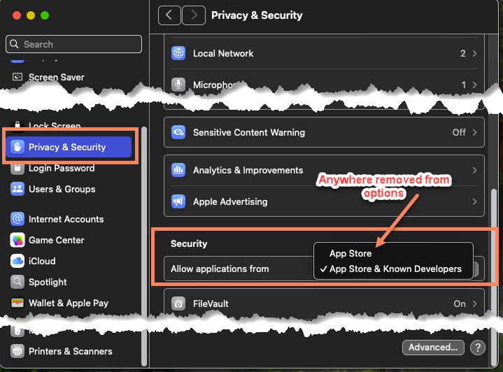

Starting with later Sonoma 14.5 releases, Apple has removed the “anywhere” option from the system settings Security area and its “Allow applications” selector (see above for missing selector in list of options).  You can re-enable the “Anywhere” option in the selector by executing a terminal command `sudo spctl --master-disable`. Enabling this setting lets you avoid having to go through the CTRL-Click approval process for our app and other bioinformatic tools you may download. But may allow apps from other sources to run if you are not careful.

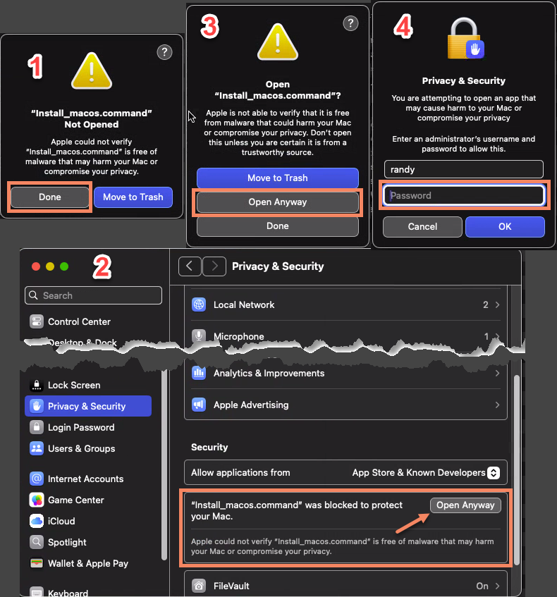

Starting with Sequoia 15, they have permanently removed the “anywhere” option from the Security settings “Allow” area.  You must now go through the following convoluted steps. Click on the “Install_macos.command” script.  You will see pop-up window (1} above. Click Done.  Within 30 minutes, you must navigate to System Settings / Privacy & Security then scroll down to Security.  There should be the shown window (2) “Install_macos.command” was blocked to protect your Mac.”.  Hit the “Open Anyway” button.  That will cause pop-up (3) to appear where you have to hit “Open Anyway” again.  After which, pop-up (4) will appear asking you to enter your password.  Once done, the application will be registered in gatekeeper as before when doing a CTRL-click to start the app the first time..

Apple is shortly going to shut down allowing even the above; according to sources, An app from outside the app store and not “notarized” by Apple will be prevented from executing going forward. Thus preventing any non-apple-approved and vetted application from being loaded and run on their platform. The months left to still run WGS Extract and hundreds of other open-source, bioinformatics tools on MacOS are few; it seems.

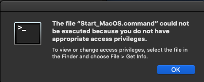

If after clicking you get the above pop-up, then the permissions were not properly set when extracted from the `.zip` archive file. To set the execute permission, open a Terminal by Control-Click (right clicking) on the installer folder as shown below and selecting the last option for “New Terminal at Folder”.

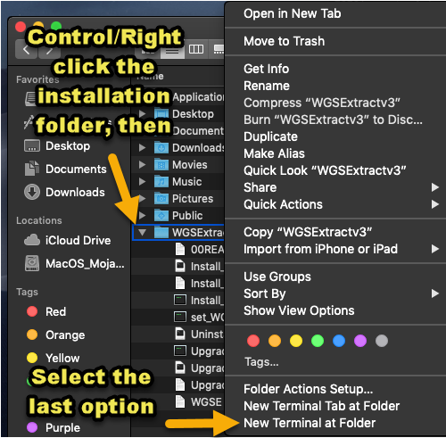

Then, in the Terminal, type:

`% ``chmod a+x *.command`` `

and hit enter.  Exit the Terminal and you should now be able to double click the `Install_MacOS.command` file. We modify other scripts we download after the fact so this is the only script you should have to modify (because you downloaded it directly). Normally, this is not required if you used the default extraction from zip files setup by the OS.

If you want, you can run the installer from the Terminal command line window. Type the following command:

```
% ./Install_MacOS.command
```
The install script needs elevated permissions as it is doing application installs in the system area.  In the command window that pops up when clicking on the script file, you will be prompted to enter the password of your account. This assumes your account has administrative privileges. If your account does not have administrative privileges, run the script from an account that does.

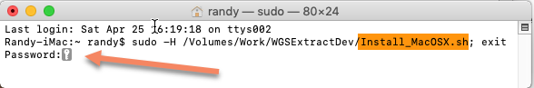

When you run the above install command it will check for and install any missing programs.  This includes (a) the Python interpreter, (b) the MacPorts package manager for the Bioinformatic tools, (c) a Java interpreter, (d) the **WGS Extract** program itself, and (e) the reference genomes  The first two install many dependent packages.


**WARNING: **MacPorts, which we rely on to bring in the Bioinformatic tools, does not know how to upgrade itself after you upgrade the major OS version (say Catalina to BigSur).  If you have a previous **WGS Extract** installation, and have since done a major upgrade of your MacOS, you will need to run the `Uninstall_macos.command` script to remove MacPorts and Xcode.  You can leave the **WGS Extract** installation and reference library (last part of the uninstall).  Then run the `Install_macos.command`  script to reinstall MacPorts and anything else you removed.


 \
The Install script is re-entrant and can be started again to finish or update dependent packages. It will not update the **WGS Extract** program itself though. To force that (like when wanting to do a v4 to v4 upgrade), delete the `program/` folder and then run the Install / Update command.

The install script no longer runs the **WGS Extract **program directly as it did in v2.

### 7.5.2 Starting WGSExtract

To start the program, simply click on the `WGSExtract.command` file. Make an Alias of the `WGSExtract.command` file, and move the alias to wherever you want to have an icon to start the program. Your desktop, the Applications folder or wherever. See [these instructions](https://discussions.apple.com/thread/7720713) for how to make your alias have the **WGS Extract** official icon as well! The images are in the `WGSextractv4/program/img/` folder. You can simply select the `icon_64x64,png` file. This `WGSExtract``.command` file was installed with the **WGS Extract v4** program itself and is in the same top level folder as your Install and Library scripts.  If it does not exist, your Installation or Upgrade was not successful.

If you wish to start **WGS Extract** via the terminal command line window, you can type the following to start the program:

```
/usr/opt/bin/python3 ~/wgsextractv4/program/wgsextract.py
This assumes you put the `WGSExtractv4` installation in your home directory.  If not, change the tilde to modify the path indicating where your installation is. You can also start it by typing:

/opt/local/bin/bash -x ~/wgsextractv4/WGSextract.command

Depending on your MacOS, sometimes simply `./WGSExtract.command` will work to start the program from a Terminal also.

```
We no longer use compiled Applescript programs to generate the .app icon for the program start.  Gatekeeper no longer allows those to be unsigned except from the Appstore.

### 7.5.3 Terminal Preferences

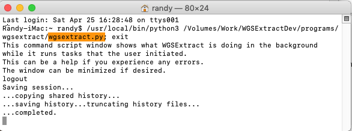

You can simply close it by clicking the red X to close a window.  If you wish to avoid this window being left and having to close it, you need to go into your Terminal Preferences to adjust a setting. Start the **Terminal **app (from the **Application **folder). Click on the upper bar **Terminal **to bring  a drop-down from which you can then select **Preferences**.

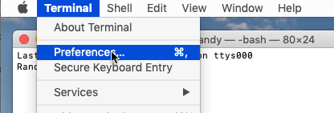

In the pop-up dialog, select **Profiles** and then **Shell **as shown below:

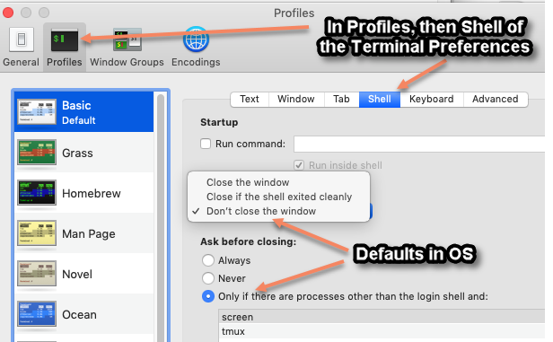

There you will see two settings.  One “Startup” and the other “Ask before closing”.  The defaults are “Don;t close the window” and “Only if there are processes …”; respectively.  You want to change these two settings to “Close if the shell …” and “Never”; respectively.

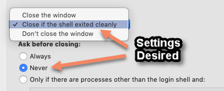

Exit out of the preferences pop-up and you should not be bothered by lingering Terminal windows anymore (unless the program crashes; in which case you can peruse the log in the window to find the error).

### 7.5.4 Uninstalling WGS Extract

Sorry to see you go. There is an Uninstall script now that performs the following commands. We repeat them here so you know what is happening and you can, if you prefer, do some or all yourself.  Before each major step, you are asked to confirm the operation.

Here is how you undo everything you did to install and use **WGS Extract**.

1. Drag and drop the Python3 installation from the Applications window to the trash; empty the trash

2. Visit the Python Framework folder in Finder and drag it to the trash.  Or use the following command (but being very careful so you do not erase your disk):

`sudo rm ``-rf /Library/Frameworks/Python.framework/Version/3.8`

3. For MacPorts, see [https://guide.macports.org/chunked/installing.macports.uninstalling.html](https://guide.macports.org/chunked/installing.macports.uninstalling.html)

It mostly works to use the command:

`sudo port ``-fp uninstall installed`

(but there is some minor cleanup to remove MacPorts itself as well) \
(and the above port command will not work to uninstall an old release when the OS has had a major version upgrade since MacPorts was installed.)

4. Navigate to the **WGSExtract **directory tree and drag it to the trash (or use the **Terminal **command line `rm`` -rf wgsextract` from the folder just above)

### 7.5.5 Apple MacOS, Python and BASH

Apple continues to have a love-hate relationship with Python and BASH.  For years now, they have shipped their OS with a simple, default python interpreter (actually Python v2) in `/usr/bin`.  But with minimal libraries and support.  With MacOSX Catalina 10.15, running that Python v2 interpreter pops up a “deprecated” warning that announces Python (2) will be dropped from the release shortly. And they install a pseudo-executable `/usr/bin/python3` that simply responds when run with a popup saying you can install Python v3 via the XCode development environment.  **WGS Extract** relies on a working Python3 executable and installs the reference python.org release.  Additional libraries and scripts are also tied to this particular release. \
 \
A similar issue exists around BASH, the command shell interpreter that we rely on to be portable across all platforms.  Apple has switched to ZSH and has their BASH as a very old, unusable version.  If you try and put your own BASH in the path to be found before theirs, they ignore the override.  So we have to install our own BASH via MacPorts and explicitly code its path into our scripts.

### 7.5.6 Apple MacOS limitations regarding Bioinformatics tools

Apple, unlike all other operating systems, has a very low limit on the number of open files by a process (256).  While this may seem like a lot, the `samtools sort `command is notorious for requiring more than that to operate.  **WGS Extract** attempts to determine the available memory and number of performance CPUs to set up parameters optimum to prevent more than 250 temporary files during sort.  Mainly by reducing the number of CPUs to increase the memory per CPU.  Sort is most often needed to unalign a BAM / CRAM and to create a BAM after alignment. The tool will attempt to get that optimum parameter set.  If it is determined it is not attainable, an error will be reported and the command aborted.  \
 \
You are encouraged to unload all other applications before starting any sort operation on the MacOS.  And possibly clear the file cache (easiest done by rebooting) as that is often reported as unavailable memory.  The File Cache can be viewed in the activity monitor, at the bottom, when in the Memory tab. \
 \
The BWA alignment tool needs 9 GB of memory just to load and operate. The different CPU cores will share that space.  The tool will attempt to verify this is available before starting and report an error if not.

## 7.6 Ubuntu Linux LTS 22, 20 (18)

Linux support has been developed and tested on Ubuntu LTS versions 18.04, 20.04 and 22.04 where the bioinformatic tools are readily available with `apt`. 18.04 has already been declared end-of-life by MacPorts; which we rely on to get most of the bioinformatic tools. So it may not be available much longer.

### 7.6.1 Install or Upgrade

Click `Install_ubuntu.sh` to upgrade or fresh install the **WGS Extract **system..  

See the [section below on permission changes](#heading=h.jlpb43t9f1u9) that may be necessary in your installation for Shell script files. The default on a new desktop is to open Shell scripts in the editor.


**Note** The Ubuntu GUI will not usually show an interactive terminal when clicking a shell script. But this is the only way for you to see what is going on (or going wrong!).  We attempt to figure out in the script how to start an Xterm Terminal window for you.  If this does not work on your installation, we recommend you starting your own Xterm Terminal command line and run the Installer from the command line. Your password is required to install some programs and this can only be seen in the Terminal window.


If you want to use the Terminal instead, simply prepend any command script with `bash -x`.  So `bash -x Install_ubuntu.sh` to run the installer from within an Xterm / Terminal command window.

Enter a password when requested to give elevated permission to install software in the system area.  And answer Y to any requests to update or  install releases.


**Note:** **WGS Extract** requires a GUI Desktop-environment Linux installation. Not a headless, server installation like only available in Microsoft Windows 10 WSL Virtual Machines. (The later WSLG in Windows 11 has the GUI.)  If using a VirtualBox or VMWare Linux installation, make sure to install the desktop environment to get the GUI. \


### 7.6.2 Starting WGS Extract

Navigate into the `WGSExtractv4` installation folder and double click the `WGSExtract.sh` file located there. It should create and bring up an X terminal that serves as the command script log window and from which it runs the graphical **WGS Extract** v4 program.  \
 \
Or you can start the program via the command line from an existing Terminal window as:

`bash ``~/WGSExtractv4/WGSExtract``.sh`

This assumes you put the release in your home (~) directory. Adjust the path otherwise.

### 7.6.3 Possible Permission Changes Required

The `.sh` script files need to have their execute permission set if you wish to double click to run them from Files.  They should have unzipped this way from the installer.  But in case they did not, in Ubuntu, this is a two step process to set execute permission.  

First, right click on the file and select properties.  Under the Permissions tab, select the Execute check box near the bottom.  If using a Terminal, you can set the permissions on the **.sh** files by the following command:

```
% chmod a+x *.sh

Second and a little more tricky is editing the preferences of the Nautilus (Files) manager.  Under its **Behavior** tab of its **Preferences**, there is a section at the bottom concerning **Executable Text Files**.  You need to switch the default to “**Run them**” or “**Ask what to do**” instead of “**Display them**”. If you use the “**Ask what to do**” option, when you click on a file, it will provide you the following pop-up:

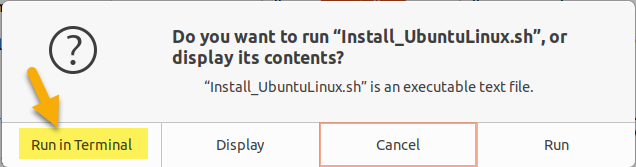

Click on “**Run in Terminal**” for all scripts in WGS Extract.


Once both these things are done, you can simply double click a desired **.sh** script file to run it.


Ubuntu distributes the unzip command by default. But if your release does not have it (that is, if you cannot double click the installer `.zip` file to uncompress it), then you can install the unzip command in the Terminal shell with:

$ sudo apt install zip unzip

Make sure you own the directory and files that were just unzip’ped from the **WGS Extract **Installer you downloaded.  And that you have permission to update them.  If not, the installer will not be able to download the additional packages needed.

```
### 7.6.4 Creating a Desktop Shortcut

If using the default window manager (), then you have to edit a special .desktop text file to have a shortcut to the Start button of the program.  Open a Terminal and type “gedit ~/Desktop/WGSEv4.desktop” to open the text editor.  Then enter the text shown below.  Make sure to update the path for your installation location.  Save the file and right click on the new .desktop file and select “Allow Launching”.  You will now have a simple icon on your desktop to start the program.

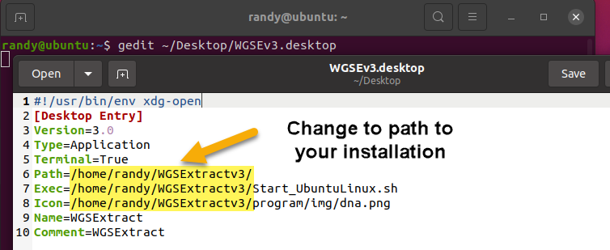

Here is that text in a form you can copy and paste into the editor:

!/usr/bin/env xdg-open
```
[Desktop Entry]
Version=3.0
Type=Application
Terminal=True
Path=/home/randy/WGSExtractv4/
Exec=/home/randy/WGSExtractv4/WGSExtract.sh
Icon=/home/randy/WGSExtractv4/program/img/dna.png
Name=WGSExtract
Comment=WGSExtract
```
You can do similar for the Install and / or Update scripts if desired. Usually the Start script is the only one clicked very often though.

Ubuntu 18.04 has an old version of the bioinformatic tools (1.9). So we recommend upgrading to at least 20.04 to get a later release of the bioinformatic tools (1.12).. The apt library stays fixed from the start of the LTS initial release.  There are even later versions available if you want to find and install yourself (1.15 and later for samtools / htslib).

# 8 Known Limitations, Licenses, Redistributed Tools

Disclaimer

The **WGS Extract** tool is built upon a number of university research, advanced development tools that are under constant improvement. These tools are generally used by University and corporate experts in the field to further advance the state of the art and knowledge. Some are used by medical testing laboratories after careful review and audit for consistency. Our attempt here is to take what consumer citizen scientists are already doing with these same tools and simply replicate the common techniques. Any use of this tool or any results it produces is purely for educational purposes and results should be questioned and reconfirmed through other methods. No premise for or guarantee of any fitness or quality is made. Use at your own risk. If using a DTC 30x WGS test for personal health research, you should definitely seek the advice of experts in the field before and while embarking on using tools such as these to try and more fully understand the results. Above all, always use qualified medical laboratories, sample collection methods, and accredited practices to assure you have test results worth relying on. 

## 8.1 Known Limitations, Bugs

Documenting some of the known issues either with the tool or the files that are input or output.

**Microarray:** generated Microarray files contain incorrect values for InDel’s.

<span style="text - decoration: underline;">Workaround</span>: Genetic Genealogy tools ignore InDel’s so this has, in general, not been an issue.  Where it crops up is when people load the microarray test generated files into health analysis sites.  Microarray generated files have less than 1% of their content as InDel’s.  We hope to work on this in the future. It is currently a limitation of all microarray files generated from BAMs..

**Microarray** FamilyTreeDNA, MyHeritage and LivingDNA cannot import a CombinedKit file.  Their match algorithm cannot handle the extra SNPs contained within it. Only GEDMatch and Geneanet seem able to accept it. They only retain what they see as useful.  They determine some SNPs are too variant to be usable, others too stable. \
<span style="text - decoration: underline;">Workaround</span>:None. Do not use the CombinedKit files as an import to those company sites. This is a limitation they have. Try the new 23andMe v3 & v5 file.  If not, just one of the individual, recommended files.

**Microarray**: The output files may not be in the same sorted order as the original from the manufacturer. Having them that way would facilitate easier textual comparisons.

<span style="text - decoration: underline;">Workaround</span>: Use `DNA Kit Studio` to compare microarray files generated with one you may have from the test lab directly for the same tester. But only on MS WIndows.  Use [David Pike’s online tools](https://www.math.mun.ca/~dapike/FF23utils/) otherwise.

**Realign (Win10)**: The BWA aligner on Windows, simply compiled, will not run multi-processor or with much memory.  We have rewritten the rmalloc routine from CygWin64 to emulate the Linux version which then enables multi-processor operation.  But Cygwin64 libraries are still 4x slower than the Linux native port on an Intel architecture. \
<span style="text - decoration: underline;">Workaround</span>: On Windows, enable Windows Subsystem for Linux (WSL 2) and install BWA there (sudo apt-get install bwa).  Then turn on the [WSL BWA patch option](#heading=h.mc0pc67qz2xr) as described in an appendix.

 \
**Save button (MacOS)**: All key result screen pop-ups have a **Save** button.  On MacOS, this will only save the desktop background for most users.  This is because MacOS added a **Screen Recording** permission to Catalina and later; which must be enabled per application. Python should modify its MacOS port to request this permission from within the application on use. But until then, you will be required to do it manually as a user. \
<span style="text - decoration: underline;">Workaround</span>: You must grant **Screen Recording** permission to <span style="text - decoration: underline;">Terminal</span> and <span style="text - decoration: underline;">Python Launcher</span> to enable the Save function. This is shown in the screen capture below.

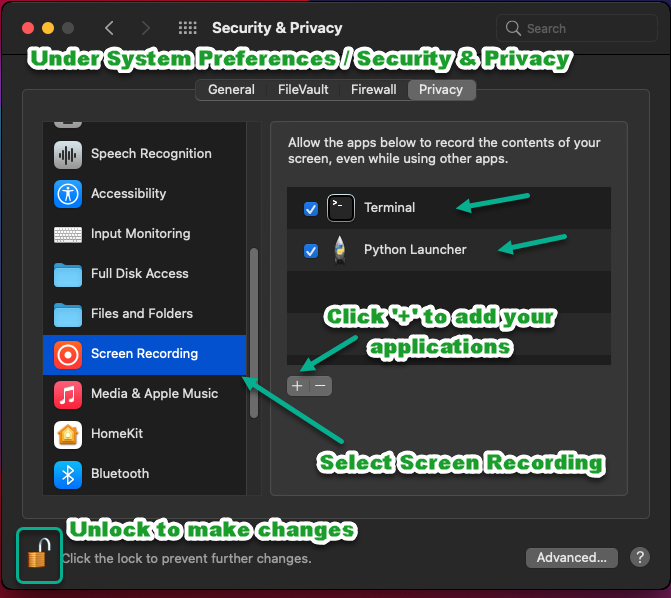

**Windows WSLG with Ubuntu Linux Guest OS**: The environment is not 100% there.  (a) Specifically, the Save button requires Pillow ImageGrab which is not working. (WSL possibly presents itself as other than running native Ubuntu?) (b) Also, fonts are a larger point size than even on an Ubuntu VM on the same Win10 desktop (Stats by-sequence header table titles are not visible with default window size, for example). (c) Finally, the `samtools sort -n` command with a `-m 2G` option cannot allocate the memory (in the unalign command) even if `.wslconfig` has memory allocation set to enough space. \
<span style="text - decoration: underline;">Workaround:</span> None. Must wait for VM support to improve. In developers mode now. WSLG is only available in Windows 11 and the default when WSL is installed there.

**Save button and secondary monitors**: The Python save window option does not always work on secondary screens. Not clear why other than the OS may not properly map the secondary screen into the primary screen pixel space. Seen on Win10. \
<span style="text - decoration: underline;">Workaround</span>: Move the window to capture onto the primary screen before hitting save.

**BAM File Header button**: The pop-up window to capture the header is often too small to capture the text of the header.  And there are no scrollbars presented to move the text within the limited size window around. \
<span style="text - decoration: underline;">Workaround</span>: The header is also saved into a text file in the Output Directory.  Maybe view the text version there with your favorite text file editor / viewer.

**BAM File Stats button (Linux)**: On Ubuntu 20.04 Linux, the font in the by-sequence table is too large for the window. Thus making the header labels unreadable.

**Nanopore Alignment (MacOS):** Minimap2 is not available as a pre-compiled binary on MacOS (in MacPorts or otherwise). \
<span style="text - decoration: underline;">Workaround</span>: Fork mimimap2 from github, compile and install yourself. Otherwise, you cannot align Nanopore long read FASTQ files under the MacOS with **WGS Extract**.

**EBI GRCh Models with (Re)Align:** For reasons not yet understood, BWA (the alignment program) does not work with the EBI Ensembl GRCh models.  So the Align command will not be able to select those as a target to create a BAM file.  Ditto if an existing BAM using these models and you hit the Realign button. \
<span style="text - decoration: underline;">Workaround</span>: None. Do not use these reference models as the target of an alignment. (Appears [HiSat2](http://daehwankimlab.github.io/hisat2/download/) may be designed to work with these models. But it is not available with any package provider that we have found so far -- not Macports nor Homebrew on Mac, etc.)

**PleaseWait Is a blocking UI function:** Makes program unresponsive while visible. Would like to look at other options while running a long job. \
<span style="text - decoration: underline;">Workaround:</span> **WGS Extract** supports multiple invocations by the same user on the same machine; separating out the **Temporary Files** directory area on a per processorID basis.  So start a second copy of the program to continue doing other tasks during a long run (that does not completely consume the CPU, Memory and/or disk bandwidth).

**MacOS 13.0 Ventura, MacPorts 2.8.0 and the like**: This new platform has many bugs.  For example, while running WGS Extract, any switch of focus to / from a tkinter window generates a message: `Python[59206:5298558] +[CATransaction synchronize] called within transaction`

Python occasionally core dumps due to a MacOS library incompatibility inside tkinter.  The xcode C compiler is now more restrictive and causes every MacPorts module to generate a warning about “configuration log files using an implicit declaration” (during installation).

<span style="text - decoration: underline;">Workaround</span>: None. Try to avoid the platform until it becomes more stable. We are filtering the xcode warnings during the install.

## 8.2 Licenses and Redistributed Tools

See the folder `open_source_libraries` in the **WGS Extract** release home location.

| Tool | Author / Institution | Where Used | Notes |
| --- | --- | --- | --- |
| Samtools, BCFTools, htsLib | Sanger Institute (Cambridge, et al) (original) License | Throughout (pretty much every function) | Installed with package managers at install time for MacOS and Linux. Custom CygWin port for Win10 release  |
| BWA MEM, BWAMEM2  |  | Re-alignment | Installed with package managers; Custom CygWin port. |
| Extract23 v0.0 (inspired code in WGSExtract) | Thomas Khran, ySeq.net | Autosomal File Generator | Inspired by; not just the single 23andMe v3 output |
| Haplogrep2 .xx (distributed with WGSExtract) | Medical University of Innsbruck; Institute of Genetic Epidemiology | Mitochondrial haplogroup determination | JAR file redistributable |
| yLeaf v2.x (distributed with WGSExtract) |  | Y haplogroup determination | Python scripts modified to relax standards so dives deeper into the tree; moderate cleanup |
| Picard, GATK3 exec / docs, Picard, GATK4, IGV (not currently used) | Broad Institute (MIT, Harvard) | TBD | JAR file redistribute (note: future release, not currently used) |
| Python3, CygWin64, MinGW64 | Various Python License; CygWin64 License | Everywhere (Win10 compiled versions of Unix utilities and libraries to support Win10 compiled bioinformatic tools) | Win10 release only (for Cygwin64) |
| PyLiftover (installed via Pip; Python module) | Konstantin Tretyakov | Autosomal extraction | Python library. To convert coordinates of extracted SNPs from GRCh38 to 37; when needed. Py library pulled in at install with Pip. |
| WGS Extract Manual | Randy Harr | Documentation | Available with the tool under the same license arrangement |

These are not incorporated into the tool but are more general inspirations or companion tools.

| Tool | Author / Institution | Where Used | Notes |
| --- | --- | --- | --- |
| BAM Analysis Kit and others (note: used by, inspired by) | Felix Chandrashakar / Immanuel, y-str.org (or (re-port by Teemu) | Initial idea for Haplogroup caller inclusion; and general tool flow effort | Not directly incorporated; but many tool flows and features inspired by this very early work |
| DNA Kit Studio <br>(note used but useful to use in conjunction) | Wilhelm H-O | Manipulating microarray RAW data files (of autosomal and X data, primarily) | Not incorporated but inspired by what it does for microarray result files |

As of this WGSExtract BetaV4 release, here are the tool versions you get with the various platforms:

| Platform<br>Tool | Win 10/11 <br> WGSE v3 | Win 10/11 <br> WGSE v4 | MacOS MacPorts 2.6.2 <br> WGSE v3 | MacOS MacPorts 2.7.2 <br>WGSE v4 | Linux Ubuntu 18.04 (drop) | Linux Ubuntu 20.04 | Linux Ubuntu 22.04 | Latest Available |
| --- | --- | --- | --- | --- | --- | --- | --- | --- |
| SAMTools | 1.12 | 1.15 | 1.10 | 1.15.1 | 1.7 | 1.10 | 1.13 | 1.15 |
| BCFTools | 1.12 | 1.15 | 1.10-2 | 1.15.1 | 1.7 | 1.10 | 1.13 | 1.15 |
| htslib | 1.12 | 1.15 | 1.10-2 | 1.15.1 | 1.7.2 | 1.10-3 | 1.13 | 1.15 |
| bwa  | 0.7.17-r1198-dirty | 0.7.17-r1198-dirty |  |  |  |  |  | 0.7.17-r1198-dirty |
| bwa-mem2 | 2.0 | 2.2.1 |  |  |  |  |  | 2.2.1 |
| minimap2 | 2.17-r974-dirty | 2.24 | na | na |  |  |  | 2.24 (r1122) |
| Hisat2 | na |  | na |  |  |  |  |  |
| Haplogrep2 | 2.2.9 | 2.4.0 | WGSE | WGSE | WGSE | WGSE | WGSE | 2.4.0 |
| yLeaf 2 | 2.2 | 3.1 | WGSE | WGSE | WGSE | WGSE | WGSE | 3.1 |
| FastP | 0.21.0 | 0.23.2 | na |  | latest | 0.20.0 | 0.20.1 | 0.23.2 |
| FastQC | na | latest | latest | latest | latest | latest | latest | 0.11.9 |
| Python3 | 3.8.9 | 3.10.2 | 3.8.3 | 3.9.12  | 3.6.9 | 3.8.5 | 3.10.4 | 3.10.4 |
| Java JRE | 11.0.10 | 8.x.x & 17.0.3 | 11.0.10 | 8.x.x & 17.0.2 | 11.0.13 | 11.0.11 | 8.x.x & 17.0.2 | 18.0.1 |
| CygWin64 | 3.2.0 | 3.3.4 | na | na | na | na | na | na |
| Source | WGSE v3 | WGSE v4 | MacPorts 2.6.2 | MacPorts 2.7.2 | apt | apt | apt | na |

WGSE means the software is in the WGS Extract release.  Look at the Win10 release and its WGSE version to determine the software version for other platforms.

“latest” means the installer takes the latest available directly from the developers website (as opposed to using apt to get a stored version from the OS development site).

See [https://github.com/WGSExtract/WGSExtract-Historical](https://github.com/WGSExtract/WGSExtract-Historical) for historical information on the v1 and v2 releases of WGS Extract. \


We have recently discovered a tool at [ugene.net](http://ugene.net/) that has some overlapping capability to **WGS Extract** and installs some of the bioinformatic tools on all the same platforms; including Windows.  It appears they did their own port of the bioinformatic tools to Windows as well.

## 8.3 Release Notes

Please see the file in the installation directory for a detailed list of changes with each release.

## 8.4 Suggestions for Future Improvements

The single large list of all items suggested.  Mostly by Marko and Randy as they work on the code,   No particular order or priority at this time. As items are done, they are struck off the list and added to the future release notes. Eventually should move this to the Github issues tracking system and consolidate there.

**Alpha release bugs (to fix before a full release; not feature enhancements)**

- Mateusz GFX Dante file causes samtools markdup to run forever without output.

- Sabri xxx BAM file causes samtools fastq to run forever with output (?) (see Facebook Messenger

- Pam’s early HG19 incorrectly delivered crashes yleaf (.out file is fine; haplogroup.txt file has single NA entry)

- MacOS uses fonts (for the same point size) that are much smaller per pixel than used on other platforms. Therefore window max sizes are too large and leave open space.  Some fonts may be harder to read.  On the other extreme, WSLG uses very large fonts for the point size specified and appears too large (Stats titles across the top of by chromosome table, etc).

- WSL Ubuntu tkinter uses alternating shades of gray for embedded frames / objects (like MacOS used to until we fixed it with styles).

- MacOS tkinter does not color buttons when requested

**Documentation**

- DOC: Microarray import chart compatibility fill-out

- DOC: Relative performance of various platforms, tools

- New screen captures for v3 (fork V3 manual)

- MICROARRAY: Change “Autosomal and X” to “Microarray” everywhere (and in tool UI). More properly reflects theallosome and MT content there. Especially for those doing medical analysis.

**Minor Functionality / Improvement**

- Add the [VarSifter Java tool](https://github.com/teerjk/VarSifter/) for VCF viewing and search. Benefit?

- Upgrade[ yleaf to 3.1](https://github.com/genid/Yleaf/tree/v3.1)

- Recognize FTDNA BigY .zip file and accept as BAM name, unzipping to get .bam and .bai inside and using name on Zip file (not internal long, cryptic code)

- Recognize and fix FTDNA BigY (original, not BigY-500 nor BigY-700) incorrect SAM format. Qname with space that corrupts `samtools fastq` command; among others.  May require [PySAM](https://pysam.readthedocs.io/en/latest/) (issue on Windows port of that)

- Parallelize WES read depth by running samtools depth in 26 processes (like bcftools mpileup for microarray generation). Cut from 1 hour to 10 minutes like in microarray generation?  Is an easy merge of results back together.

- Look for and use ~~vendor-named matching FASTQs for BAM to utilize instead of generating from BAM, Ditto for~~ VCF (raw, filtered) once variant calling added -- so easier check and add for tools needing data along the way (reuse files instead of regenerating). Basically, not specifying a BAM file as much as sequencer run / Sample file set.

- Check MD5 file-content signature of reference genome files before using (see Marko’s email 4/5/2020)

- BAM: Possibly also run `samtools flagstats` (15 min more) to get duplicates, etc.

- BAM: Report total number of N’s (by percent) in BAM itself (not the reference model N’s).  Report with BAM stats. Store stat by chromosome? (FTDNA BAM is chock full of Ns making it more bloated …). Note this is not the reference model N issue.

- Check and Fix compression of files if needed (FASTQ’s, FA/FNA’s, BAM’s, BCF files masquerading as VCF): \
`htsfile <name>  → parse output looking for gzip or bgzip, if gzip then: \
gunzip name.gz ; bgzip name     # Will do in-place, returning .gz extension \
# add .gz ext first if not there and then remove after (i.e. for BAM)`

- Add option to annotate BAM header SN’s with M5 tag (like exists in CRAM) to more accurately document the Ref Model used.  See [https://genome.sph.umich.edu/wiki/BamUtil:_polishBam#Add_MD5_and_UR_tags_to_SQ_Headers_.28--fasta.29](https://genome.sph.umich.edu/wiki/BamUtil:_polishBam#Add_MD5_and_UR_tags_to_SQ_Headers_.28--fasta.29) for utility (but pretty simple to do in python and using samtools reheader command).  Values are already in reference model DICT file.

- Incorporate [BBMap and Repair](https://sourceforge.net/projects/bbmap/) ? (yseq seems to use often)

- BAM: Add Sequencer run stats to BAM stats (see [Sequencer Run Information: Quick and Dirty](https://www.facebook.com/notes/dante-labs-and-nebula-genomics-customers/sequencer-run-information-quick-and-dirty/563280534267110/)); or button to generate (really more appropriate for FASTQ’s and only for Illumina WGS files) But maybe BGI/MGI also.

- ~~Add BAM to paired-end FASTQ button (unalign): (added but not callable by user)~~~~<span style="text - decoration: underline;"> \
~~</span>`samtools collate -o collated.bam orig.bam  `</span>`# change to name sorted in original \
`</span>`samtools fastq -1 bam_R1.fastq.gz -2 bam_R2.fastq.gz -0 /dev/null -s /dev/null -n collated.bam  `</span>`# compresses if .gz ext; 2nd line \
`</span>`rm collated.bam \
`</span>~~<span style="text - decoration: underline;">(check~~</span>~~[ Kyle Day’s One liner](https://www.facebook.com/notes/dante-labs-and-nebula-genomics-customers/extracting-r1-and-r2-reads-from-your-bam-for-realignment/488019108459920/)~~~~<span style="text - decoration: underline;">?)  (~~</span>~~[https://bioinformatics.stackexchange.com/questions/8938/convert-bam-to-properly-paired-fastq-files](https://bioinformatics.stackexchange.com/questions/8938/convert-bam-to-properly-paired-fastq-files)~~~~<span style="text - decoration: underline;">)  ~~</span>~~(~~~~[Correct, too complicated version](https://gist.github.com/darencard/72ddd9e6c08aaff5ff64ca512a04a6dd)~~~~ that uses bam2fastq from bedtools?)~~

- Remove the restriction that the temporary file directory be empty at startup

- ~~Prevent processor sleep during PleaseWait pop-up (operations). Key for longer operations.  See ~~~~[wakepy](https://github.com/np-8/wakepy)~~~~ for details. May also need ~~~~[elevate](https://github.com/barneygale/elevate)~~~~ for Linux operation.~~

- ~~Add OS ProcessID directory to temporary directory as place that all temp files reside.  Delete ProcessID directory on exit. (note:  this enables multiple, simultaneous instances of ~~**~~WGS Extract~~**~~ to run.)~~

- Add WES BAM extraction button (simply using BED file; not based on flowcell identification and extraction)

- Modify Stats page on Y-only BAM so WES Coverage button is replaced with ComboBed region coverage button and result. David Vance’s spreadsheet to create ComboBed? From Thomas Krahn?

- Generalize and add to “jartools” the programs gatk3, gatk4, picard, igv, etc ote GATK3 / Picard and GATK4 require different JREs.

- When using file name as label in results screen, if more than 25 characters then change it to “<first 10 characters> … <last 10 characters>.cram”

- ~~Create Reference Genome Index and dictionary: \
~~`samtools faidx <refmodel>.fa.gz ; samtools dict <refmodel>.fa.gz > <refmodel>.dict `~~(special form of name as required by GATK)~~

- WES 130x verification check (especially when buried in 30x WGS BAM): how to do with existing tools?  Use Exome BED file?  Quick checks are not successful in finding data..

- Allow user setting of temp directory location instead of simply in install directory

- Allow user setting of reference genome directory location instead of simply in install directory.  Makes most sense once we no longer deliver the files and download on demand. Include pyliftover files there.  Microarray templates also? Maybe download on demand from the server (google drive, github)?

- Interim fix: change reference genome determination to simple capture (a) SN style (numeric, alpha), (b) model length of Chr1/X/Y/Mt (for subsetted files), and (c) number of SN entries (to determine Ref Gen file used). Long term use John Rhys MD5 of SN names and lengths.

- ~~More Stats (Stats+) that runs ~~`samtools coverage`~~ and reports % coverage of bases.  Note: need to alter actual output of command to account for N regions.  To get coverage, use covbases / (endpos - # N’s). Makes a big difference.~~ 

- Use filedialog initialdir setting to choose reasonable default starting locations (overriding OS).  This becomes the only way to know where the current setting is actually coming from as well.  If program cannot pick a reasonable value, default to letting the OS choose.

- Change initial load of stats at hitting stats button to look for all three stats files and load if available.  Get rid of displaying buttons that, when clicked, immediately return with known values. Basically, only display buttons if files cannot be found and stats loaded when displaying the stats page.

- Use import multiprocessing; multiprocessing.cpu_count() to set number of parallel threads in htslib commands (maybe count -1 to leave one CPU for interactive work)

- BAM: Add button on BAM file setting to view BAM header; already saved internally (need scrolling text area)

- ~~BAM: Add further stats data using ~~`samtools coverage`~~ and/or ~~`samtools depth`~~. Could bring in other quality metrics as well. Longer analysis time but more information.~~

- Add a “save” button to stats and haplogroup output pages.  Save as a simple TSV or text. Graphical Tk panes used cannot be “text copied”.  And not all know how to screen capture either. (And/or use a “text” label for these outputs so screens can be copy-pasted. Put summary info then per chromosome table.)

- BAM: Analyze FA for number of N’s (per chromosome).  Adjust reported MAPPED avg read depth and percent coverage for this modified model length. Key for Y chromosome. (Gatk3 or qualimap) (see James Kane spreadsheet)

- Add setting for # threads in various long-run tools (detect and set automatically?) Automatically inquire CPU’s core count and set that way?

- ~~Create CRAM Index (CRAI) -- same as BAM index, should be coord sorted \
~~`samtools index name.cram`

- ~~Add BAM to CRAM button:~~` \
samtools view -T <refmodel>.fa.gz -C -o name.cram name.bam`

- Updated samtools bam2fq to samtools fastq. Old code deprecated in samtools.

- Updated samtools mpileup to bcftools mpileup. Old code deprecated in samtools.

- Upgrade yLeaf to v2.2 from v2.1 now used

- ~~Add CRAM to BAM button: \
~~`samtools view -@ 2 -T <refmodel>.fa.gz -b -o name.bam name.cram`

- yLeaf results page cleanup (see email from 2/26/20) (also BAM Name added)

- ISOGG Tree button on yLeaf output screen (needed?)

- Cleanup stats page to sort chr, add thousands separator, clarify values and group by RAW and MAPPED, add rest of values

- Add version number, release date and (github) URL to main window header

- Bug fixes: spurious slashes, quotes, etc that cause fault

- Cleanup_temp_dir processing: handle yleaf dir tree left after crash

- Add debug setting and file to store

- Cleanup general text to be more concise on labels, pages, etc

- Generalize and cleanup windows (non-main, pop-ups) to have explicit Exit buttons as well as handle window close appropriately

- Autosomal tool cleanup: start with recommended selected (only), add recommend select button, add Exit button; not just generate

- Cleanup settings page to bifurcate frames based on Settings; not buttons and stats

- Add to stats the components of the BAM: Auto, X, Y, MT, Unmap, Other/Alt

- Modified Extract23 base to use -B on mpileup so works on nanopore long read files

- French language file and 3rd language option (thank you François Boucher)

- Detect and implementat BAM sort on demand; add option to BAM values

- Detect and implement BAM Index just-in-time (instead of when specifying BAM file name as is now); add option button to generate on BAM File load area. Ditto for sorted state.

- Add buttons / labels to BAM file setting area for sorted and indexed (button if not, label if already available)

- Add stats of whether BAM has index, is sorted, which Chr/DNA included, short vs long read

- Show bam file name in windows title; results screens (common user request for screenshots, if they have lots of bams) (autosomal, y haplo, mt haplo)

**Major Functionality / New Feature**

- Possible refinement on RefGenome [determination from header using MD5 hash](https://www.facebook.com/groups/373644229897409/permalink/553915061870324/) per John Rhys (4/5ths of work done with spreadsheet and study). 

- Add BAM file merge (and resort, reindex) to create a third BAM file. Does it need to resort to name, add readgroup, do fixmate, and then sort coordinate and do a markdup? What else?

- Add unaligned BAM creator (not just unmapped BAM dump); recognize and use in place of FASTQ where possible. Note: cannot be made into CRAM as not aligned.

- Aligner button internals to handle PacBio HiFi CCS files (long read).  See [PBMM2](https://github.com/PacificBiosciences/pbmm2)

- Add [SNAP-aligner](https://www.microsoft.com/en-us/research/project/snap/) option from UCBerkely / MSFT Research? Add Bow-tie option?

- Modify Nanopore long-read aligner from minimap2 to Shasta, etc. See [Nanopore workflow doc](https://nanoporetech.com/sites/default/files/s3/literature/human-genome-assembly-workflow.pdf).

- Add PEMapper and PECaller option for aligning and variant calling. See the [paper on the tools](https://www.pnas.org/content/pnas/early/2017/02/17/1618065114.full.pdf?versioned=true).

- SNP Variant Caller (BAM to VCF) (bcftools call, GATK) (RAW, filtered)

- ~~mpileup parallel calls per chromosome for speedup (~~~~[see TKrahn](https://gist.github.com/tkrahn/ef62cfaab678f447ea53ddee09ce0eb2)~~~~) (easy once sub-process handling added to allow non-blocking command startup) \
(added but then removed to Debug_mode section as: ~~does not work; at least not on 1KGenome reference genomes where bcftools know about alt contigs. Would need to merge and then do calls knowing which alt contigs to keep with which chromosomes.)

- [BCFTools pipeline tutorial](https://samtools.github.io/bcftools/howtos/variant-calling.html) ; [importance of bcftools norm to left-align indels](https://www.biostars.org/p/320584/) ; [or use vt normalize instead of bcftools normalize](https://help.galaxyproject.org/t/bcftools-norm-realignment/2519/2)

- Give users a choice of variant caller (bcftools call or GATK HaplotypeCaller); GATK much slower and different license. See also [https://www.nature.com/articles/s41598-018-36177-7](https://www.nature.com/articles/s41598-018-36177-7) \
[https://genomemedicine.biomedcentral.com/articles/10.1186/s13073-020-00791-w](https://genomemedicine.biomedcentral.com/articles/10.1186/s13073-020-00791-w)

- [https://www.frontiersin.org/articles/10.3389/fgene.2015.00235/full](https://www.frontiersin.org/articles/10.3389/fgene.2015.00235/full)

- Issue with BCFTools and InDels [Post 1](https://www.biostars.org/p/481478/)

- Add Verily/Google Life Sciences [DeepVariant ](https://github.com/google/deepvariant)caller. See [wired article](https://www.wired.com/story/google-is-giving-away-ai-that-can-build-your-genome-sequence/).(python)

- Add [FreeBayes](https://github.com/freebayes/freebayes) as variant caller – supposedly much better on InDels

- [Platypus variant caller](https://www.well.ox.ac.uk/research/research-groups/lunter-group/lunter-group/platypus-a-haplotype-based-variant-caller-for-next-generation-sequence-data) (like GATK HaplotypeCaller)

- [Scalpel variant caller](https://www.ncbi.nlm.nih.gov/pmc/articles/PMC5507611/) (focused InDel caller)

- MICROARRAY: InDel properly handled in microarray files (see [Extract23 GitHub](https://github.com/tkrahn/extract23))

- InDel properly identified and set to no-call in microarray files

- See samtools workflow and GATK best practices for intermediate realign steps

- See [InDel’s in Microarray Files](https://bit.ly/2CyM4dy) doc

- MICROARRAY: Missing versions of file formats: 23andMe v1, FTDNA v1; and NGG 2 Nextgen/+. Also variants of existing file formats had some SNPs dropped or added it seems; when compared with samples we have. Should a mathematical-set merge of all sub-variants be done? See [https://h600.org/wiki/Microarray+File+Formats](https://h600.org/wiki/Microarray+File+Formats). Our sample files seem to be larger than templates; templates missing values? NGGeno+ File output (microarray) (issue: uses SNP names, not rsID’s, in Y and MT) (ref model 36?)

- VCF file annotator (add rsID, SNP Name, genes, etc; without merge); Annovar, Nirvana \
[https://www.google.com/search?q=vcf+annotation+online](https://www.google.com/search?q=vcf+annotation+online), [https://www.google.com/search?q=vcf+annotation+tools](https://www.google.com/search?q=vcf+annotation+tools), [https://www.google.com/search?q=viewing+annotated+vcf](https://www.google.com/search?q=viewing+annotated+vcf),  \
[https://www.biostars.org/p/393009/](https://www.biostars.org/p/393009/), [https://www.biostars.org/p/297578/](https://www.biostars.org/p/297578/), [https://software.broadinstitute.org/software/igv/viewing_vcf_files](https://software.broadinstitute.org/software/igv/viewing_vcf_files), [https://bioinformatics.stackexchange.com/questions/11497/vcf-file-to-gene-annotations-and-or-genes](https://bioinformatics.stackexchange.com/questions/11497/vcf-file-to-gene-annotations-and-or-genes), [https://uswest.ensembl.org/info/docs/tools/vep/index.html](https://uswest.ensembl.org/info/docs/tools/vep/index.html), [https://uswest.ensembl.org/info/docs/tools/vep/script/index.html](https://uswest.ensembl.org/info/docs/tools/vep/script/index.html),  \
See also [Section 3.4.15 in the Bioinformatics for Newbies](https://docs.google.com/document/d/1Yg4oRDCIQr5RoTZqECPYFDZxoxN-hggXKxy9BVDQpnY/edit#heading=h.1gja0lg3trxc) doc.

- Consider [Open-Cravat](https://open-cravat.readthedocs.io/) (python pip module but requires pyVCF which is python2)

- MICROARRAY: Microarray RAW file to sparse VCF converter (see [Samtools Group article](https://samtools.github.io/bcftools/howtos/convert.html), command of `bcftools convert --fasta-ref hs37*gz --tsv2vcf gvcf*CombinedKit.txt.gz -s DanteWGSExtract -Ob -o CombinedKit.bcf`

- CONTROVERSIAL: sparse VCF to all-call VCF / true gVCF (to try and recreate post pileup BAM from sparse VCF file; especially if from microarray start) \
* pseudo autosome/X impute by reference model fill-in (homozygous) \
* pseudo autosome/X impute by reference model fill-in (heterozygous) (give both values of missing; from known Ancestral in model and then derived; so matches any)

- Consensus sequence: RAW VCF (or BAM) to FASTA. See our doc on the subject:  [A Practical Guide to WGS Consensus Sequence for Genetic Genealogy](https://bit.ly/3sEzHTz)

- BAM to True gVCF / all-call VCF (BAM “replacement”, simply RAW?; closest to complete model of testers DNA) (after mpileup and some QC; not filtered or after variant caller though) ([snpedia](https://www.snpedia.com/index.php/VCF)) ([Broad](https://gatk.broadinstitute.org/hc/en-us/articles/360035531812-GVCF-Genomic-Variant-Call-Format)) ([Illumina](https://sites.google.com/site/gvcftools/home/about-gvcf))

- CNV / STR Variant Caller ([LobSTR](http://lobstr.teamerlich.org/faq.html), [hipSTR](https://hipstr-tool.github.io/HipSTR/), [GangSTR](https://github.com/gymreklab/GangSTR), [STRetch](https://github.com/Oshlack/STRetch), [RepeatSeq](https://github.com/adaptivegenome/repeatseq), [Tandem](https://github.com/mcfrith/tandem-genotypes), [ExpansionHunter](https://github.com/Illumina/ExpansionHunter), [STRsearch](https://github.com/AnJingwd/STRsearch), [Delly](https://github.com/dellytools/delly)). (ySeq and yFull doing now; was in original y-str.org BAM Analysis Kit) [Paper0](https://academic.oup.com/bib/article/16/2/193/245882), [Paper1](https://www.researchgate.net/figure/Average-running-times-of-STRViper-lobSTR-RepeatSeq-Samtools-and-Dindel_tbl3_259388023), [Paper2](https://www.biorxiv.org/content/biorxiv/early/2020/02/04/2020.02.03.933002.full.pdf), [Paper3](https://bmcgenomics.biomedcentral.com/articles/10.1186/s12864-016-3294-x), [Paper4](https://www.ncbi.nlm.nih.gov/pmc/articles/PMC6102892/) (see series of emails with Thomas Krahn in April 2020 with Randy; see [ytree STR page](https://www.ytree.net/ListAllSTRs.php)). Many require you feed it a reference set just like for SNP callers. But FTDNA and yFull do not define their STRs (location, etc). See [recent paper](https://f1000researchdata.s3.amazonaws.com/manuscripts/24995/688e1c8c-1972-4542-a669-dbcc9dd53e4c_22639_-_alicia_oshlack.pdf) Teemu found on tool invocation. [Broad Inst STR Callers](https://github.com/broadinstitute/str-callers). Was in the original Felix Immanuel / Chandrashakar [y-str.org](https://fiidau.github.io/) [BAM Analysis Kit](https://fiidau.github.io/BAM-Analysis-Kit.html) using LobSTR and his stand-alone [Y-STR kit](https://github.com/fiidau/Y-STR_Kit) that he wrote (2011-2013). See [ySeq recent post](https://www.facebook.com/groups/YSEQDNA/permalink/3865952780150424) on trying to use Tandem. Sam Keating [post on delly](https://www.facebook.com/groups/consumerwgs/posts/1031502874111538/?comment_id=1031910184070807).

- Structural Variant (SV) Caller.  See the [Parliament2 tool](https://github.com/slzarate/parliament2) and its list of SV Callers it uses. Illumina Dragen pipeline uses [Manta](https://github.com/Illumina/manta)

- Add a genome browser:

- Broad Institute [IGV](https://software.broadinstitute.org/software/igv/) to view BAM and similar files;

- Create [Batch file](http://software.broadinstitute.org/software/igv/batch) that loads reference and BAM automatically; 

- Create [.genome](https://software.broadinstitute.org/software/igv/LoadGenome) that has reference genome <span style="text - decoration: underline;">and </span>GFF annotations (json)

- Start view zoomed in far enough to show some detail (pick based on what BAM contains: auto, X, Y, MT, etc)

- Add [IGB](https://bioviz.org/) to view BAM and VCF files?  Needed if IGV there?

- UCSC [Genome Browser](https://genome-store.ucsc.edu/) (GBiB) 

- GMOD [jBrowse2](https://jbrowse.org/jb2/)

- BAM comparer (IGV-like with two BAMs instead of one reference, post-pile-up only?)

- Detecting imputed or filled-from-reference BAM/VCF files (possible?) (too many homozygous values?) (too many heterozygous values?)

- VCF comparer (see [Martin Scharfe post](https://www.facebook.com/notes/dante-labs-and-nebula-genomics-customers/comparing-multiple-vcf-files/553096038618893/) on using bcftools isec command) (especially useful if run on Y-only BAMs and add capability to detect variance only within defined “good” regions: comboBED, etc) (also bcftools vcf-compare)

- Possible improvement on [Y / MT extractor using Sambamba](https://www.facebook.com/groups/257810104756408/permalink/677028296167918/) per John Rhys (albeit [Hang Li says htslib improvements match performance of Sambamba -- see 10 years note in 2018](https://lh3.github.io/2018/12/21/sambamsamtools-is-10-years-old))

- Possible improvement with [Samblaster](https://academic.oup.com/bioinformatics/article/30/17/2503/2748175) (per [Aaron Balagan comment](https://www.facebook.com/groups/373644229897409/permalink/650632195531943/?comment_id=706009636660865)), Used in [HPGP](https://github.com/human-pangenomics/HG002_Data_Freeze_v1.0) also. Must mark read groups and not be coordinate nor name sorted (then how sorted?).

- Add Hunter Provyn’s [Clade-finder](https://github.com/hprovyn/clade-finder) for yFull haplogroup calling (both Y and MT). In Python already; but uses pytabox and pyvcf and pysam – either python 2 or not installable on Windows.

- Need data files like yfull tree json file though? now that [yFull yTree JSON](https://github.com/YFullTeam/YTree) and [mTree JSON](https://github.com/YFullTeam/MTree) are online. Maybe see [https://github.com/freeseek/getftdna](https://github.com/freeseek/getftdna)  to get tree but not SNPs?

- Can yLeaf and/or Cladefinder be made to work with FTDNA [ytree ](https://www.familytreedna.com/public/y-dna-haplotree/get)and [mtree ](https://www.familytreedna.com/public/mt-dna-haplotree/get)now available in Json as well?

- Add button to generate FTDNA defined SNP File (Y SNP name with +-) file to feed cladefinder.yseq.net

- Add 23andMe [yHaplo tool](https://github.com/23andMe/yhaplo/releases/tag/1.0.21)

- Y haplogroup results “liftover-esque” (remapping) to “same” haplogroup between yFull, FTDNA, and yleaf based on ISOGG?

- MICROARRAY: Digitally sign autosomal microarray output files (see [https://h600.org/wiki/article25](https://h600.org/wiki/article25)) \
Modify extract23 headers to have first line different than company; state something like “WGS Extract generated FTDNA v4 file on <current date> from BAM file xxxxxx (xx map avg read depth, xx gbases) (seeking to show quality so output not blocked when not warranted)

- FASTQ/BAM/VCF File downloader for Dante from AWS (restartable, if possible) (using ChromeDriver, puppeteer, selenium, requests-html, requests) See [issues with getting by server-side javascript ](https://mechanize.readthedocs.io/en/latest/faq.html#jsfaq)used with AWS in Dante to get download URL.

- FASTQ/BAM/VCF File uploader built-in for services (yFull, ySeq, etc)

- Similar to the current Extract23 template Marko heavily modified, using python f-string support with new class operators, build a user-defined custom script mechanism. Either file specified and/or entry box for copy-paste.

- BAM File compare via matching segment extraction in Autosomes and X ([https://www.cell.com/ajhg/fulltext/S0002-9297(20)30054-9](https://www.cell.com/ajhg/fulltext/S0002-9297(20)30054-9))

- Add ~~CRAM and ~~SAM input / output processing ~~(converting to BAM for internal work?)~~

- Add an ability to load VCF files and maybe annotate, query, etc.  Likely want to load into SQLite database.  See [blog post from xxxx](https://strahbg.com/?p=3356) in Bulgaria for an existing tool / approach to reading it in for query use. 

- Save key intermediate files that take awhile to generate: ~~sorted BAM~~, raw VCF (mpileup), called VCF (call), ~~CombinedKit (variant extract), y-only BAM, FASTQ(s)~~. Maybe Indices as well (~~BAM Index~~, Raw/Called TAI). Recognize when existing and start from there. Could be located with BAM or in the OutputDir area.  \
Should be similar to generalizing a check/generate-or-gather for Reference Genomes, Liftover; Microarray templates, program versions (including WGS Extract), and similar. Basically any large file that might be reused. Could be recursive. Need FA FAI, but then need FA to generate FAI, but then need to gather FA.  And similar. Key in a reference library mechanism is detecting size (BWA Fasta index file is 5x original FASTA).

- Generalize subsetting a BAM other than just done now for Y and/or mtDNA in extract tab and haplogroup work  Allow any autosome or X as well? (Multiple like in Microarray?)  For BAM (mainly), VCF and intermediate forms. Helps users by using smaller files for analysis in other parts of the tool.  WES based on bed file another option?

- MICROARRAY: Can we develop a better Microarray extract capability simply using Bcftools Query command and by changing the templates into BED or similar?  Does it more properly capture InDels that way?  (Depends on template creation from RSid instead of position for InDels?)

- Incorporate the tool HLA-HD or similar. See [Jonas Raabjerg file](https://www.facebook.com/notes/dante-labs-and-nebula-genomics-customers/hla-typing-from-wgs/896085970874045/) post. Or maybe just the HLA region to Fastq extraction for feeding a tool as described. Key speed-up by using HLA ref model to align to, remove unmapped, then unalign to get much smaller FASTQ to feed tools.

- Incorporate the tool [SMNCopyNumberCaller](https://github.com/Illumina/SMNCopyNumberCaller) from Illumina. 

- Make custom Y DNA output for DNA Data Warehouse: \
(samtools view -H ${1}.GRCh38.bam; samtools view ${1}.GRCh38.bam | grep -P "\tchr(Y|M?)\t") > ${1}.chrYM.sam \
samtools view -bS ${1}.chrYM.sam > ${1}.chrYM.bam \
{1} is the bam file name.

- New tool: [Y Lineage Tracke](https://github.com/Shuhua-Group/Y-LineageTracker)r for NGS test results (NRY Haplogroup tool); written in Python ([paper](https://bmcbioinformatics.biomedcentral.com/articles/10.1186/s12859-021-04057-z)) ([codebase](https://codeocean.com/capsule/7424381/tree/v2))

- Add special VCF generator for yseq.net version at cladefinder.yseq.net

- Add FASTQ input / output processing (more complete and independent of a particular reference model)

- ~~Aligner button (FASTQ to BAM) (bwa mem, minimap2 for long reads) \
 (see ~~~~[Sotiris Zampras post on Minimap2 for Nanopore](https://www.facebook.com/notes/dante-labs-and-nebula-genomics-customers/fastq-bam-long-reads/539591316636032/)~~~~) (he also put the ~~~~[complete, complex GATK pipeline for short reads](https://www.facebook.com/notes/dante-labs-and-nebula-genomics-customers/fastqs-bam-vcf-short-reads-grch38-with-postalt-processing/559038054691358/)~~~~ in a post as well) (bwa-mem vs bwa-mem2?  Is mem2 up to snuff yet -- reports it exceeds available memory resources)   (Added but internal button.) Need FASTQ file selection and reference model selection if to become a button.~~

- BAM Re-aligner (BAM unaligner, then realign to new ref model). Easy once FASTQ alignment is added.

- Add button to generate y-only VCF uncompressed (no annotation needed) for cladefinder.yseq.net. (Note: cladefinder has problem with InDels like Microarray file generation here; cannot handle InDels in VCF properly)

- Make custom Y DNA output for ySeq Cladefinder (Y-only VCF)

- need to annotate VCF then generate FTDNA format file?

- or just subset VCF to Y only, uncompressed for submission

- Issues with InDels in VCF format (like our microarray one)

**Major Feature (multi-file spec and comparison):**

- Add ability to specify, load, check and use more than one BAM file. Give option to choose which BAM in commands when more than one loaded (or have default set); add BAM class in underlying code to implement . Maybe like for the reference library, have a BAM library (or generalized sample) tab showing file names, sizes, location, etc.  Like File Explorer but specific to DNA files.

- Add BLAST and support BLAST compares of mtDNA FASTA files (See [https://www.biostars.org/p/257021/](https://www.biostars.org/p/257021/) for an example)

- VCF File compare (bcftools vcf-compare)

- Need a general concept of a WGS test SAMPLE instead of a BAM file.  This breaks the Output vs BAM file spec in that we now need a SAMPLE directory specified where we read and write various stages of files.  A sample would consist of:

- FASTQ file(s) (from sequencer, backport from BAM, etc)

- One or more BAM files (depending on alignment, aligner, etc) along with index, possibly sorted version if unsorted, etc

- *Pileup file (all, or also per chromosome?)*

- *RAW VCF (all-call) (gVCF same or separate?)*

- *CombinedKit file (prep for Microarray generation) (eventually work off of RAW VCF?)*

- Filtered VCF (all or subset to SNP, InDel, CNV, SV, per chromosome, etc)

- Microarray TSVs (RAW files)

- FASTA sample reference (make for mtDNA so why not diploid FASTA for nuclear?)  People seem to mention doing phased FASTA all the time but not sure how they can do it without imputation or simply generating an arbitrary pair of FASTAs that are arbitrarily mixed. Or maybe a single FASTA with two entries of the same name? Not truly phased.

Key is to add *intermediate file definitions* for anything that is resource intensive to create.  Placing CPU resources over storage ones as something to conserve.  So not just reference-specification and final output but also key intermediates that are used by multiple tools. \
 \
Maybe still allow Sample reference-only location and separate output directory location. But mix the names in the Sample pane (indicating those that are read-only or reference-only and cannot be replaced). How to deal with a common naming convention when the reference files are imported? Determine common naming not based on BAM file name? \
 \
Keep getting to be more like Sequencing generality or the Broad Institute general xxxx scripting system for manipulating sequence information. But key is to retain simplicity to do things quickly that are desired (microarray files, haplogroup determination)

- Reference Genome library browser and manipulation (like for Sample above).  Allowing the removal of the local cached versions, viewing space used, (re)generating index files, etc. For both Sample and Refgen, start with a single Pane listing major entries. Then click to get a new pane or pop-up for details of each and manipulate them.

- load and read refgen spreadsheet as starting template

- update refgen spreadsheet (check for and do)

- use wget/cur capability with restart and redo if bad checksum (see pyliftover as they built it inside Python using pycurl)

- BAM header code to generate MD5 signature to match to FASTA

- Add ~~microarray file generation templates (both VCF for variant calling and individual company generators) to Ref Library system~~; download new if updated.  Ditto for yleaf template files. Ditto for liftover file(s) when needed / outdated.

- Replace TkInter GUI with GTK (see GRAMPS; [Python GTK+](https://python-gtk-3-tutorial.readthedocs.io/en/latest/)) or Qt (PySide2) or even [PySimpleGUI](https://pysimplegui.readthedocs.io/en/latest/). See [https://docs.python-guide.org/scenarios/gui/](https://docs.python-guide.org/scenarios/gui/) for cross-platform GUIs. Which requires binary (non-python library) installs?

- MiModd incorporation / option of going from FASTQ to variants. See [https://mimodd.readthedocs.io/en/latest/](https://mimodd.readthedocs.io/en/latest/) and [https://celegans.de/mimodd/](https://celegans.de/mimodd/).  Suggested in a [Facebook group post by Miqui Rumba](https://www.facebook.com/groups/WGSEDevelopers/753721148519518/).

- Phase  BAM result. See [https://www.sanger.ac.uk/tool/sanger-imputation-service/](https://www.sanger.ac.uk/tool/sanger-imputation-service/) and [https://www.google.com/search?q=phase+WGS+DNA+result](https://www.google.com/search?q=phase+WGS+DNA+result&oq=phase+WGS+DNA+result)

**Win10 Release**

- Add support for a hybrid release.  Install bioinformatic tools in WSL2 under Ubuntu 20.04 but then use them from Win10 with WGS Extract Python code, Win10 Java and jarfiles, Winpython3 under Win10, etc. Set option for installer to install WSL2, Ubuntu 20.04 server and various tools like down in Linux environments. Set option in code to chose WSL2 Ubuntu tools over CygWin64 Win10 ones (simple as adding “wsl” to front of tool invocation?) (talk to Teemu about experiences; benchmark tools) (know BWA runs well this way; get multiprocessor)

- Change Win10 install script to be like package manager and grab bioinformatic tools (use [apt-cyg](https://www.ccammack.com/posts/install-cygwin-and-apt-cyg/)? [Chocolatey](https://chocolatey.org/)? [Scoop](https://github.com/lukesampson/scoop)? [OneGet](https://www.hanselman.com/blog/aptget-for-windows-oneget-and-chocolatey-on-windows-10)?); possibly from our own server (could Conda help here if we convince them to add Win10 executables to existing Linux/MacOS ones?)

- Win10 Tools CygWin64 port (of samtools) to utilize larger memory like in *Nix. Seems to be stuck at 380 MB per core. But have verified it is a 64bit executable and not stuck in some x386, win95 arch compatibility mode.  Need to investigate and fix. `cygwin perflag` set to 2gb on binaries did not help.

- Add [bedtools2](https://github.com/arq5x/bedtools2) capability for many useful analysis features (cpp with CygWin64 determines using deprecated features) (currently does not compile on Win10)

- Add [bwa-mem2](https://github.com/bwa-mem2/bwa-mem2) capability (check if >64 GB of total memory before use) (selects best executable for processor to get special instructions; written by Intel) 50GB index files.

- Add [Callstate](https://github.com/Luobiny/Callstate) (faster than CallableLoci, mosdepth) (written in Nim)

- Add [mosdepth](https://github.com/brentp/mosdepth) capability for quicker coverage analysis; especially with BED tools for WES coverage (issues: written in Nim)

- Add [bowtie](http://bowtie-bio.sourceforge.net/) aligner to Win10 port, all install scripts; use in WGS Extract (needs FastQ file) (issues with TBB parallelization library; MinGW64 vs CygWin64)

- Add [PySAM](https://pysam.readthedocs.io/en/latest/) (not compiling on Win10) -- all BAM file manipulations from python by wrappering samtools; easier to multiprocess then? Requires compilation during installation to link to local libraries

- Add [PyBAM](https://github.com/JohnLonginotto/pybam) (requires port to Python3; only Python2); [PyVCF](https://pyvcf.readthedocs.io/) (ditto), [PyFaidx](https://github.com/mdshw5/pyfaidx), PyTabix, and PySNPS

- Add [HTSeq](https://htseq.readthedocs.io/en/master/index.html) (needs Cython; C interface to HTSLib like PySAM; needs PySAM?)

- Add [PyBEDTools](https://daler.github.io/pybedtools/main.html) (need bedtools which is not Win10 ported yet)

- ~~Add Fastp to Win10 port, ~~all (missing from MacOS M1, MacOS x86 and Ubuntu 18.04)~~ install scripts; use in WGS Extract (needs FastQ file)~~

- Add FastQC (Java) to all install scripts; use in WGS Extract (needs FastQ file). Add multiqc (python lib) to process paired-end fastqc files into a single file.

- Add BioPython (already done; for ReferenceLibrary)

- Python3 re-port for Win10 release (WinPython “zero” 32 bit 3.7.3 upgraded to 32 bit 3.7.7)

- Samtools, Bcftools, htslib re-port for Win10 release; remove mingw need (check with teepean?). See chart below. Was 1.6/1.4 with htslib 1.9 before.  Now all 1.10 across the board.

- ~~Pip upgrades: earlier v2 release vs v3 release now (via ./python -m pip list): \
~~numpy       1.18.0~~				removed (incorrectly~~; needed by yleaf) \
pandas      0.25.3	~~			removed (incorrectly~~; needed by yleaf)~~ \
Pillow          6.0.0		7.2.0	  * \
pip             19.x.x		20.1.1    * \
pyliftover       NA		0.4         * \
biopython      NA		xxxx \
python-dateutil 2.8.1		removed \
pytz            2019.3		removed \
setuptools      40.8.0		removed \
six             1.12.0		removed \
(the historical WGSE v2 release was delivering Python with libraries already installed. Which made for a difficult run under MacOS and Linux. Changed to a install from repository Python and load identified and needed PiP libraries at install time.)~~

**Infrastructure / Install**

- Move code-base to Github. Use a submodule for yleaf. ~~ Move reference genomes to on-demand download.  Move microarray templates to separate grab at install (so not in github consuming space)  Haplogrep and similar .jar’s moved to installer and in top level of programs (GATK).~~

- Move manual to GitHub; adjust Bit.ly pointer there. Convert to MD to support ReadTheDocs.io. (Formatting similar enough?)

- Rewrite install / upgrade into Python and make it (and Python processor on Win10) part of initial installer download

- Rewrite reference/genomes/process_reference_genomes.sh and get_reference_genomes. sh into python and add to the reference library processor.

- MacOS Package Installer (see  [macos-installer-builder](https://medium.com/swlh/the-easiest-way-to-build-macos-installer-for-your-application-34a11dd08744))

- Win10 Package Installer (see [NSIS](https://nsis.sourceforge.io/Docs/))

- Python installer / redistribution (all platforms) (see [https://doc.qt.io/qtforpython/deployment.html](https://doc.qt.io/qtforpython/deployment.html))

- Replace [Macports](https://www.macports.org/) installer for bioinformatics tools and the [unique BWA](https://github.com/smikkelsendk/bwa-for-arm) installer with [Homebrew](https://brew.sh/) and [BrewskiBio](https://github.com/brewsci/homebrew-bio).  Homebrew has samtools, bcftools, htslib and BWA.  Brewski has bwa-mem2, minimap2, hisat2, fastp and many others. Assumption is this brings in the equivalent performance and setup of stand-alone, native compiled executables.

- Use Python and Jave JRE from Macports instead of a separate, independent install.

- Use Python and Java JRE from Cygwin64 instead of a separate, independent install.

- Remove Win10 executables from general WGS Extract release and instead download them during install (or possibly just add to Linux and MacOS install scripts to delete Win10 executables). For Python3 and Bioinformatics Win10tools folder.

- Add Java install / upgrade to general tool install (MacOSX, Win10, Ubuntu) (see openJDK on java.net)

- Adjust install script to make default temporary file area in release directory with permissions of user/group/global?RWX (MacOSX, Win10, Ubuntu)

**Code Infrastructure / Support**

- Utilize samtools v1.11 change to remove many single character options and have global options such as “--reference reference=fasta_file” and “--write_index”. And to also use the OUTFMT options to specify the temp directory for intermediate files.on all commands

- Expand Python reference_library code to automatically recognize missing reference genome files and download on demand (as needed).

- Extend automatic download of reference to other reference/ entries (not just genome models) like liftover files, BEDs for WES, annotation files, etc.

- Please Wait / subprocess ~~generalization and rewrite; adding estimations of time to commands.~~ Possible auto-kill when takes 2-3x longer than expected (partially done)

- Re-adjust PyLiftover to dynamically download crossover file from UCSC (licensing issue)

- Re-adjust Aligner to dynamically download the refgenome model from various places as needed. Add MD5 Hash check to make sure the downloaded file is correct..Add indexing.

- Implement a general blob read and restore; possibly with date / version check against URL “master” to update from as needed.  JSON, flat file or SQLite? Have the master file in the cloud and auto-redownload if updated.  Different for objects versus master list?  For Language file, Microarray templates, reference genomes, annotation references, liftover file, Haplogrep templates(?), user specified additions to reference genomes, user specified BAM/CRAM files, etc.

- hg38tohg19.py has lots of dup code from wgsextract; can it be pulled into wgsextract.py as a sub-module (direct call? exec ()?) so as to incorporate Please Wait, etc.

- Add check for WGSE program version against GIT and download new python code (at start). Restart with a new version.

- Make an action_button “register” routine with parameters: like which BAM characteristics it relies on (chrom_types, sorted and index BAM file, etc). Then make checking of needed state before running the action button more automatic; is now hand-coded in a few places.

- Make a bioinformatics tool register routine with parameters like min version, etc. Registration can check that the tool is available at startup and store that state.  Then action buttons can pass a list of tool requirements to check if all tools are available. Similar to the file requirement check.

- Add check for each bash command run for normal completion; stop script with error notice if not normal (catch tool execution errors as they happen; prevent continued execution on non-existent files; runs taking too long)

- Save settings and auto-reload if available (language, BAM file, output dir, temp_dir, refgen library)

- Add cleanup in process_bam_header for Y and/or MT and/or unmapped only BAMs (summary column mostly; reference and sort model settings)

- Check in the Microarray generator if CombinedKit is already available. If so, skip variant caller and use existing (may have to remove header) (saves addtl 1 hr processing) (maybe always save combined kit in with BAM?) (ditto for VCF and other items might use again)

- Inline extract23_script_template.txt; simplify piped sed command; Use f-strings

- Adjusted Autosomal reference files to remove extraneous “combined-RECOMMENDED_” in name

- Make code more robust by using “with … in” instead of f.open/f.close, conditional expressions, f-strings instead of str.format(), 80 character limit lines, comments, augmented assignments

- Add flag for sorted BAM files; pop-up warning or run sort and reindex as appropriate

- Add flag for Long Read BAM files; pop-up warning where appropriate

- ~~Rewrite determine_reference_genome to simply get header and then do “grep” inside the memory copy of header; save header with BAM stats in global area.~~ 

- Change all uses of samtools mpileup to bcftools mpileup (former is deprecated)

- Finish file/path scrub of names stored, created, used

**Verification Checks**

- [Raphael Petit's comment ](https://www.facebook.com/groups/373644229897409/559015538026943/?comment_id=587320751863088&notif_id=1586160217631759&notif_t=group_comment)on comparing WGSExtract Microarray output to Dante VCF file

- Douglas Holt tests (18 Mar email; Facebook post) - tested all 5 services and Dante

- DOC: Marko’s Autosomal verification (initial, last year) (email 4/6/2020 8:39PM)

- See [paper on Clinical Whole Genome Sequencing quality metrics](https://www.nature.com/articles/s41525-020-00154-9); especially [Table 3 summary](https://www.nature.com/articles/s41525-020-00154-9/tables/4).

- v3 CombinedKit different from v2. Only change is Samtools version?

# 

# 9 Appendix: Under the Hood

To be as transparent as possible, we want to show you the example commands that are run with many of the options.  As mentioned, this program is really a collection of other publicly available tools that have been scripted together.  In most cases, with extra tuning and modification to work with additional human reference models, on more platforms, and with more special cases. So these are the generic commands that are called.  Not all the detailed guts -- read the python code for that. If you recommend a different approach, let us know.

Note that these commands are subject to change.  Please refer to the latest release python code for what actually happens. Decisions to use pipes versus new command lines with temporary, intermediate files  is sometimes arbitrary.


**NOTE**: *Many times, long command lines are shown below. As the command line can wrap unexpectedly, depending on the width of the display you are viewing this document on, we start each new command line with the ‘*`%`*’ prompt.  Indicating the start of a new command line.  Any line without that prompt is likely a wrap-around of the line before.*


Some of these commands can be seen in the scrolling command line window or log.  Others are inside scripts in the `temp/` directory of the** WGS Extract** program during program runs.

In the command shown, we assume the file your.bam and your.bam.bai are in use and available in the current directory.  We assume paths to all appropriate tools and stored reference genome files are known and automatically found. And that the input and output directory is set relative to the current directory. The referenced temp directory is where you put it. This is all simplified here for convenience to alleviate cluttering commands with paths. General commands are shown in **blue**.  Important settings / reference files used are shown in **red** and may change depending on the context (which model of the human genome is used, for example). For most commands, if a CRAM file is the input, the reference genome must be specified as a parameter (which may not be shown).

<span style="text - decoration: underline;">1.1 Settings Tab (Select BAM)</span>

After selecting the BAM, many internal steps in the Python code are performed. To gather stats and properties about the BAM file.  A few utilize the external tools and are captured in the command line window. These are:

`% ``samtools view`` -H your.bam  1> temp/bamheader.tmp`

`% ``grep`` '@SQ    SN:chr1 LN:.*$' -m 1 -o temp/bamheader.tmp 1> temp/refgen2.tmp`

`% ``grep`` '@SQ    SN:1    LN:.*$' -m 1 -o temp/bamheader.tmp 1> temp/refgen3.tmp`

`% ``grep`` '@SQ    SN:MT   LN:.*$' -m 1 -o temp/bamheader.tmp 1> temp/refgen4.tmp`

These are used to help try and determine the reference model used and other information about the selected file.

It appears long-read “nanopore” BAMs may be sorted by length of segment as the read length tends to be very low at the start. [qual.iobio.io](https://qual.iobio.io/), like its sister tool [bam.iobio.io](https://bam.iobio.io/), jumps around the BAM doing random sampling. So the code here has been modified to rerun the view and head command to use 2 million samples to try and get deep enough into the file to get a better average length value.

<span style="text - decoration: underline;">1.1.1 Stats Button</span>

If the BAM is specified and indexed, the actions of the Stats Button are immediately executed when a BAM file is selected.  This so the full stats on the BAM file page can be displayed.  And because the `samtools idxstats` command takes only a few seconds.  If the BAM is not indexed (or not sorted) or you specify a CRAM file, then the `samtools idxstats` command is delayed until the button is clicked.  This is because it will take 30 minutes or more to run in these cases.

<span style="text - decoration: underline;">1.1.1a Stats Button (initial stats page)</span>

A temporary script `get_samtools_stats.sh` is created and then destroyed to get the BAM Stats:

`% ``samtools idxstats`` your.bam > your_idxstats.csv`

`% ``samtools view`` your.bam | ``head`` -100000 | ``gawk`` -F ’\t’ '{sum += length($10); count++} END {print sum/count}' > temp/readlength.tmp`

These results are partially displayed on the main settings tab. The original code is based on the [Average Read Depth document](http://bit.ly/304ciw0).  If the tool detects a likely long-read (Nanopore) file, it reruns the script for 2 million lines instead of 100,000. To get a better sample of average length.

<span style="text - decoration: underline;">1.1.1b Coverage Button on the Stats page</span>

`% ``samtools coverage`` -o your_coverage.csv your.bam`

<span style="text - decoration: underline;">1.1.1c WES Average Depth Button on the Stats page</span>

`% ``samtools depth`` -a -b ``wes.bed`` --reference ``hs37d5.fa.gz`` your.bam  \
  | ``awk`` {script} > your_wescfg.csv  # Check the Python code for awk script details`

<span style="text - decoration: underline;">1.1.2 Header Button</span>

To view the header which contains Sequence Name definitions from the reference model, you can view the BAM / CRAM file header:

`% ``samtools view`` -H your.bam > your_header.txt`

<span style="text - decoration: underline;">1.1.3 Index Button</span>

If a companion BAM Index file is not found, then the following is executed to create it (when requested via the button).  The button is greyed out and unavailable if already indexed.

`% ``samtools index`` your.bam`

The BAM Index file (`your.bam.bai`) is placed in the same directory as the original BAM as they must coexist together and have specific, matched file names.

<span style="text - decoration: underline;">1.1.4 Sort Button</span>

The BAM needs to be sorted in coordinate format. This creates a new BAM (and BAM Index) which is then switched to for all further processing.  The button will be greyed out if already coordinate sorted.

`% ``samtools sort`` -@ ``cpus`` -m ``memavail`` -o your_sorted.bam your.bam`

If your original BAM was `your.bam`, the new one is `your_sorted.bam`. The tool determines the number of CPU cores and available memory per core to specify with the command.

<span style="text - decoration: underline;">1.1.5a To CRAM</span>

`% ``samtools view`` -Ch -T ``hs37d5.fa.gz`` -@ ``cpus`` -o your.cram your.bam`

`% ``samtools index`` your.cram`

<span style="text - decoration: underline;">1.1.5b To BAM</span>


`% ``samtools view`` -bh -T ``hs37d5.fa.gz`` -@ ``cpus`` -o your.cram your.bam`

`% ``samtools index`` your.cram`

<span style="text - decoration: underline;">1.1.6 Realign (and Align and Unalign)</span>

The Realign function behind the button is really two internal calls.  An unalign followed by an align. Each step checks to see if the output file already exists and avoids the run if the result can be reused.

<span style="text - decoration: underline;">1.1.6a  Unalign (internal, part of Realign)</span>

For paired-end BAM files, the biggest issue is name-sorting the BAM before calling the unalign command in samtools. The sort command does not allow specifying the reference model (required if a CRAM file), so we view the file and pipe it to the sort command.

`% ``samtools view`` -uh --no-PG -T ``hs37d5.fa.gz`` your.bam  \
  | ``samtools sort`` -n -T tempdir -m ``memavail`` -@ ``cpus`` -O sam  \
  | ``samtools fastq`` -1 r1.fastq.gz -2 r2.fastq.gz -0 /dev/null -s /dev/null -n -@ ``cpus`

<span style="text - decoration: underline;">1.1.6b  </span><span style="text - decoration: underline;">Align (internal, part of Realign)</span>

(1) Create BWA index of reference genome

`% ``bwa index ``-a bwtsw`` ``hs37d5.fa.gz`

(2) Actual alignment using BWA

`%`` bwa mem`` -t ``cpus hs37d5.fa.gz`` r1.fastq.gz r2.fastq.gz  \
  | ``bgzip`` -@ ``cpus`` > temp_raw.bam`

(3) Cleanup

`% ``samtools view`` -uh --no-PG temp_raw.bam  \
   | ``samtools fixmate`` -m -O bam -@ ``cpus`` - temp_fixmate.bam`

`% ``samtools sort`` -T tempdir -m ``memavail`` -@ ``cpus`` temp_fixmate.bam  \
   | ``samtools markdup`` -s -d 2500 -@ ``cpus`` - final.bam`

`% ``samtools index`` final.bam  ; rm temp_fixmate.bam  temp_raw.bam`

(4) Convert to CRAM if started as CRAM

`% ``samtools view`` -Ch -T ``hs37d5.fa.gz`` -@ ``cpus`` -o final.cram final.bam`

`% ``samtools index`` final.cram  ;  rm final.bam`

<span style="text - decoration: underline;">1.2.1 Autosomes and X Chromosome</span>

That is, the Microarray test results file generator.  The concept is based on the original Extract23 but goes much further.  So we delve into the content of the modified Extract23 script that is generated and run first. Extract23 originally only generated a single 23andMe v3 file from only an HG19 BAM file.  We do the same initial command but now it is based on a Combined Kit file generated by Marko that has a merge of every SNP ever used in any microarray test. And mapped to all the different human genome reference models.  Once we have the variant call file for this combined kit, we can then scan and extract for the many other file formats; customizing as needed along the way.

The -l parameter requires mpileup to exactly pick the constellations at the SNP positions without having to screen through the whole genome base by base.
`% ``samtools mpileup`` -C 50 -v -l ``microarray/All_SNPs_GRCh37_ref.tab.gz`` -f ``hs37d5.fa.gz`` your.bam > temp_autosomes_raw.vcf.gz`

`% ``tabix`` -p vcf temp_autosomes_raw.vcf.gz`

Now we call the SNPs from the raw mpileup data with the -m (mixed base) caller
`% ``bcftools call`` -O z -V indels -m -P 0 temp_autosomes_raw.vcf.gz > temp_autosomes_called.vcf.gz`

`% ``tabix`` -p vcf temp_autosomes_called.vcf.gz`

Here we annotate the SNP names (rs numbers) to each SNP position
`% ``bcftools annotate`` -O z -a ``microarray/All_SNPs_GRCh37_ref.tab.gz`` -c CHROM,POS,ID temp_autosomes_called.vcf.gz > temp_autosomes_annotated.vcf.gz`

`% ``tabix`` -p vcf temp_autosomes_annotated.vcf.gz`

Pick the data from the vcf and convert it into a tab delimited table.
`% ``bcftools query`` -f '%ID\t%CHROM\t%POS[\t%TGT]\n' temp_annotated.vcf.gz \`

` | ``sed`` 's/chr//' | ``sed`` 's/\tM\t/\tMT\t/g' | ``sed`` 's/\///' | ``sed`` 's/\.\.$/--/' | ``sed`` 's/TA$/AT/' | ``sed`` 's/TC$/CT/' | ``sed`` 's/TG$/GT/' | ``sed`` 's/GA$/AG/' | ``sed`` 's/GC$/CG/' |  ``sed`` 's/CA$/AC/' > temp_result.tab`

`% ``sort`` -t $'\t' -k2,3 -V temp_result.tab > CombinedKit.tab`

This `CombinedKit.tab` created from your BAM is now used as a basis to match against the template from each of the various companies and their versions.  It is also the Combined Kit (super-kit on steroids) of over 2 million SNP diploid values that can be saved and used in sites like GEDMatch.

<span style="text - decoration: underline;">1.2.2 Mitochondrial DNA processing</span>

For the option to create an mtDNA  FASTA file for GenBank, et al.

`% ``samtools mpileup`` -r MT -u -C 50 -v -f ``hs37d5.fa.gz`` your.bam \ \
  | ``bcftools call`` -O z -v -m -P 0 1> temp\chrM.vcf.gz`

`% ``tabix`` temp\chrM.vcf.gz`

`% ``samtools faidx`` ``hs37d5.fa.gz`` MT \ \
  | ``bcftools consensus`` temp\chrM.vcf.gz -o your_mtdna.fasta`

(note: depends on the model in the BAM as to which reference genome to use. An mtDNA FASTA is specific to a reference genome just like a BAM file. If you have a Yoruba mtDNA model BAM, you are best to convert it to a rRCS model BAM before extraction. That command will be in version 3 coming soon.)

<span style="text - decoration: underline;">1</span><span style="text - decoration: underline;">.2.3 Y DNA Processing</span>

For the option for yFull to generate a BAM that contains both Y and Mito DNA, a command line similar to below is executed:

`% ``samtools view`` -b your.bam ``chrY chrM`` > your_chrYM.bam`

(note: the resultant BAM has the same reference model as the source BAM. Especially key is the mitochondrial reference model. Names of DNA segments depend on the starting model.)

<span style="text - decoration: underline;">1.3.2 Haplogroups</span>

The haplogroup callers are extensive scripts / programs unto themselves.  We simply show how we call those programs (with what parameters) and leave it to your exploration to dig into the programs further.

yLeaf is a one stop program that takes in the BAM and puts out the called haplogroup.  It relies on a database of previously called positions to compare against.  This is based on an ISOGG tree which is known lagging behind all other trees.

`% ``python`` ``yleaf/yleaf.py`` -r 3 -bam your.bam -pos ``yleaf/Position_files/hg19.txt`` -out temp/tempYleaf -r 1 -q 20 -b 90 -py python -samt samtools`

The mtDNA Haplogroup command is actually three commands that throw out the intermediate results.  It first generates the mitochondrial VCF file (first 2 lines), then the mitochondrial FASTA (next 2 lines) followed by a call to haplogrep using the FASTA to determine a mitochondrial haplogroup.

`% ``samtools mpileup`` -r chrM -u -C 50 -v -f  ``hg38.fa.gz`` your.bam > temp/pileup.bam`

`% ``bcftools call`` -O z -v -m -P 0 temp/pileup.bam > temp/chrM.vcf.gz`

`% ``tabix`` temp/chrM.vcf.gz      ``# Create Index`

`% ``samtools faidx`` ``hg38.fa.gz`` chrM | ``bcftools consensus`` temp/chrM.vcf.gz -o temp/mtdna.fasta`

`%`` ``haplogrep`` --in temp/chrM.vcf.gz --format vcf --out mtdna_haplogroup.txt`

<span style="text - decoration: underline;">1.3.3 Oral Microbiome</span>

The current option is to create FASTQ files of just your unmapped segments in the BAM file. This has to be done separately for each group of paired reads to recreate the paired-read FASTQ files.

`% ``samtools view`` -hbf 64 -@ ``cpus`` your.bam '*' | ``samtools bam2fq`` - | ``bgzip `` your_unmapped_R1.fastq.gz`

`% ``samtools view`` -hbf 128 -@ ``cpus`` your.bam  '*' | ``samtools bam2fq`` - | ``bgzip`` your_unmapped_R2.fastq.gz`

Note that the FASTQ file is unmapped and no longer dependent on a reference model. But, as these are the unmapped segments in the BAM, there really is no difference than if kept as a BAM. This assumes a paired-end sequencing BAM file.

Another, simpler, quicker option is to generate an unmapped BAM:

`% ``samtools view`` -b -o your_unmapped.bam your.bam '*'`

CosmosID accepts the unmapped BAM as well. Both are generated now in v3.


# 10 Appendix: Windows WSL2 BWA Patch Option

The BWA alignment program is, by far, the most compute intensive and longest running program you may ever run as part of WGS Extract. It is used to align (realign) to a reference model and create a BAM / CRAM file.  Although we modified BWA to run parallel in Win10 like it does under Unix, it is still nearly 4x slower than on WSL2 Ubuntu under Win10.  As such, we have created an option to utilize this executable, if available, inside **WGS Extract**.

See the related [Bioinformatics for Newbies](http://bit.ly/38jnxnK) or directly the [Installing WSL 2 and Ubuntu in Windows 10](https://bit.ly/3e3Vta1) for getting BWA available under WSL2 on your computer.  Verify working by opening a BASH shell and simply typing “wsl bwa”.

Once available, turn on the **WSL BWA patch** option to enable its use in **WGS Extract**. This is done by creating a file named **.wgsewslbwa** in your home directory under Win10.  Often C:\Users\YourLoginName.  It can be zero bytes and must start with a period (dot).  

You will likely notice a file **.wgsextract** already there.  That is where the settings between runs are saved.

Only BWA is enabled this way.  We may possibly enable others like samtools, bcftools and bgzip in the future. More likely, we will stop delivering Cygwin64 executables and just make Win10 users install WSLG once available.

This feature can also be toggled on and off when the program is in [DEBUG_MODE (see appendix)](#heading=h.xecb9pylfnas).

It helps to set a **.wslconfig** file in your home directory. Microsoft's WSL, like other VM’s, does not pick reasonable defaults for resources allocated to the virtual machine.  Here is an example file content. Set according to the resources you have and are willing to allocate to the BWA program. Generally, you want to allocate all you have.

```
[wsl2]
processors=16
memory=40GB


# 

# 11 Appendix: Language Translation

```
Doing a new language for the tool is now really easy.  With support in the tool to quickly evaluate new translations and changes. (You can edit the translation spreadsheet, load it, and view the changes without ever exiting WGS Extract. You can even have two copies of the program running -- one in English and one your language -- and view screens side by side.)

To start with, you will need a spreadsheet editor like LibreOffice Calc or Microsoft Office Excel.  In the main installation there is a `program/` sub-folder that has all the main Python program files and the key file `languages.xlsx`. The **WGS Extract** program reads the `languages.xlsx `file at startup.  Or again, on demand, via a special “reload” button that is  normally hidden from users. You will edit the `languages.xlsx` file, save it, and then reload it to see your changes.

If creating a new language translation, you need to add a new column to the spreadsheet.  Currently in alphabetic order by language name but this is not required.  The languages are presented to the user in the column order defined in the file. If adding a column, make sure to do it between the first column and the notes / explanation columns later.  Also, edit the first row, first column cell in the upper left to add one to the number there.  This tells the program how many language columns are defined in the file.  In that same first row of your new column, enter the language name in the native form for that language.  That, and the fourth row entitled “RequestLanguage” will be how the language is presented to the user for selection. The fourth row, in the English language translation, says “Please select language:”.

You can hide other language columns in the spreadsheet tool while editing. Leaving just the first “key” column, likely the “English” column, and then the column of the language you are adding or editing. Also leave the notes in the columns after the language translations for helpful hints.  (note: if the hint is not there or not clear enough, edit that so others will have the benefit in the future.)  You are using the English column to figure what translation to put in the language column you are editing.

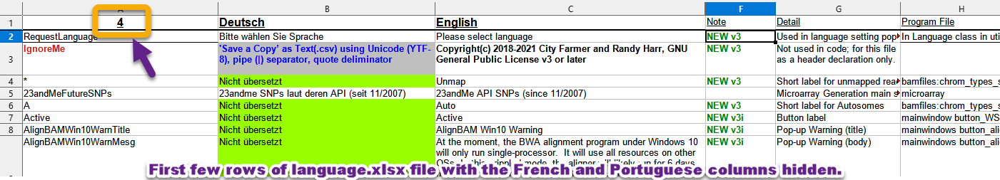

Turning on [DEBUG_MODE (see appendix)](#heading=h.xecb9pylfnas) while doing language translation development and testing is helpful.  It will enable some hidden features and buttons beside turning on more verbose messaging. Key is it will add a “reload” button next to the Language selection button on the Settings Frame (first tab).  When you hit “reload”, the program will re-read the `languages.xlsx` file and redisplay the initial language selection button. This helps you verify the file read correctly. You can then select your new language translation or whatever.  Other settings are saved and restored as well.  Allowing you to get quickly back to the screen you wish to see with your new language settings.  Whether it be one of the main tabs, the microarray selection, a result window or whatever.

There is a limited amount of wrap-around for text fields turned on.  And the space has been tuned for English language words and abbreviations.  If you just cannot fit your translation so it looks right, work with the programmers to figure out a compromise that works well for everyone. Key is keeping text that fit inside buttons at a reasonable size.

For longer text messages, we usually have word-wrapping turned on.  But sometimes for clarity or to make it fit in a Tab or Frame in a Tab, you may want to insert a newline character.  This can be done by putting a caret (‘^’) in the text.  That will be converted to a newline character when printed.  There are some places where this is required for clarity. The heading definitions of the Stats page comes to mind. As well as some output result windows. Follow the use of carets in the English example.  But try adding more if needed to properly format the output in your language. Note that many caret’s (were #’s) were removed between v2 and v3 because we did turn on word-wrap.  Look for and remove them if no longer needed.

You may widen the columns in the `.xlsx` spreadsheet  file. That does not affect the fields as used in the program.  As well as you can add color and font formatting if it helps.  For example, color cells you have to revisit or have finished, for example. We have left in but marked DEPRecated those entries that are no longer used by the program.  To make it easier to know they can be skipped, they are backgrounded yellow and have red text for the first column key entry.  We also background colored green all language cells that have never been translated and added the local language equivalent of the words “No Translation” in the cells.  This simply to avoid blank labels in any language presentation and to make it easier to find areas to focus on for translation.  The 3rd row is a sample row we add when a new entry is made. And includes the word “No Translation” for each language in its cells.

Sometimes you will see the double braces around a special keyword. Something like `{{BspSNP}}`.  The double braces and the keyword inside will be changed by the program, before displaying, to insert some value from the program.  Different for each run.  Often a filename but sometimes something else.  If a filename, it will often be surrounded by inserted newlines (carets or ‘^’) as well.  Place these keywords as appropriate into your translated text; retaining newlines you think may be appropriate for formatting and clarity as well.  Make sure the keywords remain surrounded by double-braces.

Whatever you do, do NOT CHANGE the first column in any way. Except to change the number of languages specified in the first row, first column cell if you add a new language column.  The first column is the key column and must match to the specific text inside the program. Anytime the program needs to print text to the screen, it uses the key to call a language translator that then finds the row based on the key and the column based on the user chosen language. That then gets the cell of text to display.

So edit the `language.xlsx` file.  Save in the same program/ directory.  And then simply start the **WGS Extract** program or hit the “reload” button when in DEBUG_MODE to have the new `language.xlsx` file read in and used. It is that simple.  A user created the Portugues translation in an hour or so.

Key screens to test are the main window and its three tabs, the stats button screen, the Y and MTDNA haplogroup result screens, and the unmapped and mtdna FASTA results screens. Of course, the microarray file generator (you may remember it as called Autosomal in v2).


# 12 Appendix: DEBUG / Developer mode

We have referred a few times in the manual to a DEBUG / Developer mode for the tool.  You may be asked to turn this on to enable a more refined understanding of what may be happening (wrong) in the tool. You can turn on this mode by creating a file in your home directory named `.wgsedebug ` The file need not have any content.  It can be zero bytes.  In Unix / Linux systems the easiest way to create this is to execute the command: `touch ~/.wgsedebug`

Under windows, create a `.txt` file and simply edit the name to remove the `.txt` extension and appear as it does above.

Turning on DEBUG mode does three main things.

1. It turns on more verbose messaging to the command script window

2. It prevents deletion of Temporary File directory content; thus leaving intermediate files and scripts available for analysis; and

3. It enables a few hidden buttons and modes that are not normally visible to the regular user.

While any user can turn this on, you are encouraged to be highly careful. Some of the enabled buttons can damage your original files if you do not understand what they do. We would encourage you to spend as minimal time as possible with the program in this mode.

To turn off the mode, you must remove the file from your home directory and then restart the program. The file is only checked for at startup.

At this time, the following special buttons are added:

**Reload**: On the settings page next to the selected button.  Used by language developers to reload the language.csv file after updating.  Note that use of this button purposely forgets your saved language and brings the language dialog back up. This so you can help verify your reload of the `languages.csv `file was without error.

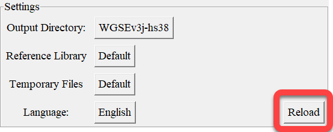

**BAM File Frame**: When running in developer / DEBUG mode, the tool will never show greyed out **Index** and** Sort** buttons.  Instead, it will show active buttons **Unindex** and **Unsort** instead of the greyed-out, inactive status indicators of **Indexed** and **Sorted**; respectively. This is so developers can unindex and unsort a BAM file for testing.


**DEBUG_MODE**: When DEBUG_MODE is on, there is now a fourth tab added to the main window that is called DEBUG.  Here are the current content but it is due to change often..

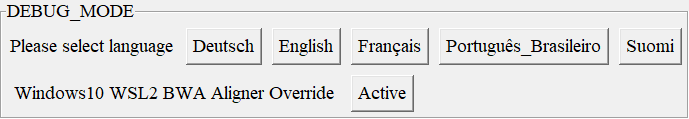

v3 had two items to select.   \
 \
Instead of the language pop-up, the individual languages can be selected directly. This can sometimes allow a recovery if the language pop-up is failing after loading a new language .csv file.

Instead of creating the **.wgsewslbwa** file and starting the program, the Windows WSL2 BWA button allows the developer to turn on and off the use of WSL2 BWA. Clicking the button changes the displayed (and stored) state from Active to Inactive or vice-a-versa. The current state is what the button shows.

Additionally now, if you want to try running the microarray generator in parallel, the button Generate will run that feature.  Note that we have found around 20,000 values are not called if you use this mode on hsxxx model BAMs. So it is generally not advised for use for final but does quickly generate a reasonable CombinedKit file.

A button to create a subset of a BAM is provided.  The entry once clicked is a percentage between 0.0 and 100.0.  It uses the samtools random access into the BAM to generate a statistical sampled subset of the BAM read segments. It can be useful to take an oversequenced BAM down to a more normal size for testing.  Or study the effects of lower read segments (read depth) on generated data.

Two buttons are added to override the OS values of total memory and total CPU threads available to the program.  You can only lower the value measured at runtime with these settings. These values are saved in the settings file and restored on the next run.  The current saved value is printed next to the button to change it. A value of 0 means the value is not saved or being used to override.  It is up to the user to remember that these values exist and are saved and to reset to inactive (0) when done experimenting. When changed from the not-set state, they will appear with a pink background. \
 \
Finally, there are two buttons to change the base font used to display all the windows.  Both the point size and font type.  The redraw button is then used to redraw all the windows using that newly set font.  When you change the font, the Base Font buttons will change to use that font immediately to gi

As developers add functionality still under test, a button may appear here for use before moving out into the main interface.


# 13 Appendix: Install and Release System

Top level scripts that the user sees and operates are ending in `.sh` are for Ubuntu, `.command` for MacOS, and `.bat` for Win10. With the caveat that `.sh` is also for common-to-all-platform BASH command scripts in the `scripts/` folder.  

The` Install_<OS>.<os-extension>` script is as simple as possible to boot strap to the universal `scripts/zinstall_common.sh`.  Windows has to bring in the base Cygwin64 environment with its .bat script but then calls a secondary, BASH script to complete the main installation steps.

Currently, all platforms check for and install (if missing) the Python and Java JRE interpreter environments.

To embellish the Unix environment and bring in most bioinformatic tools, some platforms require an additional support environment.  This is MacPorts on the MacOS and Cygwin64 on Windows.  For Cygwin64, we had to port all the tools over to this environment and release them as the bioinfo package in WGS Extract. On Ubuntu Linux, we can, for the most part, get all the needed tools from the Ubuntu “apt” repository.


**Note**: When we first started, MacPorts and Cygwin64 were behind on release versions for both Python3 and Java JRE.  Now that they have caught up, the installation could be further consolidated by using these systems to install and maintain the Python3 and Java JRE installation.


In v4, all platforms have an install and uninstall script. The install works both as an initial install and an upgrade if run again.  It will especially check the latest available version JSON file and upgrade the **WGS Extract** program packages as needed.  Eventually, the `Install.<os-extension> `scripts will become native install scripts within a release environment (for example, NSIS on Win10, a dpkg setup on MacOS, etc). They are almost there. \
 \
As part of the main **WGS Extract** v4 release, there is a `make_release.sh` file.  This is run from a development directory to create the various packages: `_installer.zip` , _program.zip , _reflib.zip and `_tools.zip` archives.  `make_release.sh` has to be run under MacOS as it uses the BOM creation tool from Apple.  This was necessary to set file flags and parameters the way MacOS wants to see them so MacOS avoids calling the scripts a virus threat.  To avoid issues, the `Install_Common.sh` script deletes this file and others during the final stages of install. So you may need to grab it from the `_program.zip` file. See the `make_release.txt` file for more information. 

Other files needed to make a release are in the `cygwin64\` directory on Windows releases. There, the scripts and support files to create the Cygwin64 Bioinformatic tool release exist. They are `make_cygwin64.sh` and `make_bioinfo.sh`.  Historically, we were creating the Python and Java releases for Windows there also.  But now those are created from public archives in the main installer..

The install and uninstall scripts look for a `release.json` file in the main installation directory. From that, it reads the desired “track” to be on for release updates. And the URL pointers to where it can find the latest available release information for all packages in each track.  As the user can edit the JSON format file to change the release track they wish to be on, it is generally left alone during installation if already existing.  Only if the user downloads a different release track installer will it override the file.

The URL pointers are to an online source for the merged (combined) version JSON file for each of 6 packages: **installer**, **program**, **reflib**, **tools**, **cygwin64 **and **bioinfo**.  The last two only exist in Windows systems.  Each package entry in the file is a JSON object indicating the latest available version for a package, its last release date, and a URL to that package's archive (.zip) file.  

Each package has a separate JSON file in its release that is stored in the installation area.  This then provides the currently installed version of a package.  These separate JSONs are located at `scripts/installer.json`, `program/program.json`, `reference/reflib.json`,  `jartools/tools.json`, `cygwin64/cygwin64.json` and `cygwin64/usr/local/bioinfo.json`.

The `release.json` file is created from stored information in `make_release.sh`.  As of this writing, here are the `release.json` file typical contents.  Note that the set track is dependent on which installer archive is downloaded. \
`{ `

```
  "release": { 
    "track": "Beta", 
    "__comment0": "WGS Extract Installer release track control", 
    "__comment1": "Set release.track to select the URL to find the latest version json.", 
    "__comment2": "Only stored in _installer.zip. Can be edited before rerunning the installer.", 
    "baseURL":"https://raw.githubusercontent.com/WGSExtract/WGSExtract-Dev/master/", 
    "DevURL": "https://raw.githubusercontent.com/WGSExtract/WGSExtract-Dev/master/latest-release-Dev.json", 
    "AlphaURL": "https://raw.githubusercontent.com/WGSExtract/WGSExtract-Dev/master/latest-release-Alpha.json", 
    "BetaURL": "https://raw.githubusercontent.com/WGSExtract/WGSExtract-Dev/master/latest-release-Beta.json" 
   } 
}
whereas a developer may have their own custom `release.json` file similar to: \
`{ `

  "release": { 
    "track": "Dev", 
    "baseURL":  "file://randy-pc2/wgse/Dev/",
    "DevURL":   "file:///Applications/WGSE/latest-release-Dev.json",
    "AlphaURL": "file:///D:/latest-release-Alpha.json",
    "BetaURL":  "file:///wgse/Dev/latest-release-Beta.json"
   } 
} 
Notice how they are providing a local `file://` URL instead of the online `https:` protocol URL

```
.

A package JSON file may look something like the following (taken from the` scripts/installer.json` file in the current development directory).  The package JSON files are currently individually set and edited by the developer. Eventually, they will be generated when a release is checked out of the main github repository.

```
{
  "installer": {
    "version": 35,
    "date": "30Jul2022",
    "URL": "https://api.onedrive.com/v1.0/shares/s!AgorjTSMFYpjgWG2wfTjd0MLmcLj/root/content"
  }
}
The script `make_release.sh` will collect the six package JSON files together and create a `latest_available_track.json` file.  One for each track (Beta, Alpha or Dev(eloper). Note that the `scripts/installer.json` file must be customized for each track.  As its content is different for each track..


## Notes

[^1]:  Taken from “Coverage Depth Recommendations” from Illumina’s website.
[^2]:   None of the transfer-in companies accept any Y or mitochondrial SNPs that may be in a file.  Even though they are still extracted and included here as they exist in the BAM.
[^3]:  Traditional VCF files only list the derived SNP values. Whether you were tested or not for possible “ancestral” SNPs in the main Reference Genome or its alternate contig regions is lost. Some assume the tester is ancestral for anything not mentioned.
[^4]:  See http://www.beholdgenealogy.com/blog/?p=2879 for one anecdotal example
[^5]:  The BWA distributed with Win10 has had the rmalloc routine rewritten to enable parallelization under Cygwin64. Otherwise it is identical to the master release on Github
[^6]:  Need Python 3.9.4 or later to get Apple M1 native port
